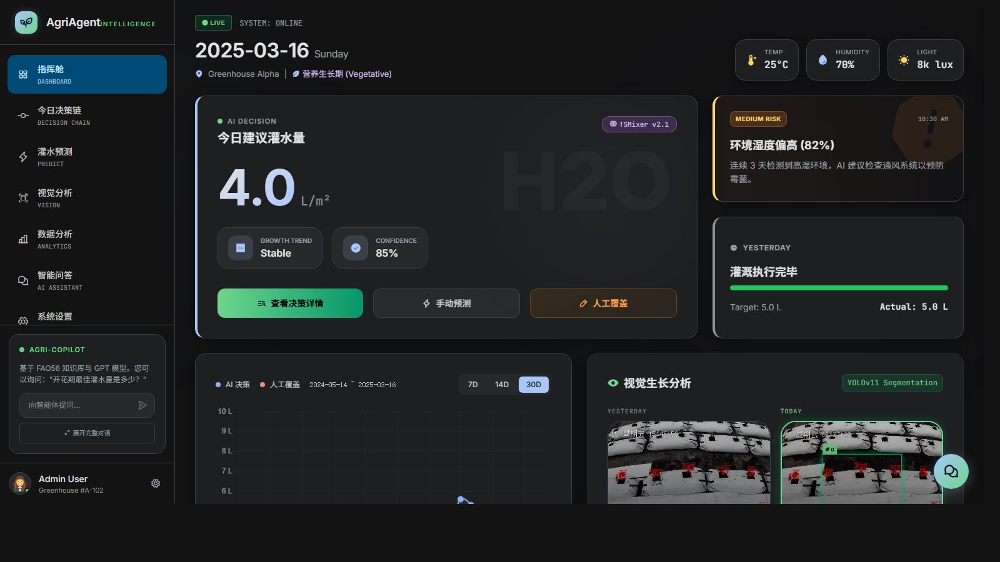
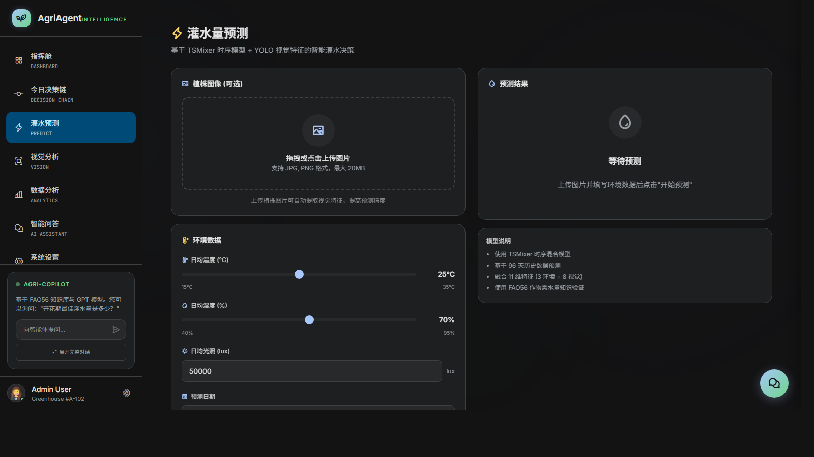
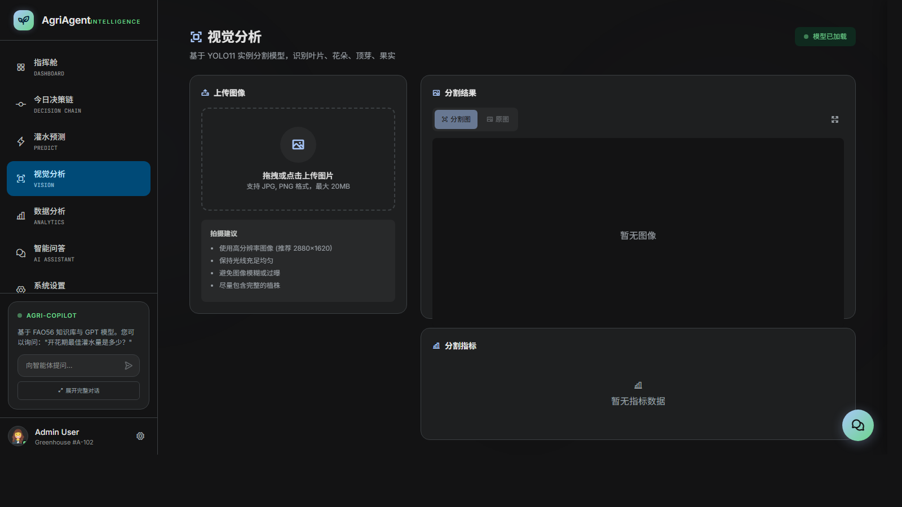
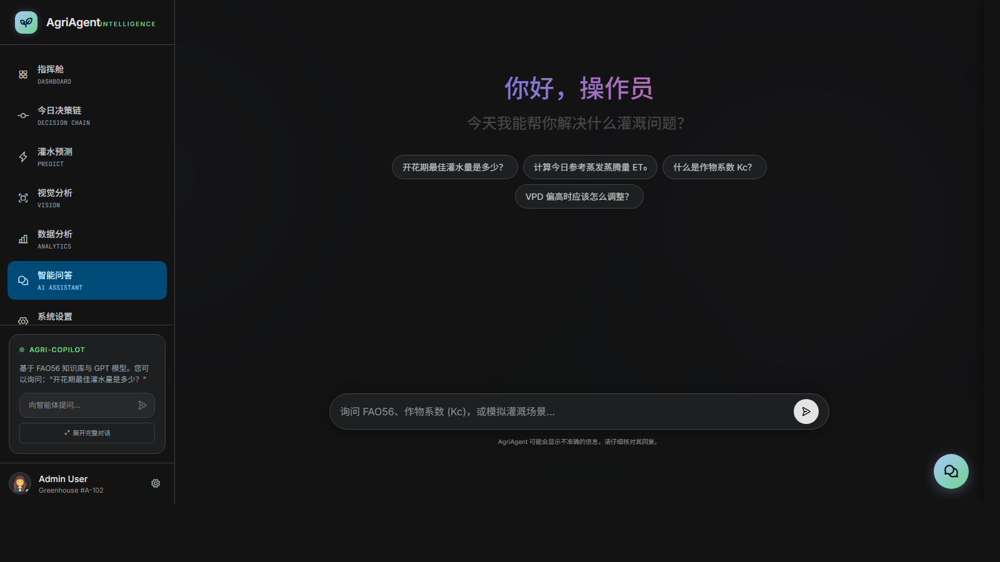
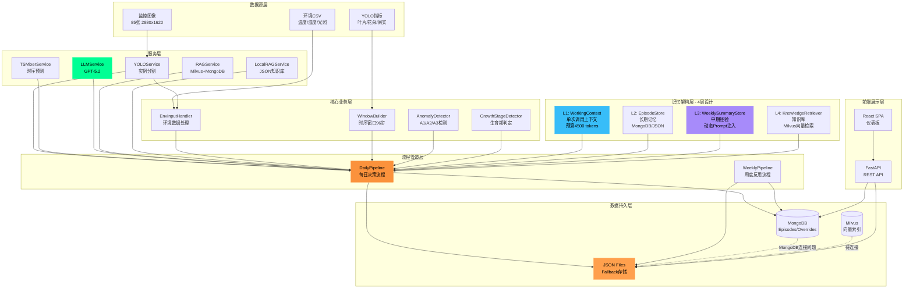

# 🌱 AgriAgent - 温室黄瓜灌水智能体系统

<div align="center">


**基于 AI 的智能温室灌溉决策系统**

集成 YOLO 图像分析、TSMixer 时序预测和 GPT-5.2 多模态推理

[功能特性](#功能特性) • [快速开始](#快速开始) • [架构设计](#系统架构) • [API文档](#api文档) • [开发指南](#开发指南)

</div>

---

## 📋 目录

- [项目概述](#项目概述)
- [功能特性](#功能特性)
- [系统架构](#系统架构)
- [数据流程](#数据流程)
- [目录结构](#目录结构)
- [快速开始](#快速开始)
- [使用指南](#使用指南)
- [前端UI](#前端ui)
- [API文档](#api文档)
- [开发指南](#开发指南)
- [测试](#测试)
- [部署](#部署)
- [常见问题](#常见问题)
- [贡献指南](#贡献指南)
- [许可证](#许可证)

---

## 📚 文档入口

- **Docker 部署与技术说明**: [docs/TECHNICAL_GUIDE.md](docs/TECHNICAL_GUIDE.md)
- **环境变量模板**: [.env.example](.env.example)
- **Docker Compose 启动**: [docker-compose.yml](docker-compose.yml)
- **远端镜像一键启动**: [docker-compose.registry.yml](docker-compose.registry.yml)

## 🖼️ 界面预览

| Dashboard | Predict |
|-----------|---------|
|  |  |

| Vision | Knowledge |
|--------|-----------|
|  |  |

## 🚀 最快启动

如果你不想在本地构建镜像，而是直接拉取预构建镜像，优先使用：

```bash
copy .env.example .env
docker compose -f docker-compose.registry.yml pull
docker compose -f docker-compose.registry.yml up -d
```

启动后访问：

- 前端：`http://localhost:3003`
- 后端：`http://localhost:8000`
- Swagger：`http://localhost:8000/docs`

说明：

- `docker-compose.registry.yml` 使用 GitHub Container Registry 里的预构建镜像。
- 首次镜像发布由 `.github/workflows/publish-images.yml` 自动完成。
- 如果 GHCR 包首次发布后默认不是公开的，需要在 GitHub Packages 页面将其切换为 `public`。

## 📖 项目概述

**AgriAgent** 是一个面向温室黄瓜种植的 AI 智能决策系统，通过融合计算机视觉、时序预测和大语言模型，实现全自动化的灌溉决策流程。

### 核心能力

| 模块 | 技术栈 | 功能描述 |
|------|--------|----------|
| **视觉分析** | YOLO11n-FCHL | 实例分割提取叶片、花朵、果实、顶芽指标 |
| **时序预测** | TSMixer | 基于96步历史数据预测灌水量 |
| **长势评估** | GPT-5.2 (Multimodal) | 对比今日/昨日图像，评估 better/same/worse |
| **合理性复核** | GPT-5.2 | 结合植物长势、环境数据、RAG知识库进行决策复核 |
| **周度反思** | GPT-5.2 | 生成周报，提取规律性经验并注入未来Prompt |
| **知识增强** | Milvus + BGE-M3 | RAG向量检索FAO56农业知识（10,211个知识块）|

### 应用场景

- 🏭 **商业温室**：自动化灌溉，减少人工干预，提升产量
- 🔬 **科研实验**：记录决策链条，支持回溯分析和论文数据导出
- 🎓 **教学演示**：可视化AI决策过程，辅助农业智能化课程

---

## ✨ 功能特性

### 🎯 核心功能（已完成）

#### 1. 每日决策流程（DailyPipeline）

```
环境数据 + YOLO指标 → TSMixer预测 → PlantResponse评估 → SanityCheck复核 → 最终决策
```

- ✅ 自动读取温度、湿度、光照、YOLO指标
- ✅ 96步时序窗口构建（支持冷启动填充）
- ✅ 多模态长势评估（今日 vs 昨日图像 + YOLO指标）
- ✅ 三级异常检测（A1范围、A2趋势矛盾、A3环境异常）
- ✅ RAG知识库检索（FAO56农业知识辅助决策）
- ✅ 风险等级评估（low/medium/high/critical）
- ✅ 人工覆盖（Override）机制

#### 2. 周度总结流程（WeeklyPipeline）

```
过去7天Episodes → 统计分析 → LLM生成洞察 → 动态Prompt注入
```

- ✅ 自动统计长势趋势分布、灌水趋势、异常事件
- ✅ LLM生成3条关键洞察（中文）
- ✅ 知识库引用（RAG检索结果）
- ✅ 生成Prompt块（自动注入下周决策）

#### 3. 知识管理（RAG）

- ✅ **LocalRAG**：本地关键词匹配（10,211个FAO56知识块）
- ⚠️ **Milvus RAG**：向量混合检索（待修复MongoDB连接）
- ✅ BGE-M3向量化模型
- ✅ 系统文献 + 用户文献双源检索

#### 4. 数据存储

- ✅ **Episodes**：JSON文件存储（data/weekly_storage/episodes_temp.json）
- ✅ **WeeklySummaries**：JSON文件存储（data/weekly_storage/weekly.json）
- ⚠️ **MongoDB**：数据模型完成，Windows启动问题待解决

### 🚧 开发中功能

#### 前端UI（Phase 1优先级）

- [ ] 仪表板（Dashboard）- 今日决策摘要
- [ ] 今日决策详情页 - 完整决策链条展示
- [ ] Override对话框 - 人工覆盖系统建议
- [ ] 历史记录查询 - 筛选、导出
- [ ] 周度报告 - 可视化周摘要

**参考设计**: [cankao.html](cankao.html) - 极光背景 + 玻璃拟态 + 霓虹色彩

---

## 🏗️ 系统架构

### 整体架构图




### 分层架构

```
┌─────────────────────────────────────────────────────────┐
│                    展示层（Presentation）                 │
│   React SPA + FastAPI REST API                          │
└─────────────────────────────────────────────────────────┘
                            ↓
┌─────────────────────────────────────────────────────────┐
│                    管道层（Pipelines）                    │
│   DailyPipeline | WeeklyPipeline                        │
└─────────────────────────────────────────────────────────┘
                            ↓
┌─────────────────────────────────────────────────────────┐
│              业务逻辑层（Core + Memory）                  │
│   AnomalyDetector | WorkingContext | EpisodeStore       │
└─────────────────────────────────────────────────────────┘
                            ↓
┌─────────────────────────────────────────────────────────┐
│                    服务层（Services）                     │
│   LLMService | RAGService | YOLOService | TSMixerService│
└─────────────────────────────────────────────────────────┘
                            ↓
┌─────────────────────────────────────────────────────────┐
│                 数据层（Models + Storage）                │
│   Episode | PlantResponse | MongoDB | Milvus | JSON     │
└─────────────────────────────────────────────────────────┘
```

---

## 🔄 数据流程

### DailyPipeline 流程图

```mermaid
flowchart TD
    Start([开始: 2025-12-26]) --> Input[读取环境数据<br/>温度25°C, 湿度70%, 光照8000lux]
    Input --> YOLO[读取YOLO指标<br/>叶片数3.5, 掩码820, 花朵0.2]
    YOLO --> Window[构建96步时序窗口<br/>env + YOLO历史数据]
    Window --> TSMixer[TSMixer预测<br/>灌水量: 5.2 L/m²]

    TSMixer --> PlantResp[PlantResponse长势评估]
    PlantResp --> |读取今日/昨日图像| LLM1[GPT-5.2多模态分析]
    LLM1 --> |输出JSON| Trend{长势趋势?}

    Trend -->|better ↗| Conf1[置信度: 0.85<br/>证据: 叶片掩码+15%]
    Trend -->|same →| Conf2[置信度: 0.70]
    Trend -->|worse ↘| Conf3[置信度: 0.60<br/>异常: 萎蔫/黄化]

    Conf1 --> Anomaly[异常检测A1/A2/A3]
    Conf2 --> Anomaly
    Conf3 --> Anomaly

    Anomaly --> |A1范围检测| RangeCheck{5.2 ∈ [0.1,15]?}
    RangeCheck -->|Yes| A2Check
    RangeCheck -->|No| HighRisk[风险: critical]

    A2Check[A2趋势矛盾检测] --> Conflict{长势好<br/>but灌水大降?}
    Conflict -->|Yes| MediumRisk[风险: medium]
    Conflict -->|No| A3Check

    A3Check[A3环境异常检测] --> EnvCheck{连续3天<br/>高湿/高温/低光?}
    EnvCheck -->|Yes| MediumRisk
    EnvCheck -->|No| LowRisk[风险: low]

    MediumRisk --> RAG[RAG知识库检索<br/>query: 高湿环境灌水建议]
    HighRisk --> RAG
    LowRisk --> Context

    RAG --> |TopK=3| Knowledge[FAO56片段:<br/>1. 高湿需减水10%<br/>2. 注意通风<br/>3. 防霉菌]

    Knowledge --> Context[构建L1工作上下文<br/>System+Weekly+Today+RAG]
    Context --> Budget{预算<br/>>4500?}
    Budget -->|Yes| Compress[压缩上下文<br/>RAG TopK 3→1<br/>删除evidence详情]
    Budget -->|No| SanityCheck
    Compress --> SanityCheck

    SanityCheck[SanityCheck合理性复核] --> LLM2[GPT-5.2推理<br/>结合上下文+RAG知识]
    LLM2 --> Decision{决策?}

    Decision -->|接受| Accept[final_decision:<br/>value=5.2, source=TSMixer]
    Decision -->|需人工确认| Question[questions:<br/>1. 湿度是否持续过高?<br/>2. 是否观察到病害?]
    Decision -->|覆盖| Override[final_decision:<br/>value=6.0, source=Override<br/>reason=高温预警]

    Accept --> Store[存储Episode<br/>MongoDB/JSON]
    Question --> Store
    Override --> Store

    Store --> End([结束])

    style TSMixer fill:#00FF94,color:#000
    style LLM1 fill:#38BDF8,color:#000
    style LLM2 fill:#38BDF8,color:#000
    style RAG fill:#A78BFA,color:#fff
    style HighRisk fill:#FF6B6B,color:#fff
    style MediumRisk fill:#FFA04D,color:#000
    style LowRisk fill:#51CF66,color:#000
```

### WeeklyPipeline 流程图

```mermaid
flowchart TD
    Start([每周日执行]) --> Query[查询过去7天Episodes<br/>2024-06-03 ~ 06-09]
    Query --> Stats[统计分析]

    Stats --> Trend[长势趋势分布<br/>better: 0天<br/>same: 3天<br/>worse: 1天]
    Stats --> Irrigation[灌水趋势<br/>日均8.7 L/m²<br/>总量34.7 L<br/>趋势: 下降↘]
    Stats --> Anomalies[异常事件<br/>1次趋势冲突(6/5)]

    Trend --> Format[格式化统计摘要]
    Irrigation --> Format
    Anomalies --> Format

    Format --> LLM[GPT-5.2周度反思<br/>Prompt: weekly_reflection]
    LLM --> Insights[生成3条关键洞察:<br/>1. 长势平稳为主无好转且有1天下降<br/>2. 灌溉递减需防水分不足<br/>3. 6/5灌水10.5仍转差,建议排查EC]

    Insights --> RAGRefs[关联知识库引用<br/>FAO56 Ch7: 灌溉量递减警惕缺水<br/>FAO56 Ch9: 趋势冲突可能由EC引起]

    RAGRefs --> PromptBlock[生成Prompt块<br/>## 上周经验<br/>长势趋势: 平稳 | 灌溉趋势: 下降<br/>关键洞察: ...<br/>本周异常 1 次]

    PromptBlock --> Store[存储WeeklySummary<br/>MongoDB/JSON]

    Store --> Inject[下周DailyPipeline<br/>自动注入Prompt块到L1上下文]

    Inject --> End([周度循环])

    style LLM fill:#00FF94,color:#000
    style Insights fill:#FFD43B,color:#000
    style Inject fill:#A78BFA,color:#fff
```

---

## 📂 目录结构

```
cucumber-irrigation/
├── 📁 configs/                      # 配置文件目录
│   ├── settings.yaml                # 全局设置（LLM配置、数据路径等）
│   ├── rules.yaml                   # 业务规则配置
│   ├── thresholds.yaml              # 异常检测阈值
│   ├── memory.yaml                  # 4层记忆架构配置
│   └── 📁 schema/                   # JSON Schema 验证文件
│
├── 📁 src/cucumber_irrigation/      # 源代码目录
│   ├── 📁 models/                   # 数据模型层
│   ├── 📁 services/                 # 服务层
│   ├── 📁 core/                     # 核心业务逻辑层
│   ├── 📁 memory/                   # 4层记忆架构
│   ├── 📁 pipelines/                # 流程管道层
│   ├── 📁 processors/               # 数据处理器
│   ├── 📁 utils/                    # 工具函数
│   └── 📁 rag/                      # RAG组件
│
├── 📁 prompts/                      # Prompt模板目录
│   ├── 📁 plant_response/           # 长势评估Prompt
│   ├── 📁 sanity_check/             # 合理性复核Prompt
│   └── 📁 weekly_reflection/        # 周度反思Prompt
│
├── 📁 data/                         # 数据目录
│   ├── 📁 images/                   # 原始监控图像（85张）
│   ├── 📁 csv/                      # irrigation.csv（93行）
│   ├── 📁 knowledge_base/           # FAO56知识库（10,211块）
│   └── 📁 weekly_storage/           # Episodes + WeeklySummaries
│
├── 📁 scripts/                      # 运行脚本目录
├── 📁 tests/                        # 测试目录
├── 📁 docs/                         # 文档目录
├── cankao.html                      # 前端UI参考设计
├── requirements_ui.md               # 前端UI需求文档
├── pyproject.toml                   # 项目配置
└── README.md                        # 本文件
```

---

## 🚀 快速开始

### 环境要求

- **Python**: 3.10+
- **操作系统**: Windows / Linux / macOS
- **GPU**: CUDA 11.8+（可选，YOLO推理加速）
- **RAM**: 8GB+（16GB推荐）

### 1. 克隆项目

```bash
git clone https://github.com/your-org/cucumber-irrigation.git
cd cucumber-irrigation
```

### 2. 安装依赖（使用uv）

```bash
# 安装 uv 包管理器
curl -LsSf https://astral.sh/uv/install.sh | sh

# 创建虚拟环境并安装依赖
uv sync

# 激活虚拟环境
source .venv/bin/activate  # Linux/macOS
# .venv\Scripts\activate   # Windows
```

### 3. 配置环境变量

创建 `.env` 文件：

```bash
# OpenAI API（GPT-5.2通过yunwu.ai代理）
OPENAI_API_KEY=your_api_key_here
OPENAI_BASE_URL=https://yunwu.zeabur.app/v1

# 日志级别
LOG_LEVEL=INFO
```

### 4. 验证安装

```bash
# 测试核心组件
pytest tests/test_core.py -v

# 检查配置加载
python -c "from src.cucumber_irrigation.config import load_config; print(load_config())"
```

### 5. 运行演示

```bash
# 运行周度LLM演示（使用真实数据）
uv run python scripts/demo_weekly_llm.py

# 查看生成的周报
cat data/weekly_storage/weekly.json
```

---

## 📖 使用指南

### 运行周度反思流程

```bash
# 自动处理最近一周
uv run python scripts/run_weekly_real.py

# 指定周范围
uv run python scripts/run_weekly_real.py --week-start 2024-06-03 --week-end 2024-06-09
```

### 知识库检索（CLI）

```bash
# 检索FAO56知识（使用LocalRAG）
uv run python -m cucumber_irrigation.rag.cli search "开花期灌水量建议" --use-local
```

---

## 🎨 前端UI

### 设计风格（参考 cankao.html）

**视觉特点**：
- **深空暗色主题**：背景 `#0B1120`（深空蓝）
- **极光背景效果**：3层模糊渐变光斑动画
- **玻璃拟态（Glassmorphism）**：半透明卡片 + 背景模糊
- **霓虹色彩系统**：
  - 主色：霓虹绿 `#00FF94`（健康/正常）
  - 辅色：蓝 `#38BDF8`、紫 `#A78BFA`、橙 `#FB923C`（预警）

**技术栈**：
- **框架**: React 18 + Vite
- **UI库**: Tailwind CSS + Phosphor Icons
- **图表**: Chart.js / ECharts
- **字体**: Inter + JetBrains Mono + Noto Sans SC

**详细设计文档**: [requirements_ui.md](requirements_ui.md)

---

## 🧪 测试

### 运行测试

```bash
# 运行所有测试
pytest tests/ -v

# 查看覆盖率
pytest --cov=src/cucumber_irrigation tests/
```

**当前覆盖率**: ~85%

---

## ❓ 常见问题

### Q1: MongoDB无法启动（Windows）

**解决方案**: 当前使用JSON文件fallback（已自动启用）

### Q2: YOLO推理速度慢

**解决方案**: 使用GPU加速或减少tile数量

### Q3: LLM调用失败（API超时）

**解决方案**: 增加timeout参数

---

## 🤝 贡献指南

欢迎贡献代码、文档和bug报告！

### 提交流程

1. Fork本仓库
2. 创建功能分支: `git checkout -b feature/my-feature`
3. 提交代码: `git commit -m "feat: add my feature"`
4. 推送分支: `git push origin feature/my-feature`
5. 创建Pull Request

---

## 📄 许可证

本项目采用 [MIT License](LICENSE)。

---

<div align="center">

**⭐ 如果这个项目对你有帮助，请给个Star！**

Made with ❤️ by AgriAgent Team

</div>
