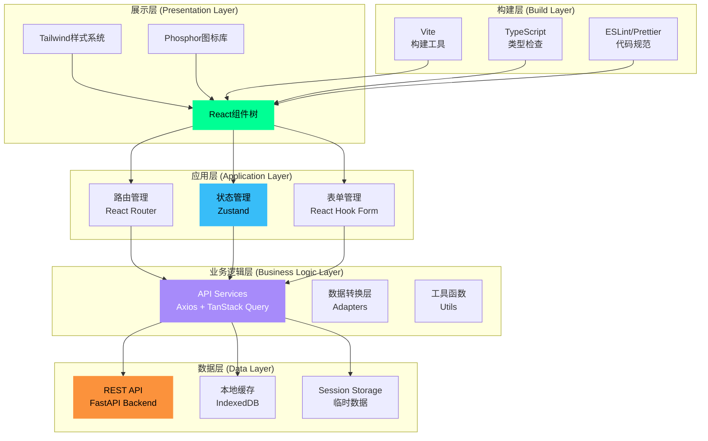
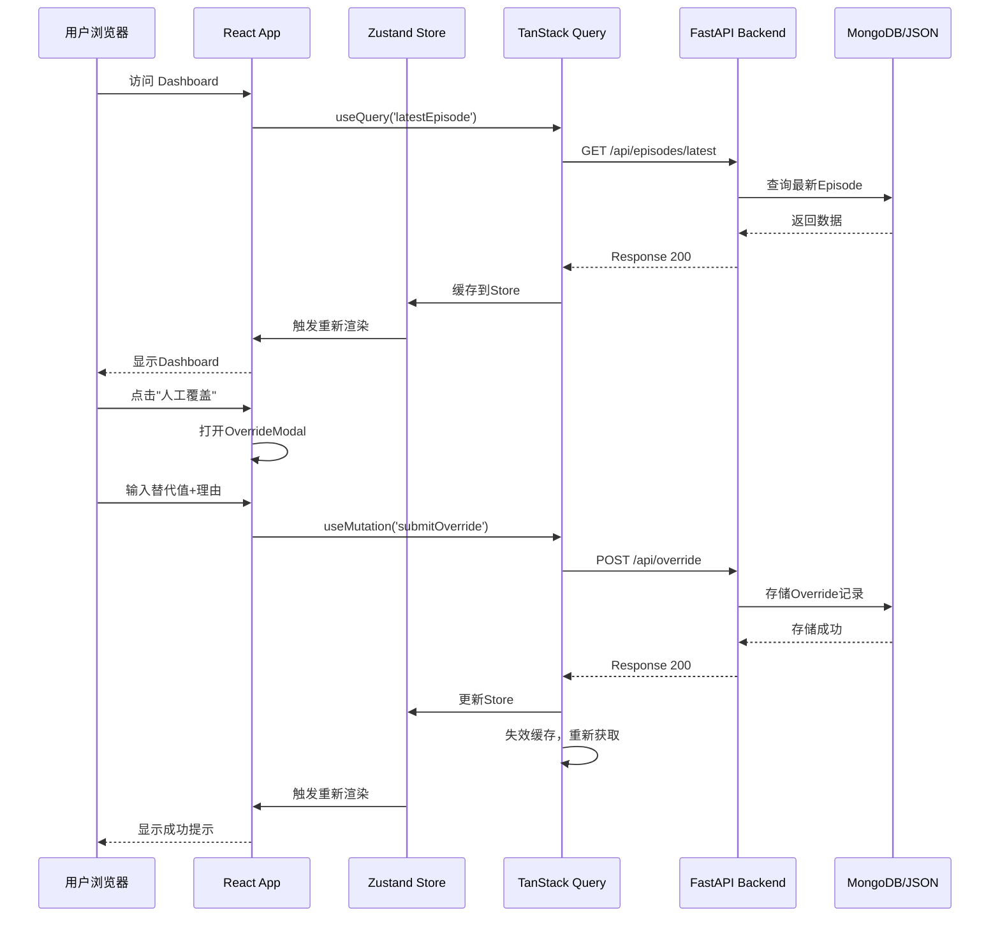
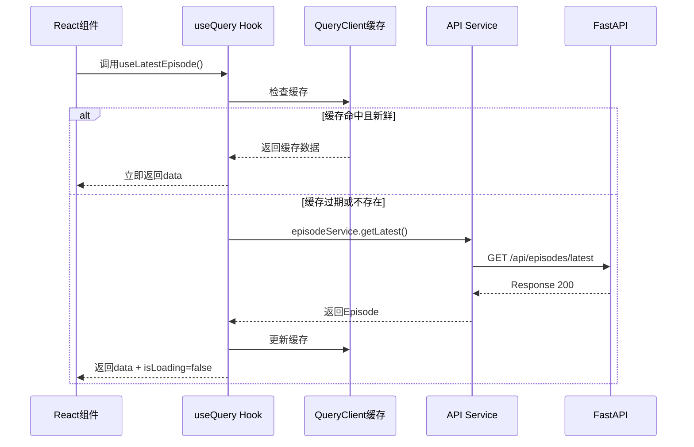
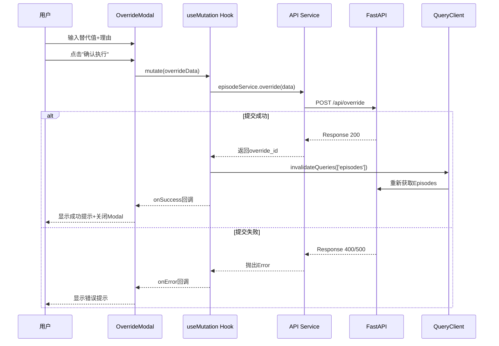

# AgriAgent 前端UI设计文档

> **版本**: v1.0
> **创建日期**: 2025-12-26
> **文档状态**: 正式版
> **参考需求**: [requirements_ui.md](requirements_ui.md)

---

## 📋 目录

- [1. 核心目标](#1-核心目标)
- [2. 设计架构](#2-设计架构)
- [3. 技术栈选型](#3-技术栈选型)
- [4. 模块划分](#4-模块划分)
- [5. 组件设计](#5-组件设计)
- [6. 状态管理设计](#6-状态管理设计)
- [7. 路由设计](#7-路由设计)
- [8. API集成设计](#8-api集成设计)
- [9. 样式系统设计](#9-样式系统设计)
- [10. 数据流设计](#10-数据流设计)
- [11. 性能优化策略](#11-性能优化策略)
- [12. 开发规范](#12-开发规范)
- [13. 依赖管理](#13-依赖管理)
- [14. 构建与部署](#14-构建与部署)

---

## 1. 核心目标

### 1.1 产品目标

**主要目标**：
- 为温室种植人员提供**直观、易用**的每日灌水决策界面
- 为研究人员提供**数据密集、分析友好**的历史查询和周度报告工具
- 实现**实时预警提示**，支持人工覆盖（Override）机制
- 展示**AI决策链条**，提升系统透明度和可信度

**次要目标**：
- 支持知识库检索，辅助用户理解决策依据
- 提供系统配置界面，支持Prompt调优和阈值调整
- 支持数据导出（CSV/JSON），满足科研需求

### 1.2 用户目标

#### 👨‍🌾 温室种植/生产管理人员

| 用户任务 | 成功指标 |
|---------|---------|
| 每日查看灌水量建议 | 3秒内找到今日决策 |
| 理解决策依据 | 一屏内展示完整决策链 |
| 人工覆盖错误决策 | 3步完成Override |
| 发现预警问题 | 预警信息自动高亮 |

#### 👩‍🔬 实验室研究人员

| 用户任务 | 成功指标 |
|---------|---------|
| 查询历史决策 | 支持多维度筛选 |
| 分析长势趋势 | 图表直观易读 |
| 导出论文数据 | 一键导出CSV |
| 周度报告查看 | LLM洞察清晰呈现 |

### 1.3 技术目标

- **响应速度**: 首屏加载 < 2s，页面切换 < 300ms
- **浏览器兼容**: Chrome 90+, Edge 90+, Safari 14+
- **可访问性**: WCAG 2.1 AA级（保留文本对比度、键盘导航）
- **可维护性**: 组件复用率 > 60%，代码覆盖率 > 70%
- **可扩展性**: 支持插件化页面扩展，模块化状态管理

---

## 2. 设计架构

### 2.1 整体架构图



### 2.2 分层架构说明

#### 展示层 (Presentation Layer)

**职责**：
- 渲染UI组件，处理用户交互
- 应用Tailwind样式类，实现响应式布局
- 使用Phosphor图标库提供一致的视觉语言

**关键技术**：
- React 18 (函数组件 + Hooks)
- Tailwind CSS (原子化样式)
- Phosphor Icons (SVG图标)

#### 应用层 (Application Layer)

**职责**：
- 路由管理：定义页面路由，处理导航逻辑
- 状态管理：全局状态、用户偏好、缓存数据
- 表单管理：表单验证、数据绑定、提交处理

**关键技术**：
- React Router v6 (路由管理)
- Zustand (轻量级状态管理)
- React Hook Form (高性能表单)

#### 业务逻辑层 (Business Logic Layer)

**职责**：
- API调用：封装HTTP请求，统一错误处理
- 数据转换：后端数据 → 前端数据模型
- 工具函数：日期格式化、数值计算、Token计数等

**关键技术**：
- Axios (HTTP客户端)
- TanStack Query (数据获取、缓存、同步)
- Day.js (日期处理)

#### 数据层 (Data Layer)

**职责**：
- REST API：与FastAPI后端通信
- 本地缓存：IndexedDB存储大对象（如图像Base64）
- Session Storage：存储临时数据（如筛选条件）

**关键技术**：
- FastAPI (后端API)
- IndexedDB (本地数据库)
- Session/Local Storage

#### 构建层 (Build Layer)

**职责**：
- 快速开发：热重载、模块化打包
- 类型安全：TypeScript编译、类型检查
- 代码质量：Lint检查、格式化

**关键技术**：
- Vite (构建工具)
- TypeScript (类型系统)
- ESLint + Prettier (代码规范)

### 2.3 前后端交互架构



---

## 3. 技术栈选型

### 3.1 核心框架

| 技术 | 版本 | 选择理由 | 备选方案 |
|------|------|---------|---------|
| **React** | 18.2+ | 生态成熟、Hook强大、团队熟悉 | Vue 3, Svelte |
| **Vite** | 5.0+ | 快速HMR、ES Module原生支持 | Webpack, Turbopack |
| **TypeScript** | 5.0+ | 类型安全、IDE支持、维护性强 | 纯JavaScript |

### 3.2 UI/样式

| 技术 | 版本 | 选择理由 | 备选方案 |
|------|------|---------|---------|
| **Tailwind CSS** | 3.4+ | 原子化样式、快速开发、体积小 | Material-UI, Ant Design |
| **Phosphor Icons** | 2.0+ | 风格统一、SVG矢量、体积小 | Heroicons, Lucide |
| **Chart.js** | 4.4+ | 配置简单、动画流畅、文档全 | ECharts, Recharts |

**为什么选Tailwind而非MUI？**
- cankao.html使用Tailwind，已有设计参考
- Tailwind更灵活，适合定制化科技风格
- 打包体积更小（按需编译）

### 3.3 状态管理

| 技术 | 版本 | 选择理由 | 备选方案 |
|------|------|---------|---------|
| **Zustand** | 4.4+ | 轻量级、API简单、TS友好 | Redux Toolkit, Jotai |
| **TanStack Query** | 5.0+ | 服务端状态管理、自动缓存刷新 | SWR, Apollo Client |

**为什么选Zustand而非Redux？**
- 项目规模中等，无需Redux的复杂度
- Zustand API更简洁（无需action/reducer）
- 与TanStack Query配合，职责分离清晰

### 3.4 数据获取

| 技术 | 版本 | 选择理由 | 备选方案 |
|------|------|---------|---------|
| **Axios** | 1.6+ | 拦截器强大、取消请求、超时处理 | fetch API, ky |
| **TanStack Query** | 5.0+ | 缓存策略、乐观更新、重试机制 | SWR |

### 3.5 表单处理

| 技术 | 版本 | 选择理由 | 备选方案 |
|------|------|---------|---------|
| **React Hook Form** | 7.49+ | 性能优秀、非受控表单、TS支持 | Formik |
| **Zod** | 3.22+ | Schema验证、TS类型推断 | Yup, Joi |

### 3.6 工具库

| 技术 | 版本 | 用途 |
|------|------|------|
| **Day.js** | 1.11+ | 日期格式化、时区处理 |
| **Lodash-es** | 4.17+ | 工具函数（Tree-shakable） |
| **clsx** | 2.0+ | 条件样式类名拼接 |
| **Recharts** | 2.10+ | 备选图表库（声明式） |

---

## 4. 模块划分

### 4.1 项目目录结构

```
frontend/
├── public/                      # 静态资源
│   ├── favicon.ico
│   └── robots.txt
│
├── src/
│   ├── main.tsx                 # 应用入口
│   ├── App.tsx                  # 根组件
│   ├── index.css                # 全局样式（Tailwind导入）
│   │
│   ├── 📁 assets/               # 静态资源
│   │   ├── images/              # 图片资源
│   │   └── fonts/               # 字体文件（Inter, JetBrains Mono）
│   │
│   ├── 📁 components/           # 组件目录
│   │   ├── 📁 common/           # 通用组件（原子组件）
│   │   │   ├── Button/          # 按钮组件
│   │   │   ├── Card/            # 卡片组件（玻璃拟态）
│   │   │   ├── Badge/           # 徽章组件
│   │   │   ├── Input/           # 输入框组件
│   │   │   ├── Modal/           # 模态框组件
│   │   │   ├── Spinner/         # 加载动画
│   │   │   └── Tooltip/         # 提示框
│   │   │
│   │   ├── 📁 layout/           # 布局组件
│   │   │   ├── Sidebar/         # 侧边栏（玻璃拟态）
│   │   │   ├── Header/          # 顶部导航栏
│   │   │   ├── MobileMenu/      # 移动端菜单
│   │   │   └── AuroraBackground/# 极光背景效果
│   │   │
│   │   ├── 📁 features/         # 业务组件（功能模块）
│   │   │   ├── dashboard/       # Dashboard相关组件
│   │   │   │   ├── HeroCard.tsx         # 今日决策卡片
│   │   │   │   ├── TrendChart.tsx       # 灌水量趋势图
│   │   │   │   ├── WarningCard.tsx      # 预警卡片
│   │   │   │   └── StatsCard.tsx        # 统计卡片
│   │   │   │
│   │   │   ├── decision/        # 今日决策详情
│   │   │   │   ├── InputSection.tsx     # 输入数据区
│   │   │   │   ├── PlantResponseCard.tsx# 长势评估卡片
│   │   │   │   ├── SanityCheckCard.tsx  # 合理性复核
│   │   │   │   └── DecisionTimeline.tsx # 决策时间线
│   │   │   │
│   │   │   ├── override/        # Override相关
│   │   │   │   ├── OverrideModal.tsx    # Override对话框
│   │   │   │   └── OverrideHistory.tsx  # Override历史
│   │   │   │
│   │   │   ├── history/         # 历史记录
│   │   │   │   ├── FilterPanel.tsx      # 筛选面板
│   │   │   │   ├── DataTable.tsx        # 数据表格
│   │   │   │   └── CompareView.tsx      # 批量对比
│   │   │   │
│   │   │   ├── weekly/          # 周度报告
│   │   │   │   ├── WeeklyList.tsx       # 周报列表
│   │   │   │   ├── InsightsCard.tsx     # 洞察卡片
│   │   │   │   └── PromptBlock.tsx      # Prompt块展示
│   │   │   │
│   │   │   ├── knowledge/       # 知识库
│   │   │   │   ├── SearchBar.tsx        # 搜索栏
│   │   │   │   ├── ResultCard.tsx       # 检索结果卡片
│   │   │   │   └── FeedbackButton.tsx   # 反馈按钮
│   │   │   │
│   │   │   └── settings/        # 系统设置
│   │   │       ├── ThresholdEditor.tsx  # 阈值编辑器
│   │   │       └── PromptEditor.tsx     # Prompt编辑器
│   │   │
│   │   └── 📁 charts/           # 图表组件
│   │       ├── IrrigationTrendChart.tsx # 灌水量趋势图
│   │       ├── GrowthDistribution.tsx   # 长势分布饼图
│   │       └── EnvironmentMonitor.tsx   # 环境监控图
│   │
│   ├── 📁 pages/                # 页面组件
│   │   ├── Dashboard.tsx        # 仪表板页面
│   │   ├── DailyDecision.tsx    # 今日决策页面
│   │   ├── History.tsx          # 历史记录页面
│   │   ├── Weekly.tsx           # 周度报告页面
│   │   ├── Knowledge.tsx        # 知识库页面
│   │   ├── PlantResponse.tsx    # 长势图像对比页面
│   │   ├── Settings.tsx         # 系统设置页面
│   │   └── NotFound.tsx         # 404页面
│   │
│   ├── 📁 hooks/                # 自定义Hooks
│   │   ├── useEpisodes.ts       # Episodes数据获取
│   │   ├── useWeeklySummary.ts  # 周报数据获取
│   │   ├── useKnowledgeSearch.ts# 知识库检索
│   │   ├── useOverride.ts       # Override提交
│   │   └── usePolling.ts        # 轮询Hook（定时刷新）
│   │
│   ├── 📁 services/             # API服务层
│   │   ├── api.ts               # Axios实例配置
│   │   ├── episodeService.ts    # Episode相关API
│   │   ├── weeklyService.ts     # Weekly相关API
│   │   ├── knowledgeService.ts  # Knowledge相关API
│   │   └── overrideService.ts   # Override相关API
│   │
│   ├── 📁 store/                # Zustand状态管理
│   │   ├── useEpisodeStore.ts   # Episode状态
│   │   ├── useUserStore.ts      # 用户状态
│   │   ├── useUIStore.ts        # UI状态（侧边栏展开/折叠）
│   │   └── index.ts             # 统一导出
│   │
│   ├── 📁 types/                # TypeScript类型定义
│   │   ├── episode.ts           # Episode相关类型
│   │   ├── plantResponse.ts     # PlantResponse类型
│   │   ├── sanityCheck.ts       # SanityCheck类型
│   │   ├── weeklySummary.ts     # WeeklySummary类型
│   │   └── api.ts               # API响应类型
│   │
│   ├── 📁 utils/                # 工具函数
│   │   ├── date.ts              # 日期格式化
│   │   ├── format.ts            # 数字格式化
│   │   ├── validation.ts        # 表单验证
│   │   └── constants.ts         # 常量定义
│   │
│   ├── 📁 routes/               # 路由配置
│   │   └── index.tsx            # 路由定义
│   │
│   └── 📁 styles/               # 样式相关
│       ├── tailwind.config.js   # Tailwind配置
│       └── theme.ts             # 主题配置（颜色、字体）
│
├── .env.example                 # 环境变量示例
├── .eslintrc.json               # ESLint配置
├── .prettierrc                  # Prettier配置
├── tsconfig.json                # TypeScript配置
├── vite.config.ts               # Vite配置
├── package.json                 # 依赖管理
└── README.md                    # 前端说明文档
```

### 4.2 模块职责矩阵

| 模块 | 职责 | 依赖 | 暴露接口 |
|------|------|------|---------|
| **components/common** | 通用UI组件，无业务逻辑 | React, Tailwind | 组件props接口 |
| **components/layout** | 布局容器，路由切换 | React Router | 布局slots |
| **components/features** | 业务组件，封装业务逻辑 | hooks, services | 业务组件props |
| **pages** | 页面组件，组装业务组件 | features, layout | 无 |
| **hooks** | 数据获取、副作用封装 | services, TanStack Query | Hook返回值 |
| **services** | API调用，HTTP封装 | Axios | Promise<ApiResponse> |
| **store** | 全局状态管理 | Zustand | Store actions |
| **types** | 类型定义，无运行时代码 | 无 | TypeScript types |
| **utils** | 纯函数工具 | 无 | 工具函数 |

---

## 5. 组件设计

### 5.1 组件分类

#### 原子组件 (Atomic Components)

**特点**：
- 无业务逻辑，纯展示
- 高度复用，样式可定制
- 接受Props，无内部状态

**示例组件**：

```tsx
// components/common/Button/Button.tsx

import { ButtonHTMLAttributes, ReactNode } from 'react'
import clsx from 'clsx'

export interface ButtonProps extends ButtonHTMLAttributes<HTMLButtonElement> {
  variant?: 'primary' | 'secondary' | 'danger' | 'ghost'
  size?: 'sm' | 'md' | 'lg'
  loading?: boolean
  icon?: ReactNode
  children: ReactNode
}

export function Button({
  variant = 'primary',
  size = 'md',
  loading = false,
  icon,
  className,
  disabled,
  children,
  ...props
}: ButtonProps) {
  const baseStyles = 'inline-flex items-center justify-center gap-2 rounded-xl font-bold transition-all transform hover:-translate-y-1'

  const variantStyles = {
    primary: 'bg-gradient-to-r from-neon-green to-emerald-600 text-black shadow-[0_0_20px_rgba(0,255,148,0.3)] hover:shadow-[0_0_30px_rgba(0,255,148,0.5)]',
    secondary: 'bg-white/5 border border-white/10 text-white hover:bg-white/10',
    danger: 'bg-gradient-to-r from-red-500 to-red-600 text-white',
    ghost: 'bg-transparent text-neon-green hover:bg-neon-green/10'
  }

  const sizeStyles = {
    sm: 'px-4 py-2 text-sm',
    md: 'px-6 py-3 text-base',
    lg: 'px-8 py-4 text-lg'
  }

  return (
    <button
      className={clsx(
        baseStyles,
        variantStyles[variant],
        sizeStyles[size],
        (disabled || loading) && 'opacity-50 cursor-not-allowed',
        className
      )}
      disabled={disabled || loading}
      {...props}
    >
      {loading ? (
        <div className="w-5 h-5 border-2 border-white/20 border-t-white rounded-full animate-spin" />
      ) : icon}
      {children}
    </button>
  )
}
```

**原子组件清单**：

| 组件 | 用途 | Props |
|------|------|------|
| Button | 按钮 | variant, size, loading, icon |
| Card | 卡片容器 | variant (glass/solid), children |
| Badge | 徽章标签 | variant, size, children |
| Input | 输入框 | type, placeholder, error |
| Modal | 模态框 | open, onClose, title, children |
| Spinner | 加载动画 | size, color |
| Tooltip | 提示框 | content, placement, children |
| Select | 下拉选择 | options, value, onChange |
| Checkbox | 复选框 | checked, onChange, label |
| Switch | 开关 | checked, onChange |

#### 业务组件 (Feature Components)

**特点**：
- 包含业务逻辑
- 与数据层交互（通过Hooks）
- 组合多个原子组件

**示例组件**：

```tsx
// components/features/dashboard/HeroCard.tsx

import { Card } from '@/components/common/Card'
import { Button } from '@/components/common/Button'
import { Badge } from '@/components/common/Badge'
import { useLatestEpisode } from '@/hooks/useEpisodes'
import { useNavigate } from 'react-router-dom'
import { formatNumber } from '@/utils/format'

export function HeroCard() {
  const { data: episode, isLoading } = useLatestEpisode()
  const navigate = useNavigate()

  if (isLoading) {
    return <Card className="h-96 flex items-center justify-center"><Spinner /></Card>
  }

  const riskColor = {
    low: 'bg-green-500',
    medium: 'bg-yellow-500',
    high: 'bg-orange-500',
    critical: 'bg-red-500'
  }[episode?.sanity_check.risk_level || 'low']

  return (
    <Card variant="glass" className="p-8 border-l-4 border-l-neon-green relative overflow-hidden group">
      {/* 背景装饰 */}
      <div className="absolute right-0 top-0 w-96 h-96 bg-neon-green/5 rounded-full blur-[100px] group-hover:bg-neon-green/10 transition-all duration-700" />
      <div className="absolute right-10 top-10 text-white/5 text-9xl font-black select-none">H2O</div>

      {/* 内容 */}
      <div className="relative z-10">
        <div className="flex justify-between items-start mb-6">
          <div>
            <div className="flex items-center gap-2 mb-1">
              <div className={`w-2 h-2 rounded-full ${riskColor}`} />
              <h2 className="text-slate-400 text-sm font-bold uppercase tracking-widest">AI Decision</h2>
            </div>
            <h3 className="text-2xl font-bold text-white">今日建议灌水量</h3>
          </div>
          <Badge variant="info">
            <i className="ph-bold ph-brain" /> {episode?.final_decision.source}
          </Badge>
        </div>

        {/* 大号灌水量 */}
        <div className="flex items-baseline gap-2 mb-6">
          <div className="text-[6rem] leading-none font-bold text-transparent bg-clip-text bg-gradient-to-br from-white via-white to-slate-500 tracking-tighter">
            {formatNumber(episode?.final_decision.value || 0, 1)}
          </div>
          <span className="text-2xl text-slate-500 font-medium font-mono">L/m²</span>
        </div>

        {/* 长势 + 置信度 */}
        <div className="flex gap-4 mb-8">
          <div className="px-4 py-3 rounded-xl bg-white/5 border border-white/10 flex items-center gap-3">
            <div className="w-10 h-10 rounded-lg bg-neon-green/10 flex items-center justify-center text-neon-green">
              <i className="ph-fill ph-trend-up text-xl" />
            </div>
            <div>
              <span className="block text-xs text-slate-400 uppercase font-bold">Growth Trend</span>
              <span className="text-white font-bold capitalize">{episode?.plant_response.trend}</span>
            </div>
          </div>

          <div className="px-4 py-3 rounded-xl bg-white/5 border border-white/10 flex items-center gap-3">
            <div className="w-10 h-10 rounded-lg bg-neon-blue/10 flex items-center justify-center text-neon-blue">
              <i className="ph-fill ph-check-circle text-xl" />
            </div>
            <div>
              <span className="block text-xs text-slate-400 uppercase font-bold">Confidence</span>
              <span className="text-white font-bold">{(episode?.plant_response.confidence * 100).toFixed(0)}%</span>
            </div>
          </div>
        </div>

        {/* 操作按钮 */}
        <div className="flex gap-4">
          <Button variant="primary" onClick={() => navigate(`/daily/${episode?.date}`)}>
            <i className="ph-bold ph-list-magnifying-glass" />
            查看决策详情
          </Button>
          <Button variant="secondary" className="btn-override" onClick={() => navigate(`/override/${episode?.date}`)}>
            <i className="ph-bold ph-pencil-simple" />
            人工覆盖 (Override)
          </Button>
        </div>
      </div>
    </Card>
  )
}
```

### 5.2 组件通信模式

#### Props Down

**场景**：父组件向子组件传递数据

```tsx
<HeroCard episode={episode} onOverride={handleOverride} />
```

#### Callback Up

**场景**：子组件向父组件传递事件

```tsx
// 子组件
<Button onClick={() => onOverride(episode.date)}>Override</Button>

// 父组件
function Dashboard() {
  const handleOverride = (date: string) => {
    navigate(`/override/${date}`)
  }

  return <HeroCard onOverride={handleOverride} />
}
```

#### Context

**场景**：跨层级共享数据（如主题、用户信息）

```tsx
// contexts/ThemeContext.tsx
export const ThemeContext = createContext<ThemeContextValue>()

export function ThemeProvider({ children }) {
  const [theme, setTheme] = useState('dark')

  return (
    <ThemeContext.Provider value={{ theme, setTheme }}>
      {children}
    </ThemeContext.Provider>
  )
}

// 使用
const { theme } = useContext(ThemeContext)
```

#### Zustand Store

**场景**：全局状态共享（如用户登录状态、UI状态）

```tsx
// store/useUIStore.ts
export const useUIStore = create<UIStore>((set) => ({
  sidebarOpen: true,
  toggleSidebar: () => set((state) => ({ sidebarOpen: !state.sidebarOpen }))
}))

// 使用
const { sidebarOpen, toggleSidebar } = useUIStore()
```

### 5.3 组件样式策略

#### Tailwind工具类

```tsx
// 直接使用Tailwind类名
<div className="bg-slate-900 rounded-xl p-6 shadow-lg">
  <h2 className="text-2xl font-bold text-white">Title</h2>
</div>
```

#### clsx条件样式

```tsx
import clsx from 'clsx'

<div className={clsx(
  'rounded-xl p-4',
  isActive && 'bg-neon-green/20 border-neon-green',
  !isActive && 'bg-white/5 border-white/10'
)}>
  Content
</div>
```

#### 样式复用（@apply）

```css
/* styles/components.css */
@layer components {
  .glass-panel {
    @apply bg-slate-800/40 backdrop-blur-md border border-white/10 rounded-3xl shadow-xl;
  }

  .btn-override {
    @apply bg-gradient-to-br from-orange-500/10 to-orange-500/5 border border-orange-500/30 text-orange-400;
  }
}
```

---

## 6. 状态管理设计

### 6.1 状态分类

#### 服务端状态 (Server State)

**管理工具**：TanStack Query

**特点**：
- 数据来源于后端API
- 需要缓存、同步、重新获取
- 生命周期由Query管理

**示例**：

```tsx
// hooks/useEpisodes.ts
import { useQuery, useMutation, useQueryClient } from '@tanstack/react-query'
import { episodeService } from '@/services/episodeService'

// 获取最新Episode
export function useLatestEpisode() {
  return useQuery({
    queryKey: ['episodes', 'latest'],
    queryFn: () => episodeService.getLatest(),
    staleTime: 1000 * 60, // 1分钟内数据视为新鲜
    refetchInterval: 1000 * 10, // 每10秒轮询
  })
}

// 获取指定日期Episode
export function useEpisode(date: string) {
  return useQuery({
    queryKey: ['episodes', date],
    queryFn: () => episodeService.getByDate(date),
    enabled: !!date, // 仅当date存在时查询
  })
}

// 筛选Episodes
export function useEpisodesQuery(filters: EpisodeFilters) {
  return useQuery({
    queryKey: ['episodes', 'list', filters],
    queryFn: () => episodeService.query(filters),
    keepPreviousData: true, // 切换筛选时保留旧数据
  })
}

// 提交Override
export function useOverrideMutation() {
  const queryClient = useQueryClient()

  return useMutation({
    mutationFn: (data: OverrideData) => episodeService.override(data),
    onSuccess: () => {
      // 失效缓存，触发重新获取
      queryClient.invalidateQueries({ queryKey: ['episodes'] })
    },
  })
}
```

#### 客户端状态 (Client State)

**管理工具**：Zustand

**特点**：
- 数据仅存在于前端
- 如UI状态、用户偏好
- 不需要与服务端同步

**示例**：

```tsx
// store/useUIStore.ts
import { create } from 'zustand'
import { persist } from 'zustand/middleware'

interface UIStore {
  // 侧边栏状态
  sidebarOpen: boolean
  toggleSidebar: () => void

  // 主题
  theme: 'dark' | 'light'
  setTheme: (theme: 'dark' | 'light') => void

  // 筛选条件（临时状态）
  filters: EpisodeFilters
  setFilters: (filters: Partial<EpisodeFilters>) => void
  resetFilters: () => void
}

export const useUIStore = create<UIStore>()(
  persist(
    (set) => ({
      // 初始状态
      sidebarOpen: true,
      theme: 'dark',
      filters: {
        start: null,
        end: null,
        trend: 'all',
        source: 'all',
      },

      // Actions
      toggleSidebar: () => set((state) => ({ sidebarOpen: !state.sidebarOpen })),
      setTheme: (theme) => set({ theme }),
      setFilters: (newFilters) =>
        set((state) => ({ filters: { ...state.filters, ...newFilters } })),
      resetFilters: () =>
        set({
          filters: {
            start: null,
            end: null,
            trend: 'all',
            source: 'all',
          },
        }),
    }),
    {
      name: 'agriagent-ui', // localStorage key
      partialize: (state) => ({ theme: state.theme }), // 只持久化theme
    }
  )
)
```

#### URL状态 (URL State)

**管理工具**：React Router

**特点**：
- 状态反映在URL上
- 支持浏览器前进/后退
- 可分享链接

**示例**：

```tsx
// pages/History.tsx
import { useSearchParams } from 'react-router-dom'

export function History() {
  const [searchParams, setSearchParams] = useSearchParams()

  const filters = {
    start: searchParams.get('start'),
    end: searchParams.get('end'),
    trend: searchParams.get('trend') || 'all',
  }

  const updateFilter = (key: string, value: string) => {
    const newParams = new URLSearchParams(searchParams)
    newParams.set(key, value)
    setSearchParams(newParams)
  }

  return (
    <div>
      <FilterPanel filters={filters} onUpdate={updateFilter} />
      <DataTable filters={filters} />
    </div>
  )
}
```

### 6.2 缓存策略

#### TanStack Query缓存配置

```tsx
// main.tsx
import { QueryClient, QueryClientProvider } from '@tanstack/react-query'

const queryClient = new QueryClient({
  defaultOptions: {
    queries: {
      // 默认缓存配置
      staleTime: 1000 * 60 * 5, // 5分钟内数据新鲜
      cacheTime: 1000 * 60 * 30, // 缓存保留30分钟
      refetchOnWindowFocus: false, // 窗口聚焦不重新获取
      retry: 3, // 失败重试3次
    },
  },
})

function App() {
  return (
    <QueryClientProvider client={queryClient}>
      <RouterProvider router={router} />
    </QueryClientProvider>
  )
}
```

#### 缓存失效策略

| 场景 | 策略 | 实现 |
|------|------|------|
| 提交Override后 | 失效所有Episodes缓存 | `invalidateQueries(['episodes'])` |
| 定时轮询最新数据 | 每10秒refetch | `refetchInterval: 10000` |
| 切换筛选条件 | 保留旧数据，加载新数据 | `keepPreviousData: true` |
| 页面切换 | 保留缓存，避免重复请求 | 默认行为 |

---

## 7. 路由设计

### 7.1 路由表

```tsx
// routes/index.tsx
import { createBrowserRouter, Navigate } from 'react-router-dom'
import { Layout } from '@/components/layout/Layout'
import Dashboard from '@/pages/Dashboard'
import DailyDecision from '@/pages/DailyDecision'
import History from '@/pages/History'
import Weekly from '@/pages/Weekly'
import Knowledge from '@/pages/Knowledge'
import PlantResponse from '@/pages/PlantResponse'
import Settings from '@/pages/Settings'
import NotFound from '@/pages/NotFound'

export const router = createBrowserRouter([
  {
    path: '/',
    element: <Layout />,
    children: [
      {
        index: true,
        element: <Dashboard />,
      },
      {
        path: 'daily/:date',
        element: <DailyDecision />,
      },
      {
        path: 'history',
        element: <History />,
      },
      {
        path: 'weekly',
        element: <Weekly />,
      },
      {
        path: 'weekly/:weekStart',
        element: <Weekly />,
      },
      {
        path: 'knowledge',
        element: <Knowledge />,
      },
      {
        path: 'plant-response/:date',
        element: <PlantResponse />,
      },
      {
        path: 'settings',
        element: <Settings />,
      },
      {
        path: '404',
        element: <NotFound />,
      },
      {
        path: '*',
        element: <Navigate to="/404" replace />,
      },
    ],
  },
])
```

### 7.2 路由守卫

```tsx
// components/layout/Layout.tsx
import { Outlet, useLocation, Navigate } from 'react-router-dom'
import { Sidebar } from './Sidebar'
import { AuroraBackground } from './AuroraBackground'

export function Layout() {
  const location = useLocation()

  // 路由切换时滚动到顶部
  useEffect(() => {
    window.scrollTo(0, 0)
  }, [location.pathname])

  return (
    <div className="flex h-screen overflow-hidden bg-dark-bg">
      <AuroraBackground />
      <Sidebar />
      <main className="flex-1 overflow-y-auto p-8">
        <Outlet />
      </main>
    </div>
  )
}
```

### 7.3 路由导航

```tsx
// components/layout/Sidebar.tsx
import { NavLink } from 'react-router-dom'
import clsx from 'clsx'

export function Sidebar() {
  const navItems = [
    { path: '/', icon: 'ph-squares-four', label: '指挥舱', sublabel: 'DASHBOARD' },
    { path: '/daily/latest', icon: 'ph-git-commit', label: '今日决策链', sublabel: 'DECISION CHAIN' },
    { path: '/history', icon: 'ph-clock-counter-clockwise', label: '时光回溯', sublabel: 'HISTORY' },
    { path: '/weekly', icon: 'ph-chart-line-up', label: '周度分析', sublabel: 'WEEKLY REPORT' },
    { path: '/knowledge', icon: 'ph-brain', label: 'FAO56 知识库', sublabel: 'KNOWLEDGE BASE' },
  ]

  return (
    <aside className="w-80 glass-sidebar flex flex-col">
      <div className="h-24 flex items-center px-8 border-b border-white/5">
        {/* Logo */}
      </div>

      <nav className="flex-1 py-6 space-y-1 px-3">
        {navItems.map((item) => (
          <NavLink
            key={item.path}
            to={item.path}
            className={({ isActive }) =>
              clsx(
                'nav-item flex items-center px-5 py-4 rounded-xl text-sm font-medium transition-all group',
                isActive
                  ? 'active bg-gradient-to-r from-neon-green/10 to-transparent border-l-3 border-l-neon-green text-neon-green'
                  : 'text-slate-400 hover:text-white hover:bg-white/5'
              )
            }
          >
            <i className={`ph ${item.icon} text-xl mr-4 group-hover:text-neon-green transition-colors`} />
            <div>
              <span className="block">{item.label}</span>
              <span className="text-xs text-slate-600 font-mono">{item.sublabel}</span>
            </div>
          </NavLink>
        ))}
      </nav>
    </aside>
  )
}
```

---

## 8. API集成设计

### 8.1 API客户端配置

```tsx
// services/api.ts
import axios, { AxiosError } from 'axios'

const API_BASE_URL = import.meta.env.VITE_API_BASE_URL || 'http://localhost:8000/api'

export const apiClient = axios.create({
  baseURL: API_BASE_URL,
  timeout: 30000, // 30秒超时
  headers: {
    'Content-Type': 'application/json',
  },
})

// 请求拦截器
apiClient.interceptors.request.use(
  (config) => {
    // 添加认证token（如果有）
    const token = localStorage.getItem('token')
    if (token) {
      config.headers.Authorization = `Bearer ${token}`
    }
    return config
  },
  (error) => Promise.reject(error)
)

// 响应拦截器
apiClient.interceptors.response.use(
  (response) => {
    // 统一处理成功响应
    return response.data
  },
  (error: AxiosError<ApiErrorResponse>) => {
    // 统一错误处理
    const errorMessage = error.response?.data?.error?.message || '网络请求失败'

    // 显示错误提示（使用toast）
    console.error('API Error:', errorMessage)

    return Promise.reject(error)
  }
)

// 类型定义
export interface ApiResponse<T = any> {
  success: boolean
  data: T | null
  error: ApiError | null
  timestamp: string
}

export interface ApiError {
  code: string
  message: string
  details?: any
}
```

### 8.2 Service层封装

```tsx
// services/episodeService.ts
import { apiClient, ApiResponse } from './api'
import { Episode, EpisodeFilters } from '@/types/episode'

export const episodeService = {
  // 获取最新Episode
  async getLatest(): Promise<Episode> {
    const response = await apiClient.get<ApiResponse<Episode>>('/episodes/latest')
    return response.data!
  },

  // 获取指定日期Episode
  async getByDate(date: string): Promise<Episode> {
    const response = await apiClient.get<ApiResponse<Episode>>(`/episodes/${date}`)
    return response.data!
  },

  // 筛选查询
  async query(filters: EpisodeFilters): Promise<{ total: number; episodes: Episode[] }> {
    const response = await apiClient.get<ApiResponse<{ total: number; episodes: Episode[] }>>(
      '/episodes',
      { params: filters }
    )
    return response.data!
  },

  // 提交Override
  async override(data: OverrideData): Promise<{ override_id: string; created_at: string }> {
    const response = await apiClient.post<ApiResponse<{ override_id: string; created_at: string }>>(
      '/override',
      data
    )
    return response.data!
  },

  // 提交用户反馈
  async feedback(date: string, feedback: UserFeedback): Promise<void> {
    await apiClient.put(`/episodes/${date}/feedback`, feedback)
  },
}
```

### 8.3 错误处理

```tsx
// hooks/useEpisodes.ts
import { useQuery } from '@tanstack/react-query'
import { episodeService } from '@/services/episodeService'
import { useToast } from '@/hooks/useToast'

export function useEpisode(date: string) {
  const { showError } = useToast()

  return useQuery({
    queryKey: ['episodes', date],
    queryFn: () => episodeService.getByDate(date),
    enabled: !!date,
    onError: (error: any) => {
      showError(error.response?.data?.error?.message || '获取Episode失败')
    },
  })
}
```

---

## 9. 样式系统设计

### 9.1 Tailwind配置

```js
// tailwind.config.js
/** @type {import('tailwindcss').Config} */
export default {
  content: ['./index.html', './src/**/*.{js,ts,jsx,tsx}'],
  darkMode: 'class',
  theme: {
    extend: {
      fontFamily: {
        sans: ['"Inter"', '"Noto Sans SC"', 'sans-serif'],
        mono: ['"JetBrains Mono"', 'monospace'],
      },
      colors: {
        neon: {
          green: '#00FF94',
          blue: '#38BDF8',
          purple: '#A78BFA',
          orange: '#FB923C',
        },
        dark: {
          bg: '#0B1120', // Deep Space
          card: '#1E293B',
        },
      },
      animation: {
        blob: 'blob 10s infinite',
        float: 'float 6s ease-in-out infinite',
        'pulse-glow': 'pulseGlow 2s cubic-bezier(0.4, 0, 0.6, 1) infinite',
        'fade-in': 'fadeIn 0.5s ease-out forwards',
      },
      keyframes: {
        blob: {
          '0%': { transform: 'translate(0px, 0px) scale(1)' },
          '33%': { transform: 'translate(30px, -50px) scale(1.1)' },
          '66%': { transform: 'translate(-20px, 20px) scale(0.9)' },
          '100%': { transform: 'translate(0px, 0px) scale(1)' },
        },
        float: {
          '0%, 100%': { transform: 'translateY(0)' },
          '50%': { transform: 'translateY(-10px)' },
        },
        pulseGlow: {
          '0%, 100%': {
            opacity: 1,
            boxShadow: '0 0 20px rgba(0, 255, 148, 0.5)',
          },
          '50%': {
            opacity: 0.7,
            boxShadow: '0 0 10px rgba(0, 255, 148, 0.2)',
          },
        },
        fadeIn: {
          '0%': { opacity: '0', transform: 'translateY(10px)' },
          '100%': { opacity: '1', transform: 'translateY(0)' },
        },
      },
    },
  },
  plugins: [],
}
```

### 9.2 样式组件库

```css
/* styles/components.css */
@tailwind base;
@tailwind components;
@tailwind utilities;

@layer base {
  body {
    @apply bg-dark-bg text-slate-200 overflow-x-hidden;
    font-family: 'Inter', 'Noto Sans SC', sans-serif;
  }
}

@layer components {
  /* 玻璃拟态卡片 */
  .glass-panel {
    @apply bg-slate-800/40 backdrop-blur-md border border-white/10 rounded-3xl shadow-xl;
    transition: all 0.3s ease;
  }

  .glass-panel:hover {
    @apply bg-slate-800/50 border-white/20 shadow-2xl;
    box-shadow: 0 15px 40px 0 rgba(0, 0, 0, 0.4), 0 0 20px rgba(56, 189, 248, 0.1);
  }

  /* 玻璃侧边栏 */
  .glass-sidebar {
    @apply bg-dark-bg/80 backdrop-blur-xl border-r border-white/5;
  }

  /* 霓虹文字 */
  .text-glow {
    text-shadow: 0 0 10px rgba(0, 255, 148, 0.5);
  }

  /* Override按钮 */
  .btn-override {
    @apply bg-gradient-to-br from-orange-500/10 to-orange-500/5 border border-orange-500/30 text-orange-400;
  }

  .btn-override:hover {
    @apply bg-orange-500/20;
    box-shadow: 0 0 15px rgba(255, 143, 0, 0.3);
    border-color: theme('colors.orange.400');
  }

  /* 滚动条美化 */
  ::-webkit-scrollbar {
    @apply w-1.5;
  }

  ::-webkit-scrollbar-track {
    @apply bg-black/20;
  }

  ::-webkit-scrollbar-thumb {
    @apply bg-white/10 rounded;
  }

  ::-webkit-scrollbar-thumb:hover {
    @apply bg-white/20;
  }
}

@layer utilities {
  .animate-blob {
    animation: blob 20s infinite alternate;
  }
}
```

### 9.3 极光背景组件

```tsx
// components/layout/AuroraBackground.tsx
export function AuroraBackground() {
  return (
    <div className="fixed inset-0 z-[-1] overflow-hidden pointer-events-none">
      <div className="aurora-blob absolute top-[-10%] left-[-10%] w-[50vw] h-[50vw] rounded-full bg-neon-blue/30 blur-[80px] opacity-60 animate-blob" />
      <div className="aurora-blob absolute bottom-[-10%] right-[-10%] w-[60vw] h-[60vw] rounded-full bg-neon-purple/25 blur-[80px] opacity-60 animate-blob" style={{ animationDelay: '-5s' }} />
      <div className="aurora-blob absolute top-[40%] left-[40%] w-[40vw] h-[40vw] rounded-full bg-neon-green/15 blur-[80px] opacity-60 animate-blob" style={{ animationDelay: '-10s' }} />
    </div>
  )
}
```

---

## 10. 数据流设计

### 10.1 数据获取流程



### 10.2 数据提交流程



### 10.3 轮询刷新流程

```tsx
// hooks/useLatestEpisode.ts
export function useLatestEpisode() {
  return useQuery({
    queryKey: ['episodes', 'latest'],
    queryFn: () => episodeService.getLatest(),
    staleTime: 1000 * 60, // 1分钟
    refetchInterval: 1000 * 10, // 每10秒轮询
    refetchIntervalInBackground: false, // 页面不可见时停止轮询
  })
}
```

---

## 11. 性能优化策略

### 11.1 代码分割 (Code Splitting)

```tsx
// routes/index.tsx
import { lazy, Suspense } from 'react'
import { Spinner } from '@/components/common/Spinner'

// 懒加载页面组件
const Dashboard = lazy(() => import('@/pages/Dashboard'))
const History = lazy(() => import('@/pages/History'))
const Weekly = lazy(() => import('@/pages/Weekly'))

export const router = createBrowserRouter([
  {
    path: '/',
    element: <Layout />,
    children: [
      {
        index: true,
        element: (
          <Suspense fallback={<Spinner />}>
            <Dashboard />
          </Suspense>
        ),
      },
      {
        path: 'history',
        element: (
          <Suspense fallback={<Spinner />}>
            <History />
          </Suspense>
        ),
      },
      // ...
    ],
  },
])
```

### 11.2 组件懒渲染

```tsx
// components/features/dashboard/TrendChart.tsx
import { useState, useEffect } from 'react'

export function TrendChart() {
  const [isVisible, setIsVisible] = useState(false)
  const ref = useRef<HTMLDivElement>(null)

  useEffect(() => {
    const observer = new IntersectionObserver(
      ([entry]) => {
        if (entry.isIntersecting) {
          setIsVisible(true)
          observer.disconnect()
        }
      },
      { threshold: 0.1 }
    )

    if (ref.current) {
      observer.observe(ref.current)
    }

    return () => observer.disconnect()
  }, [])

  return (
    <div ref={ref}>
      {isVisible ? <Chart /> : <Skeleton />}
    </div>
  )
}
```

### 11.3 虚拟滚动

```tsx
// components/features/history/DataTable.tsx
import { useVirtualizer } from '@tanstack/react-virtual'

export function DataTable({ data }: { data: Episode[] }) {
  const parentRef = useRef<HTMLDivElement>(null)

  const virtualizer = useVirtualizer({
    count: data.length,
    getScrollElement: () => parentRef.current,
    estimateSize: () => 80, // 每行高度
    overscan: 5, // 预加载5行
  })

  return (
    <div ref={parentRef} className="h-[600px] overflow-auto">
      <div style={{ height: virtualizer.getTotalSize() }}>
        {virtualizer.getVirtualItems().map((virtualRow) => (
          <div
            key={virtualRow.index}
            style={{
              height: virtualRow.size,
              transform: `translateY(${virtualRow.start}px)`,
            }}
          >
            <TableRow data={data[virtualRow.index]} />
          </div>
        ))}
      </div>
    </div>
  )
}
```

### 11.4 图片优化

```tsx
// components/features/decision/ImageCompare.tsx
export function ImageCompare({ todayUrl, yesterdayUrl }: Props) {
  return (
    <div className="grid grid-cols-2 gap-4">
      
      
    </div>
  )
}
```

### 11.5 Memo优化

```tsx
// components/features/dashboard/HeroCard.tsx
import { memo } from 'react'

export const HeroCard = memo(function HeroCard({ episode }: Props) {
  // 组件逻辑
}, (prevProps, nextProps) => {
  // 自定义比较函数
  return prevProps.episode.date === nextProps.episode.date
})
```

---

## 12. 开发规范

### 12.1 代码规范

#### ESLint配置

```json
// .eslintrc.json
{
  "extends": [
    "eslint:recommended",
    "plugin:@typescript-eslint/recommended",
    "plugin:react-hooks/recommended",
    "prettier"
  ],
  "rules": {
    "react-hooks/exhaustive-deps": "warn",
    "@typescript-eslint/no-unused-vars": "warn",
    "@typescript-eslint/no-explicit-any": "off",
    "no-console": ["warn", { "allow": ["warn", "error"] }]
  }
}
```

#### Prettier配置

```json
// .prettierrc
{
  "semi": false,
  "singleQuote": true,
  "trailingComma": "es5",
  "printWidth": 100,
  "tabWidth": 2,
  "arrowParens": "always"
}
```

### 12.2 命名规范

| 类型 | 规范 | 示例 |
|------|------|------|
| 组件 | PascalCase | `HeroCard`, `OverrideModal` |
| Hook | camelCase, use前缀 | `useEpisodes`, `useLatestEpisode` |
| 工具函数 | camelCase | `formatDate`, `formatNumber` |
| 常量 | UPPER_SNAKE_CASE | `API_BASE_URL`, `MAX_RETRY` |
| 类型/接口 | PascalCase | `Episode`, `ApiResponse` |
| 文件名 | PascalCase (组件), camelCase (其他) | `Dashboard.tsx`, `episodeService.ts` |

### 12.3 注释规范

```tsx
/**
 * 今日决策卡片组件
 *
 * 显示最新一天的灌水量决策，包括：
 * - 决策值（大号显示）
 * - 长势趋势（better/same/worse）
 * - 置信度
 * - 风险等级
 *
 * @example
 * <HeroCard />
 */
export function HeroCard() {
  // ...
}

/**
 * 格式化数字为指定小数位
 *
 * @param value - 要格式化的数字
 * @param decimals - 小数位数
 * @returns 格式化后的字符串
 *
 * @example
 * formatNumber(5.234, 1) // "5.2"
 */
export function formatNumber(value: number, decimals: number = 2): string {
  return value.toFixed(decimals)
}
```

### 12.4 Git提交规范

遵循 [Conventional Commits](https://www.conventionalcommits.org/):

```
feat: 新增Dashboard HeroCard组件
fix: 修复Override对话框关闭后状态未重置
docs: 更新API集成文档
style: 调整玻璃拟态样式透明度
refactor: 重构EpisodeService为单例模式
test: 添加HeroCard单元测试
chore: 更新依赖包版本
```

---

## 13. 依赖管理

### 13.1 package.json

```json
{
  "name": "agriagent-frontend",
  "version": "1.0.0",
  "type": "module",
  "scripts": {
    "dev": "vite",
    "build": "tsc && vite build",
    "preview": "vite preview",
    "lint": "eslint . --ext ts,tsx --report-unused-disable-directives --max-warnings 0",
    "format": "prettier --write \"src/**/*.{ts,tsx,css}\"",
    "type-check": "tsc --noEmit"
  },
  "dependencies": {
    "react": "^18.2.0",
    "react-dom": "^18.2.0",
    "react-router-dom": "^6.20.0",

    "@tanstack/react-query": "^5.17.0",
    "@tanstack/react-virtual": "^3.0.0",
    "zustand": "^4.4.0",

    "axios": "^1.6.2",
    "react-hook-form": "^7.49.0",
    "zod": "^3.22.0",

    "chart.js": "^4.4.0",
    "react-chartjs-2": "^5.2.0",

    "dayjs": "^1.11.10",
    "clsx": "^2.0.0",
    "lodash-es": "^4.17.21"
  },
  "devDependencies": {
    "@types/react": "^18.2.45",
    "@types/react-dom": "^18.2.18",
    "@types/lodash-es": "^4.17.12",

    "@vitejs/plugin-react": "^4.2.1",
    "vite": "^5.0.8",

    "typescript": "^5.3.3",
    "@typescript-eslint/eslint-plugin": "^6.15.0",
    "@typescript-eslint/parser": "^6.15.0",

    "eslint": "^8.56.0",
    "eslint-plugin-react-hooks": "^4.6.0",
    "eslint-config-prettier": "^9.1.0",
    "prettier": "^3.1.1",

    "tailwindcss": "^3.4.0",
    "autoprefixer": "^10.4.16",
    "postcss": "^8.4.32"
  }
}
```

### 13.2 依赖说明

#### 核心框架 (Core)

| 包名 | 版本 | 用途 | 大小 |
|------|------|------|------|
| react | ^18.2.0 | UI框架 | 42KB (gzip) |
| react-dom | ^18.2.0 | DOM渲染 | 130KB (gzip) |
| react-router-dom | ^6.20.0 | 路由管理 | 11KB (gzip) |

#### 状态管理 (State Management)

| 包名 | 版本 | 用途 | 大小 |
|------|------|------|------|
| @tanstack/react-query | ^5.17.0 | 服务端状态管理 | 41KB (gzip) |
| zustand | ^4.4.0 | 客户端状态管理 | 3KB (gzip) |

#### 数据获取 (Data Fetching)

| 包名 | 版本 | 用途 | 大小 |
|------|------|------|------|
| axios | ^1.6.2 | HTTP客户端 | 13KB (gzip) |

#### 表单处理 (Forms)

| 包名 | 版本 | 用途 | 大小 |
|------|------|------|------|
| react-hook-form | ^7.49.0 | 表单管理 | 29KB (gzip) |
| zod | ^3.22.0 | Schema验证 | 57KB (gzip) |

#### 图表 (Charts)

| 包名 | 版本 | 用途 | 大小 |
|------|------|------|------|
| chart.js | ^4.4.0 | 图表库 | 186KB (gzip) |
| react-chartjs-2 | ^5.2.0 | Chart.js React封装 | 3KB (gzip) |

#### 工具库 (Utils)

| 包名 | 版本 | 用途 | 大小 |
|------|------|------|------|
| dayjs | ^1.11.10 | 日期处理 | 7KB (gzip) |
| clsx | ^2.0.0 | 类名拼接 | 1KB (gzip) |
| lodash-es | ^4.17.21 | 工具函数（Tree-shakable） | ~24KB (按需) |

#### 开发工具 (Dev Tools)

| 包名 | 版本 | 用途 |
|------|------|------|
| vite | ^5.0.8 | 构建工具 |
| typescript | ^5.3.3 | 类型检查 |
| eslint | ^8.56.0 | 代码检查 |
| prettier | ^3.1.1 | 代码格式化 |
| tailwindcss | ^3.4.0 | CSS框架 |

### 13.3 依赖安装

```bash
# 使用 pnpm（推荐，速度快）
pnpm install

# 或使用 npm
npm install

# 或使用 yarn
yarn install
```

---

## 14. 构建与部署

### 14.1 Vite配置

```ts
// vite.config.ts
import { defineConfig } from 'vite'
import react from '@vitejs/plugin-react'
import path from 'path'

export default defineConfig({
  plugins: [react()],
  resolve: {
    alias: {
      '@': path.resolve(__dirname, './src'),
    },
  },
  build: {
    outDir: 'dist',
    sourcemap: false,
    rollupOptions: {
      output: {
        manualChunks: {
          'react-vendor': ['react', 'react-dom', 'react-router-dom'],
          'chart-vendor': ['chart.js', 'react-chartjs-2'],
          'query-vendor': ['@tanstack/react-query'],
        },
      },
    },
  },
  server: {
    port: 3000,
    proxy: {
      '/api': {
        target: 'http://localhost:8000',
        changeOrigin: true,
      },
    },
  },
})
```

### 14.2 环境变量

```bash
# .env.development
VITE_API_BASE_URL=http://localhost:8000/api
VITE_APP_TITLE=AgriAgent Dev

# .env.production
VITE_API_BASE_URL=https://api.agriagent.com/api
VITE_APP_TITLE=AgriAgent
```

### 14.3 构建脚本

```bash
# 开发模式
npm run dev

# 类型检查
npm run type-check

# Lint检查
npm run lint

# 格式化代码
npm run format

# 生产构建
npm run build

# 预览构建结果
npm run preview
```

### 14.4 部署（Nginx）

```nginx
# nginx.conf
server {
    listen 80;
    server_name agriagent.example.com;

    root /var/www/agriagent/dist;
    index index.html;

    # 前端路由支持
    location / {
        try_files $uri /index.html;
    }

    # API反向代理
    location /api/ {
        proxy_pass http://localhost:8000/api/;
        proxy_set_header Host $host;
        proxy_set_header X-Real-IP $remote_addr;
        proxy_set_header X-Forwarded-For $proxy_add_x_forwarded_for;
        proxy_set_header X-Forwarded-Proto $scheme;
    }

    # 静态资源缓存
    location ~* \.(js|css|png|jpg|jpeg|gif|ico|svg|woff|woff2)$ {
        expires 1y;
        add_header Cache-Control "public, immutable";
    }

    # Gzip压缩
    gzip on;
    gzip_types text/plain text/css application/json application/javascript text/xml application/xml application/xml+rss text/javascript;
}
```

### 14.5 Docker部署

```dockerfile
# Dockerfile
FROM node:20-alpine as builder

WORKDIR /app
COPY package*.json ./
RUN npm ci
COPY . .
RUN npm run build

FROM nginx:alpine
COPY --from=builder /app/dist /usr/share/nginx/html
COPY nginx.conf /etc/nginx/conf.d/default.conf
EXPOSE 80
CMD ["nginx", "-g", "daemon off;"]
```

```yaml
# docker-compose.yml
version: '3.8'

services:
  frontend:
    build: ./frontend
    ports:
      - "3000:80"
    depends_on:
      - backend
    environment:
      - VITE_API_BASE_URL=http://backend:8000/api

  backend:
    build: ./
    ports:
      - "8000:8000"
    volumes:
      - ./data:/app/data
```

---

## 附录

### A. 参考资源

- **React官方文档**: https://react.dev
- **Tailwind CSS文档**: https://tailwindcss.com
- **TanStack Query文档**: https://tanstack.com/query
- **Phosphor Icons**: https://phosphoricons.com
- **Chart.js文档**: https://www.chartjs.org

### B. 设计决策记录 (ADR)

#### ADR-001: 选择Zustand而非Redux

**背景**: 需要选择全局状态管理工具

**决策**: 使用Zustand

**理由**:
1. 项目规模中等，无需Redux的复杂度
2. Zustand API更简洁，学习成本低
3. TypeScript支持优秀
4. 打包体积仅3KB（Redux Toolkit 42KB）

#### ADR-002: 选择TailwindCSS而非Material-UI

**背景**: 需要选择UI框架

**决策**: 使用Tailwind CSS

**理由**:
1. cankao.html已使用Tailwind，有设计参考
2. 更灵活，适合定制化科技风格
3. 打包体积更小（按需编译）
4. 原子化样式便于快速开发

#### ADR-003: 选择Chart.js而非ECharts

**背景**: 需要选择图表库

**决策**: 使用Chart.js

**理由**:
1. 配置更简单，API更友好
2. 与React集成更好（react-chartjs-2）
3. 体积更小（186KB vs 300KB+）
4. 动画流畅，满足需求

---

<div align="center">

**文档版本**: v1.0
**最后更新**: 2025-12-26
**维护者**: AgriAgent Frontend Team

</div>
