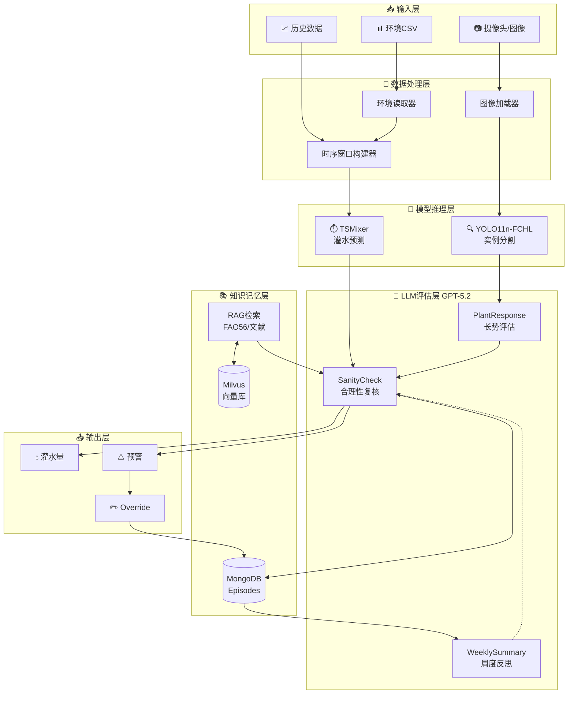
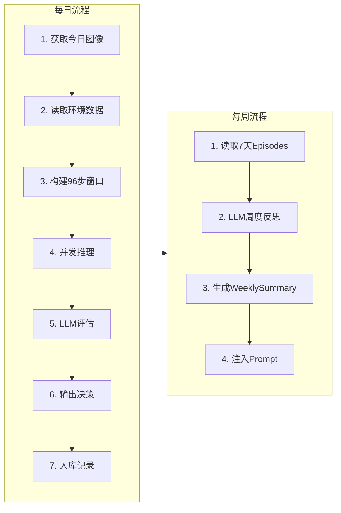
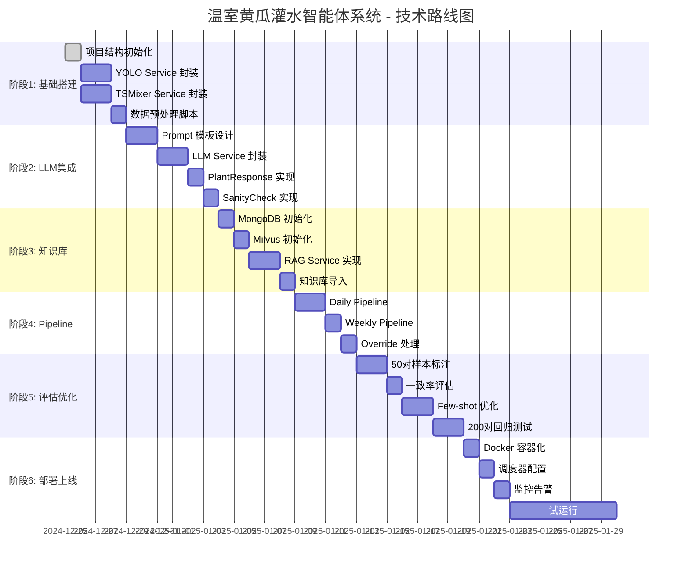

# 温室黄瓜灌水智能体系统 - 详细设计文档

> 版本：v1.0
> 更新日期：2024-12-25
> 文档状态：设计定稿

---

## 1. 系统架构

### 1.1 整体架构图

```
┌─────────────────────────────────────────────────────────────────────────────┐
│                           温室黄瓜灌水智能体系统                              │
├─────────────────────────────────────────────────────────────────────────────┤
│                                                                             │
│  ┌─────────────┐    ┌─────────────┐    ┌─────────────┐    ┌─────────────┐  │
│  │  📷 图像    │    │  🌡️ 环境    │    │  💧 历史    │    │  👨‍🌾 用户   │  │
│  │   输入      │    │   CSV      │    │   灌水量    │    │   交互      │  │
│  └──────┬──────┘    └──────┬──────┘    └──────┬──────┘    └──────┬──────┘  │
│         │                  │                  │                  │         │
│         ▼                  ▼                  ▼                  ▼         │
│  ┌─────────────────────────────────────────────────────────────────────┐   │
│  │                        数据采集与预处理层                            │   │
│  │  ┌─────────┐  ┌─────────────┐  ┌─────────────┐  ┌─────────────┐    │   │
│  │  │ 图像    │  │  环境数据   │  │  时序窗口   │  │  数据验证   │    │   │
│  │  │ 加载器  │  │  读取器     │  │  构建器     │  │  器         │    │   │
│  │  └────┬────┘  └──────┬──────┘  └──────┬──────┘  └─────────────┘    │   │
│  └───────┼──────────────┼───────────────┼────────────────────────────┘   │
│          │              │               │                                 │
│          ▼              ▼               ▼                                 │
│  ┌─────────────────────────────────────────────────────────────────────┐   │
│  │                        模型推理层 (线程池并发)                        │   │
│  │                                                                     │   │
│  │  ┌───────────────────┐          ┌───────────────────┐              │   │
│  │  │  🔍 YOLO Service  │          │  ⏱️ TSMixer Service│              │   │
│  │  │                   │          │                   │              │   │
│  │  │  - 图像分块       │          │  - 时序输入       │              │   │
│  │  │  - 实例分割       │          │  - 灌水预测       │              │   │
│  │  │  - 指标提取       │          │  - 反标准化       │              │   │
│  │  │                   │          │                   │              │   │
│  │  │  权重: best.pt    │          │  权重: model.pt   │              │   │
│  │  └─────────┬─────────┘          └─────────┬─────────┘              │   │
│  │            │                              │                         │   │
│  └────────────┼──────────────────────────────┼─────────────────────────┘   │
│               │                              │                             │
│               ▼                              ▼                             │
│  ┌─────────────────────────────────────────────────────────────────────┐   │
│  │                        LLM 评估层 (GPT-5.2)                          │   │
│  │                                                                     │   │
│  │  ┌─────────────────┐  ┌─────────────────┐  ┌─────────────────┐     │   │
│  │  │  PlantResponse  │  │  SanityCheck    │  │ WeeklySummary   │     │   │
│  │  │  长势评估       │──▶│  合理性复核    │  │  周度反思       │     │   │
│  │  └─────────────────┘  └────────┬────────┘  └─────────────────┘     │   │
│  │                                │                                    │   │
│  └────────────────────────────────┼────────────────────────────────────┘   │
│                                   │                                        │
│                                   ▼                                        │
│  ┌─────────────────────────────────────────────────────────────────────┐   │
│  │                        知识与记忆层                                   │   │
│  │                                                                     │   │
│  │  ┌───────────────┐  ┌───────────────┐  ┌───────────────┐          │   │
│  │  │  📚 RAG       │  │  🧠 MongoDB   │  │  🔢 Milvus    │          │   │
│  │  │  知识检索     │  │  Episode存储  │  │  向量检索     │          │   │
│  │  └───────────────┘  └───────────────┘  └───────────────┘          │   │
│  │                                                                     │   │
│  └─────────────────────────────────────────────────────────────────────┘   │
│                                                                             │
│  ┌─────────────────────────────────────────────────────────────────────┐   │
│  │                        输出与反馈层                                   │   │
│  │                                                                     │   │
│  │  ┌─────────┐  ┌─────────┐  ┌─────────┐  ┌─────────┐              │   │
│  │  │ 灌水量  │  │  预警   │  │ Override│  │  日志   │              │   │
│  │  │ 输出    │  │  展示   │  │  记录   │  │  记录   │              │   │
│  │  └─────────┘  └─────────┘  └─────────┘  └─────────┘              │   │
│  │                                                                     │   │
│  └─────────────────────────────────────────────────────────────────────┘   │
│                                                                             │
└─────────────────────────────────────────────────────────────────────────────┘
```

### 1.2 技术架构图 (Mermaid)



### 1.3 数据流图



---

## 2. 目录结构设计

```
cucumber-irrigation/
├── 📁 configs/                          # 配置文件
│   ├── settings.yaml                    # 全局配置
│   ├── models.yaml                      # 模型配置
│   ├── rules.yaml                       # 业务规则
│   └── 📁 schema/                       # JSON Schema
│       ├── episode.schema.json
│       ├── plant_response.schema.json
│       ├── sanity_check.schema.json
│       └── weekly_summary.schema.json
│
├── 📁 data/                             # 数据目录
│   ├── 📁 images/                       # 原始图像
│   │   └── *.jpg                        # MMDD.jpg 命名
│   ├── 📁 csv/                          # CSV 数据
│   │   └── irrigation.csv               # 环境+YOLO+灌水量
│   ├── 📁 processed/                    # 处理后数据
│   │   ├── yolo_metrics.csv             # YOLO 提取指标
│   │   ├── pairs_index.json             # 日期配对索引
│   │   └── episodes/                    # 导出的 Episodes
│   └── 📁 knowledge/                    # 知识库文档
│       ├── fao56/                       # FAO56 文档
│       └── literature/                  # 参考文献
│
├── 📁 prompts/                          # Prompt 模板
│   ├── 📁 plant_response/
│   │   ├── system_v1.txt
│   │   ├── user_v1.txt
│   │   └── examples_v1.jsonl
│   ├── 📁 sanity_check/
│   │   ├── system_v1.txt
│   │   ├── user_v1.txt
│   │   └── examples_v1.jsonl
│   └── 📁 weekly_reflection/
│       ├── system_v1.txt
│       ├── user_v1.txt
│       └── examples_v1.jsonl
│
├── 📁 src/                              # 源代码
│   ├── 📁 services/                     # 核心服务
│   │   ├── __init__.py
│   │   ├── yolo_service.py              # YOLO 推理服务
│   │   ├── tsmixer_service.py           # TSMixer 预测服务
│   │   ├── llm_service.py               # LLM 调用服务
│   │   ├── rag_service.py               # RAG 检索服务
│   │   └── db_service.py                # 数据库服务
│   │
│   ├── 📁 pipelines/                    # 流程管道
│   │   ├── __init__.py
│   │   ├── daily_pipeline.py            # 每日推理流程
│   │   ├── weekly_pipeline.py           # 每周反思流程
│   │   └── batch_pipeline.py            # 批量处理流程
│   │
│   ├── 📁 models/                       # 数据模型
│   │   ├── __init__.py
│   │   ├── episode.py                   # Episode 模型
│   │   ├── plant_response.py            # PlantResponse 模型
│   │   ├── sanity_check.py              # SanityCheck 模型
│   │   └── weekly_summary.py            # WeeklySummary 模型
│   │
│   ├── 📁 utils/                        # 工具函数
│   │   ├── __init__.py
│   │   ├── image_utils.py               # 图像处理
│   │   ├── data_utils.py                # 数据处理
│   │   ├── prompt_utils.py              # Prompt 构建
│   │   └── validation.py                # 数据验证
│   │
│   ├── 📁 scripts/                      # 独立脚本
│   │   ├── build_index.py               # 构建日期索引
│   │   ├── build_pairs.py               # 构建配对数据
│   │   ├── yolo_batch.py                # YOLO 批量推理
│   │   ├── tsmixer_batch.py             # TSMixer 批量预测
│   │   ├── init_knowledge.py            # 初始化知识库
│   │   └── eval_consistency.py          # 一致性评估
│   │
│   ├── run_daily.py                     # 每日运行入口
│   ├── run_weekly.py                    # 每周运行入口
│   └── main.py                          # 主程序入口
│
├── 📁 tests/                            # 测试
│   ├── test_yolo_service.py
│   ├── test_tsmixer_service.py
│   ├── test_llm_service.py
│   └── test_pipelines.py
│
├── 📁 db/                               # 数据库相关
│   ├── mongodb_collections.md           # 集合设计文档
│   ├── init_mongo.py                    # MongoDB 初始化
│   └── init_milvus.py                   # Milvus 初始化
│
├── 📁 docs/                             # 文档
│   ├── requirements.md                  # 需求文档
│   ├── design.md                        # 设计文档
│   ├── task.md                          # 任务文档
│   └── api.md                           # API 文档
│
├── 📁 logs/                             # 日志
│   └── .gitkeep
│
├── .env.example                         # 环境变量示例
├── requirements.txt                     # Python 依赖
├── docker-compose.yml                   # Docker 编排
└── README.md                            # 项目说明
```

---

## 3. 模块设计

### 3.1 YOLO Service

#### 3.1.1 类图

```python
class YOLOService:
    """YOLO 实例分割服务"""

    def __init__(self, model_path: str, device: str = "cuda"):
        self.model = YOLO(model_path)
        self.device = device
        self.tile_size = 640
        self.original_size = (2880, 1620)
        self.process_size = (3200, 1920)
        self.classes = ["leaf", "terminal", "flower", "fruit"]

    def preprocess(self, image: np.ndarray) -> List[np.ndarray]:
        """分块预处理：2880x1620 -> 3200x1920 -> 15个640x640块"""
        pass

    def infer_tile(self, tile: np.ndarray) -> Results:
        """单块推理"""
        pass

    def merge_results(self, results: List[Results]) -> Dict:
        """合并分块结果"""
        pass

    def extract_metrics(self, merged: Dict) -> YOLOMetrics:
        """提取结构化指标"""
        pass

    def infer(self, image_path: str) -> YOLOMetrics:
        """完整推理流程"""
        image = cv2.imread(image_path)
        tiles = self.preprocess(image)
        results = [self.infer_tile(t) for t in tiles]
        merged = self.merge_results(results)
        return self.extract_metrics(merged)

    def batch_infer(self, image_paths: List[str]) -> List[YOLOMetrics]:
        """批量推理"""
        return [self.infer(p) for p in image_paths]
```

#### 3.1.2 输出结构

```python
@dataclass
class YOLOMetrics:
    date: str
    leaf_instance_count: float
    leaf_average_mask: float
    flower_instance_count: float
    flower_mask_pixel_count: float
    terminal_average_mask: float
    fruit_mask_average: float
    all_leaf_mask: float

    def to_dict(self) -> Dict:
        return asdict(self)

    def to_csv_row(self) -> List:
        return [
            self.date,
            self.leaf_instance_count,
            self.leaf_average_mask,
            # ...
        ]
```

### 3.2 TSMixer Service

#### 3.2.1 类图

```python
class TSMixerService:
    """TSMixer 时序预测服务"""

    def __init__(
        self,
        model_path: str,
        scaler_path: str = None,
        seq_len: int = 96,
        pred_len: int = 1,
        feature_dim: int = 11
    ):
        self.model = self._load_model(model_path)
        self.scaler = self._load_scaler(scaler_path)
        self.seq_len = seq_len
        self.pred_len = pred_len
        self.feature_dim = feature_dim

    def _load_model(self, path: str) -> nn.Module:
        """加载模型权重"""
        pass

    def _load_scaler(self, path: str) -> StandardScaler:
        """加载标准化器"""
        pass

    def build_window(self, data: pd.DataFrame, target_date: str) -> np.ndarray:
        """构建96步时序窗口"""
        # 获取 target_date 之前的 96 天数据
        pass

    def predict(self, window: np.ndarray) -> float:
        """
        预测灌水量

        Args:
            window: shape [96, 11]
        Returns:
            反标准化后的灌水量
        """
        # 标准化
        window_scaled = self.scaler.transform(window)

        # 转 tensor
        x = torch.tensor(window_scaled).unsqueeze(0).float()

        # 推理
        with torch.no_grad():
            pred = self.model(x)

        # 反标准化
        pred_denorm = self.scaler.inverse_transform(pred)

        return float(pred_denorm[0, 0, -1])  # Target 列

    def predict_from_csv(self, csv_path: str, target_date: str) -> float:
        """从 CSV 读取数据并预测"""
        df = pd.read_csv(csv_path)
        window = self.build_window(df, target_date)
        return self.predict(window)
```

#### 3.2.2 时序窗口构建

```python
def build_window(data: pd.DataFrame, target_date: str) -> np.ndarray:
    """
    构建时序窗口

    Features (11列):
    - temperature
    - humidity
    - light
    - leaf_instance_count
    - leaf_average_mask
    - flower_instance_count
    - flower_mask_pixel_count
    - terminal_average_mask
    - fruit_mask_average
    - all_leaf_mask
    - Target (历史灌水量)
    """
    # 解析目标日期
    target_dt = pd.to_datetime(target_date)

    # 过滤目标日期之前的数据
    data['date'] = pd.to_datetime(data['date'])
    historical = data[data['date'] < target_dt].tail(96)

    # 提取特征列
    feature_cols = [
        'temperature', 'humidity', 'light',
        'leaf Instance Count', 'leaf average mask',
        'flower Instance Count', 'flower Mask Pixel Count',
        'terminal average Mask Pixel Count', 'fruit Mask average',
        'all leaf mask', 'Target'
    ]

    window = historical[feature_cols].values

    # 如果不足96步，前向填充
    if len(window) < 96:
        padding = np.tile(window[0], (96 - len(window), 1))
        window = np.vstack([padding, window])

    return window  # shape: [96, 11]
```

### 3.3 LLM Service

#### 3.3.1 类图

```python
class LLMService:
    """GPT-5.2 LLM 服务"""

    def __init__(
        self,
        api_key: str,
        model: str = "gpt-5.2",
        temperature: float = 0.3,
        prompt_dir: str = "prompts/"
    ):
        self.client = OpenAI(api_key=api_key)
        self.model = model
        self.temperature = temperature
        self.prompt_dir = Path(prompt_dir)
        self.prompt_cache = {}

    def _load_prompt(self, task: str, version: str = "v1") -> Tuple[str, str]:
        """加载 system/user prompt"""
        task_dir = self.prompt_dir / task
        system = (task_dir / f"system_{version}.txt").read_text()
        user = (task_dir / f"user_{version}.txt").read_text()
        return system, user

    def _load_examples(self, task: str, version: str = "v1") -> List[Dict]:
        """加载 few-shot 示例"""
        examples_file = self.prompt_dir / task / f"examples_{version}.jsonl"
        examples = []
        with open(examples_file) as f:
            for line in f:
                examples.append(json.loads(line))
        return examples

    def _build_messages(
        self,
        system: str,
        user: str,
        examples: List[Dict] = None,
        weekly_summary: Dict = None
    ) -> List[Dict]:
        """构建消息列表"""
        messages = [{"role": "system", "content": system}]

        # 注入 weekly_summary (波动 Prompt)
        if weekly_summary:
            summary_text = self._format_weekly_summary(weekly_summary)
            messages[0]["content"] += f"\n\n## 近期总结\n{summary_text}"

        # 添加 few-shot 示例
        if examples:
            for ex in examples:
                messages.append({"role": "user", "content": ex["user"]})
                messages.append({"role": "assistant", "content": ex["assistant"]})

        # 添加当前请求
        messages.append({"role": "user", "content": user})

        return messages

    def evaluate_plant(
        self,
        image_today: str,
        image_yesterday: str,
        yolo_today: YOLOMetrics,
        yolo_yesterday: YOLOMetrics
    ) -> PlantResponse:
        """
        长势评估

        对比今日与昨日图像，结合 YOLO 指标评估植物长势
        """
        system, user_template = self._load_prompt("plant_response")
        examples = self._load_examples("plant_response")

        # 图像 base64 编码
        img_today_b64 = self._encode_image(image_today)
        img_yesterday_b64 = self._encode_image(image_yesterday)

        # 填充 user prompt
        user = user_template.format(
            yolo_today=json.dumps(yolo_today.to_dict(), indent=2),
            yolo_yesterday=json.dumps(yolo_yesterday.to_dict(), indent=2)
        )

        messages = self._build_messages(system, user, examples)

        # 添加图像
        messages[-1]["content"] = [
            {"type": "text", "text": user},
            {"type": "image_url", "image_url": {"url": f"data:image/jpeg;base64,{img_yesterday_b64}"}},
            {"type": "image_url", "image_url": {"url": f"data:image/jpeg;base64,{img_today_b64}"}}
        ]

        response = self.client.chat.completions.create(
            model=self.model,
            messages=messages,
            temperature=self.temperature,
            response_format={"type": "json_object"}
        )

        return PlantResponse.from_dict(json.loads(response.choices[0].message.content))

    def sanity_check(
        self,
        plant_response: PlantResponse,
        tsmixer_pred: float,
        rag_context: List[str],
        weekly_summary: WeeklySummaryBlock = None
    ) -> SanityCheck:
        """
        合理性复核

        基于长势评估、TSMixer 预测值、RAG 建议进行复核
        """
        system, user_template = self._load_prompt("sanity_check")
        examples = self._load_examples("sanity_check")

        user = user_template.format(
            plant_response=json.dumps(plant_response.to_dict(), indent=2),
            tsmixer_pred=tsmixer_pred,
            rag_context="\n".join([f"- {c}" for c in rag_context])
        )

        messages = self._build_messages(system, user, examples, weekly_summary)

        response = self.client.chat.completions.create(
            model=self.model,
            messages=messages,
            temperature=self.temperature,
            response_format={"type": "json_object"}
        )

        return SanityCheck.from_dict(json.loads(response.choices[0].message.content))

    def weekly_reflect(
        self,
        episodes: List[Episode]
    ) -> WeeklySummaryBlock:
        """
        周度反思

        总结过去7天的规律、风险触发条件、override情况
        """
        system, user_template = self._load_prompt("weekly_reflection")
        examples = self._load_examples("weekly_reflection")

        episodes_summary = self._format_episodes_for_reflection(episodes)
        user = user_template.format(episodes=episodes_summary)

        messages = self._build_messages(system, user, examples)

        response = self.client.chat.completions.create(
            model=self.model,
            messages=messages,
            temperature=self.temperature,
            response_format={"type": "json_object"}
        )

        return WeeklySummaryBlock.from_dict(json.loads(response.choices[0].message.content))
```

### 3.4 RAG Service

#### 3.4.1 类图

```python
class RAGService:
    """RAG 知识检索服务"""

    def __init__(
        self,
        milvus_host: str = "localhost",
        milvus_port: int = 19530,
        collection_name: str = "knowledge_vectors",
        embedding_model: str = "text-embedding-ada-002",
        mongodb_uri: str = "mongodb://localhost:27017"
    ):
        self.milvus = connections.connect(host=milvus_host, port=milvus_port)
        self.collection = Collection(collection_name)
        self.embedding_client = OpenAI()
        self.embedding_model = embedding_model
        self.mongo = MongoClient(mongodb_uri)
        self.db = self.mongo["cucumber_irrigation"]

    def embed_text(self, text: str) -> List[float]:
        """文本向量化"""
        response = self.embedding_client.embeddings.create(
            model=self.embedding_model,
            input=text
        )
        return response.data[0].embedding

    def search(
        self,
        query: str,
        top_k: int = 5,
        filters: Dict = None
    ) -> List[RAGResult]:
        """
        相似检索

        Returns:
            List of RAGResult with doc_id, snippet, relevance_score
        """
        query_vec = self.embed_text(query)

        search_params = {"metric_type": "IP", "params": {"nprobe": 10}}

        results = self.collection.search(
            data=[query_vec],
            anns_field="embedding",
            param=search_params,
            limit=top_k,
            expr=self._build_filter_expr(filters) if filters else None,
            output_fields=["doc_id", "snippet", "source"]
        )

        return [
            RAGResult(
                doc_id=hit.entity.get("doc_id"),
                snippet=hit.entity.get("snippet"),
                relevance_score=hit.score,
                source=hit.entity.get("source")
            )
            for hit in results[0]
        ]

    def record_feedback(
        self,
        doc_id: str,
        user_rating: Optional[int],
        user_note: Optional[str],
        episode_date: str
    ):
        """记录用户反馈"""
        self.db["rag_feedback"].insert_one({
            "doc_id": doc_id,
            "user_rating": user_rating,
            "user_note": user_note,
            "episode_date": episode_date,
            "created_at": datetime.utcnow()
        })

    def index_document(
        self,
        doc_id: str,
        text: str,
        source: str,
        metadata: Dict = None
    ):
        """索引新文档"""
        # 分块
        chunks = self._chunk_text(text, chunk_size=512, overlap=64)

        for i, chunk in enumerate(chunks):
            chunk_id = f"{doc_id}_chunk_{i}"
            embedding = self.embed_text(chunk)

            self.collection.insert([{
                "doc_id": chunk_id,
                "snippet": chunk,
                "source": source,
                "embedding": embedding,
                **(metadata or {})
            }])
```

### 3.5 DB Service

#### 3.5.1 MongoDB 集合设计

```python
class DBService:
    """数据库服务"""

    COLLECTIONS = {
        "episodes": {
            "description": "每日决策记录",
            "indexes": [
                {"keys": [("date", 1)], "unique": True},
                {"keys": [("final_decision.source", 1)]},
                {"keys": [("metadata.created_at", -1)]}
            ]
        },
        "overrides": {
            "description": "人工覆盖记录",
            "indexes": [
                {"keys": [("date", 1)]},
                {"keys": [("reason", "text")]}
            ]
        },
        "weekly_summaries": {
            "description": "周度总结",
            "indexes": [
                {"keys": [("week_start", 1)], "unique": True}
            ]
        },
        "rag_feedback": {
            "description": "RAG检索反馈",
            "indexes": [
                {"keys": [("doc_id", 1)]},
                {"keys": [("episode_date", 1)]}
            ]
        },
        "knowledge_docs": {
            "description": "知识文档元数据",
            "indexes": [
                {"keys": [("source", 1)]},
                {"keys": [("title", "text")]}
            ]
        }
    }

    def __init__(self, uri: str = "mongodb://localhost:27017"):
        self.client = MongoClient(uri)
        self.db = self.client["cucumber_irrigation"]

    def save_episode(self, episode: Episode) -> str:
        """保存 Episode，缺失字段用 null"""
        doc = episode.to_dict()
        # 确保所有字段存在，缺失用 None
        doc = self._fill_nulls(doc)
        result = self.db["episodes"].update_one(
            {"date": doc["date"]},
            {"$set": doc},
            upsert=True
        )
        return str(result.upserted_id or doc["date"])

    def save_override(
        self,
        date: str,
        original_value: float,
        replaced_value: float,
        reason: str
    ) -> str:
        """保存 Override 记录"""
        doc = {
            "date": date,
            "original_value": original_value,
            "replaced_value": replaced_value,
            "reason": reason,
            "created_at": datetime.utcnow()
        }
        result = self.db["overrides"].insert_one(doc)
        return str(result.inserted_id)

    def get_recent_episodes(self, days: int = 7) -> List[Episode]:
        """获取最近 N 天的 Episodes"""
        cutoff = datetime.utcnow() - timedelta(days=days)
        docs = self.db["episodes"].find(
            {"metadata.created_at": {"$gte": cutoff}}
        ).sort("date", -1)
        return [Episode.from_dict(d) for d in docs]

    def save_weekly_summary(self, summary: WeeklySummaryBlock) -> str:
        """保存周度总结"""
        doc = summary.to_dict()
        result = self.db["weekly_summaries"].update_one(
            {"week_start": doc["week_start"]},
            {"$set": doc},
            upsert=True
        )
        return str(result.upserted_id or doc["week_start"])

    def get_latest_weekly_summary(self) -> Optional[WeeklySummaryBlock]:
        """获取最新的周度总结"""
        doc = self.db["weekly_summaries"].find_one(
            sort=[("week_start", -1)]
        )
        return WeeklySummaryBlock.from_dict(doc) if doc else None
```

---

## 4. Pipeline 设计

### 4.1 Daily Pipeline

```python
class DailyPipeline:
    """每日推理流程"""

    def __init__(
        self,
        yolo_service: YOLOService,
        tsmixer_service: TSMixerService,
        llm_service: LLMService,
        rag_service: RAGService,
        db_service: DBService,
        config: Dict
    ):
        self.yolo = yolo_service
        self.tsmixer = tsmixer_service
        self.llm = llm_service
        self.rag = rag_service
        self.db = db_service
        self.config = config
        self.executor = ThreadPoolExecutor(max_workers=4)

    def run(self, target_date: str) -> Episode:
        """
        执行每日推理流程

        Args:
            target_date: 目标日期 "YYYY-MM-DD"

        Returns:
            完整的 Episode 记录
        """
        logger.info(f"Starting daily pipeline for {target_date}")

        # 1. 获取图像路径
        image_today = self._get_image_path(target_date)
        image_yesterday = self._get_image_path(self._prev_date(target_date))

        # 2. 并发执行 YOLO 和 TSMixer
        with self.executor:
            future_yolo_today = self.executor.submit(self.yolo.infer, image_today)
            future_yolo_yesterday = self.executor.submit(self.yolo.infer, image_yesterday)
            future_tsmixer = self.executor.submit(
                self.tsmixer.predict_from_csv,
                self.config["csv_path"],
                target_date
            )

            yolo_today = future_yolo_today.result()
            yolo_yesterday = future_yolo_yesterday.result()
            tsmixer_pred = future_tsmixer.result()

        # 3. LLM 长势评估
        plant_response = self.llm.evaluate_plant(
            image_today, image_yesterday,
            yolo_today, yolo_yesterday
        )

        # 4. RAG 检索相关建议
        rag_query = self._build_rag_query(plant_response, tsmixer_pred)
        rag_results = self.rag.search(rag_query, top_k=3)
        rag_context = [r.snippet for r in rag_results]

        # 5. 获取最新周度总结
        weekly_summary = self.db.get_latest_weekly_summary()

        # 6. LLM 合理性复核
        sanity_check = self.llm.sanity_check(
            plant_response, tsmixer_pred,
            rag_context, weekly_summary
        )

        # 7. 构建 Episode
        episode = Episode(
            date=target_date,
            inputs={
                "image_path": image_today,
                "environment": self._get_env_data(target_date),
                "yolo_metrics": yolo_today.to_dict()
            },
            predictions={
                "tsmixer_raw": tsmixer_pred,
                "tsmixer_denorm": tsmixer_pred
            },
            llm_outputs={
                "plant_response": plant_response.to_dict(),
                "sanity_check": sanity_check.to_dict()
            },
            final_decision={
                "value": sanity_check.decision.final_value,
                "source": "tsmixer" if sanity_check.decision.accept else "pending",
                "override_reason": None
            },
            feedback={
                "rag_ratings": [],
                "farmer_notes": None
            },
            metadata={
                "created_at": datetime.utcnow().isoformat(),
                "model_versions": {
                    "yolo": self.config["yolo_version"],
                    "tsmixer": self.config["tsmixer_version"]
                }
            }
        )

        # 8. 保存 Episode
        self.db.save_episode(episode)

        # 9. 检查是否需要人工确认
        if sanity_check.requires_confirmation:
            self._notify_farmer(episode, sanity_check)

        logger.info(f"Daily pipeline completed for {target_date}")
        return episode

    def handle_override(
        self,
        date: str,
        replaced_value: float,
        reason: str
    ) -> Episode:
        """处理人工覆盖"""
        # 获取原 Episode
        episode = self.db.get_episode(date)
        original_value = episode.final_decision["value"]

        # 更新 Episode
        episode.final_decision = {
            "value": replaced_value,
            "source": "override",
            "override_reason": reason
        }

        # 保存 Override 记录
        self.db.save_override(date, original_value, replaced_value, reason)

        # 更新 Episode
        self.db.save_episode(episode)

        return episode
```

### 4.2 Weekly Pipeline

```python
class WeeklyPipeline:
    """每周反思流程"""

    def __init__(
        self,
        llm_service: LLMService,
        db_service: DBService,
        prompt_dir: str
    ):
        self.llm = llm_service
        self.db = db_service
        self.prompt_dir = Path(prompt_dir)

    def run(self) -> WeeklySummaryBlock:
        """
        执行每周反思流程

        Returns:
            WeeklySummaryBlock 周度总结
        """
        logger.info("Starting weekly reflection pipeline")

        # 1. 获取过去 7 天的 Episodes
        episodes = self.db.get_recent_episodes(days=7)

        if len(episodes) < 3:
            logger.warning("Not enough episodes for weekly reflection")
            return None

        # 2. LLM 周度反思
        weekly_summary = self.llm.weekly_reflect(episodes)

        # 3. 保存周度总结
        self.db.save_weekly_summary(weekly_summary)

        # 4. 更新动态 Prompt (波动 Prompt)
        self._update_dynamic_prompt(weekly_summary)

        logger.info("Weekly reflection completed")
        return weekly_summary

    def _update_dynamic_prompt(self, summary: WeeklySummaryBlock):
        """将周度总结注入 Prompt 模板"""
        # 生成可注入的文本块
        injection_text = self._format_for_injection(summary)

        # 写入动态 Prompt 文件
        dynamic_file = self.prompt_dir / "dynamic" / "weekly_context.txt"
        dynamic_file.parent.mkdir(exist_ok=True)
        dynamic_file.write_text(injection_text)
```

---

## 5. Prompt 设计

### 5.1 PlantResponse Prompt

#### system_v1.txt

```
你是一位专业的温室作物长势评估专家。你的任务是对比今日与昨日的黄瓜作物监控图像，结合 YOLO 实例分割指标，输出结构化的长势评估报告。

## 输出要求

你必须输出严格的 JSON 格式，符合以下 Schema：

```json
{
  "date": "string (YYYY-MM-DD)",
  "comparison": {
    "trend": "better|same|worse",
    "confidence": "float (0-1)",
    "evidence": "string (具体证据描述)"
  },
  "abnormalities": {
    "wilting": "boolean|null",
    "yellowing": "boolean|null",
    "pest_damage": "boolean|string|null",
    "other": "string|null"
  },
  "growth_stage": "vegetative|flowering|fruiting|mixed",
  "key_observations": ["string array, 2-4 条关键观察"]
}
```

## 评估维度

1. **趋势判断 (trend)**
   - better: 叶片面积增加、新增顶芽/花朵/果实、整体更翠绿
   - same: 无明显变化
   - worse: 叶片面积减少、萎蔫迹象、黄化增加

2. **异常检测 (abnormalities)**
   - wilting: 叶片下垂、边缘卷曲
   - yellowing: 叶片黄化、叶脉间失绿
   - pest_damage: 虫孔、斑点、粉状物
   - 如果无法确定，填 null

3. **生长阶段 (growth_stage)**
   - vegetative: 营养生长期（主要长叶）
   - flowering: 开花期（花朵出现）
   - fruiting: 结果期（果实发育）
   - mixed: 多阶段混合

## 注意事项

- 优先使用 YOLO 指标作为客观依据
- 图像对比时注意光照差异可能导致的视觉偏差
- 置信度应反映你的判断确定程度
- evidence 字段要具体，引用具体数值变化
```

#### user_v1.txt

```
请对比以下两张监控图像（昨日 vs 今日）并结合 YOLO 分割指标进行长势评估。

## 昨日 YOLO 指标
{yolo_yesterday}

## 今日 YOLO 指标
{yolo_today}

请输出 JSON 格式的 PlantResponse。
```

### 5.2 SanityCheck Prompt

#### system_v1.txt

```
你是一位温室灌溉决策专家。你的任务是对 TSMixer 模型预测的灌水量进行合理性复核，结合植物长势评估和专业知识给出最终建议。

## 输出要求

你必须输出严格的 JSON 格式：

```json
{
  "date": "string (YYYY-MM-DD)",
  "tsmixer_pred": "float",
  "decision": {
    "accept": "boolean",
    "final_value": "float",
    "adjustment_reason": "string|null"
  },
  "risk_assessment": {
    "level": "low|medium|high|critical",
    "factors": ["string array"],
    "confidence": "float (0-1)"
  },
  "requires_confirmation": "boolean",
  "questions_for_farmer": ["string array, 0-3 个问题"],
  "rag_references": [
    {
      "doc_id": "string",
      "snippet": "string",
      "relevance_score": "float",
      "user_rating": "null"
    }
  ]
}
```

## 复核逻辑

### 接受 TSMixer 预测的情况 (accept: true)
- 预测值在合理范围内 (0.1 - 20 L/m²)
- 与长势评估一致（长势好→水量适中/偏高，长势差→水量偏低）
- 无明显异常因素

### 需要调整的情况 (accept: false)
- 预测值超出合理范围
- 与长势评估矛盾
- 存在异常天气（暴雨、高温）
- 植物有萎蔫/黄化/病害迹象

### 风险等级定义
- low: 正常运行，无需额外关注
- medium: 需要关注，但可按预测执行
- high: 建议人工确认后执行
- critical: 必须人工介入，暂停自动执行

## 重要原则

1. 不要发明新的灌水计算公式
2. 灌水量以 TSMixer 预测为基准
3. 你的角色是评估和预警，不是计算
4. 如有不确定，倾向于要求人工确认

{weekly_context}
```

#### user_v1.txt

```
请对以下预测结果进行合理性复核：

## 植物长势评估
{plant_response}

## TSMixer 预测灌水量
{tsmixer_pred} L/m²

## RAG 检索到的相关建议
{rag_context}

请输出 JSON 格式的 SanityCheck。
```

### 5.3 WeeklyReflection Prompt

#### system_v1.txt

```
你是一位温室灌溉系统的周度分析专家。你的任务是总结过去 7 天的决策记录，提取规律、识别风险触发条件，并给出 Prompt 注入建议。

## 输出要求

```json
{
  "week_start": "string (YYYY-MM-DD)",
  "week_end": "string (YYYY-MM-DD)",
  "patterns": ["string array, 2-5 条规律"],
  "risk_triggers": ["string array, 2-4 条风险触发条件"],
  "overrides": [
    {
      "date": "string",
      "original": "float",
      "replaced": "float",
      "reason": "string"
    }
  ],
  "prompt_notes": ["string array, 1-3 条 Prompt 注入建议"],
  "statistics": {
    "avg_irrigation": "float",
    "max_irrigation": "float",
    "min_irrigation": "float",
    "override_rate": "float (0-1)"
  }
}
```

## 分析维度

1. **规律提取 (patterns)**
   - 灌水量与环境因素的相关性
   - 不同生长阶段的需水特征
   - 时间模式（工作日/周末差异等）

2. **风险触发条件 (risk_triggers)**
   - 导致高风险的环境组合
   - 需要人工确认的情况
   - Override 频繁的场景

3. **Prompt 注入建议 (prompt_notes)**
   - 本周需要特别关注的事项
   - 生长阶段转换提醒
   - 预警阈值调整建议

## 注意事项

- 基于实际数据提取规律，不要编造
- Override 记录反映了人工经验，要重点学习
- prompt_notes 将被注入后续决策的 Prompt
```

---

## 6. 数据结构设计

### 6.1 Episode Schema (完整版)

```json
{
  "$schema": "https://json-schema.org/draft/2020-12/schema",
  "title": "Episode",
  "type": "object",
  "required": ["date"],
  "properties": {
    "date": {
      "type": "string",
      "format": "date",
      "description": "日期 YYYY-MM-DD"
    },
    "inputs": {
      "type": "object",
      "properties": {
        "image_path": {"type": ["string", "null"]},
        "environment": {
          "type": ["object", "null"],
          "properties": {
            "temperature": {"type": ["number", "null"]},
            "humidity": {"type": ["number", "null"]},
            "light": {"type": ["number", "null"]}
          }
        },
        "yolo_metrics": {
          "type": ["object", "null"],
          "properties": {
            "leaf_instance_count": {"type": ["number", "null"]},
            "leaf_average_mask": {"type": ["number", "null"]},
            "flower_instance_count": {"type": ["number", "null"]},
            "flower_mask_pixel_count": {"type": ["number", "null"]},
            "terminal_average_mask": {"type": ["number", "null"]},
            "fruit_mask_average": {"type": ["number", "null"]},
            "all_leaf_mask": {"type": ["number", "null"]}
          }
        }
      }
    },
    "predictions": {
      "type": ["object", "null"],
      "properties": {
        "tsmixer_raw": {"type": ["number", "null"]},
        "tsmixer_denorm": {"type": ["number", "null"]}
      }
    },
    "llm_outputs": {
      "type": ["object", "null"],
      "properties": {
        "plant_response": {"$ref": "#/$defs/PlantResponse"},
        "sanity_check": {"$ref": "#/$defs/SanityCheck"}
      }
    },
    "final_decision": {
      "type": ["object", "null"],
      "properties": {
        "value": {"type": ["number", "null"]},
        "source": {"type": ["string", "null"], "enum": ["tsmixer", "override", "pending", null]},
        "override_reason": {"type": ["string", "null"]}
      }
    },
    "feedback": {
      "type": ["object", "null"],
      "properties": {
        "rag_ratings": {
          "type": ["array", "null"],
          "items": {
            "type": "object",
            "properties": {
              "doc_id": {"type": "string"},
              "rating": {"type": ["integer", "null"], "minimum": 1, "maximum": 5},
              "note": {"type": ["string", "null"]}
            }
          }
        },
        "farmer_notes": {"type": ["string", "null"]}
      }
    },
    "metadata": {
      "type": ["object", "null"],
      "properties": {
        "created_at": {"type": ["string", "null"], "format": "date-time"},
        "model_versions": {
          "type": ["object", "null"],
          "properties": {
            "yolo": {"type": ["string", "null"]},
            "tsmixer": {"type": ["string", "null"]}
          }
        }
      }
    }
  },
  "$defs": {
    "PlantResponse": {
      "type": ["object", "null"]
    },
    "SanityCheck": {
      "type": ["object", "null"]
    }
  }
}
```

### 6.2 配对索引结构

```json
{
  "pairs_index": {
    "description": "日期配对索引，用于 LLM 对比评估",
    "created_at": "2024-12-25T00:00:00Z",
    "pairs": [
      {
        "date": "2024-03-15",
        "today": {
          "image": "data/images/0315.jpg",
          "yolo_metrics": "data/processed/yolo_metrics.csv#row2"
        },
        "yesterday": {
          "image": "data/images/0314.jpg",
          "yolo_metrics": "data/processed/yolo_metrics.csv#row1"
        }
      }
    ]
  }
}
```

---

## 7. 配置设计

### 7.1 settings.yaml

```yaml
# 全局配置
app:
  name: "cucumber-irrigation-agent"
  version: "1.0.0"
  log_level: "INFO"
  log_dir: "logs/"

# 数据路径
data:
  images_dir: "data/images/"
  csv_path: "data/csv/irrigation.csv"
  processed_dir: "data/processed/"
  knowledge_dir: "data/knowledge/"

# 模型配置
models:
  yolo:
    weight_path: "../v11_4seg/runs/segment/jy_data_precoco_delive/exp21/weights/best.pt"
    device: "cuda"  # or "cpu"
    tile_size: 640
    original_size: [2880, 1620]
    process_size: [3200, 1920]
    classes: ["leaf", "terminal", "flower", "fruit"]
    version: "YOLO11n-FCHL-exp21"

  tsmixer:
    weight_path: "../Irrigation/model.pt"
    scaler_path: "../Irrigation/scaler.pkl"
    seq_len: 96
    pred_len: 1
    feature_dim: 11
    version: "TSMixer_sl96_pl1"

# LLM 配置
llm:
  provider: "openai"
  model: "gpt-5.2"
  temperature: 0.3
  max_tokens: 2000
  timeout: 30
  retry_attempts: 3
  retry_delay: 1

# 数据库配置
database:
  mongodb:
    uri: "mongodb://localhost:27017"
    database: "cucumber_irrigation"
  milvus:
    host: "localhost"
    port: 19530
    collection: "knowledge_vectors"

# RAG 配置
rag:
  embedding_model: "text-embedding-ada-002"
  top_k: 5
  chunk_size: 512
  chunk_overlap: 64

# Prompt 配置
prompts:
  dir: "prompts/"
  version: "v1"

# 调度配置
scheduler:
  daily_run_time: "06:00"
  weekly_run_day: "sunday"
  weekly_run_time: "20:00"
```

### 7.2 .env.example

```bash
# OpenAI API
OPENAI_API_KEY=your_api_key_here

# MongoDB
MONGODB_URI=mongodb://localhost:27017

# Milvus
MILVUS_HOST=localhost
MILVUS_PORT=19530

# 可选：GPU 设备
CUDA_VISIBLE_DEVICES=0

# 日志级别
LOG_LEVEL=INFO
```

---

## 8. 部署架构

### 8.1 Docker Compose

```yaml
version: '3.8'

services:
  app:
    build: .
    container_name: cucumber-irrigation
    volumes:
      - ./data:/app/data
      - ./logs:/app/logs
      - ./configs:/app/configs
    environment:
      - OPENAI_API_KEY=${OPENAI_API_KEY}
    depends_on:
      - mongodb
      - milvus
    networks:
      - cucumber-net

  mongodb:
    image: mongo:5.0
    container_name: cucumber-mongodb
    ports:
      - "27017:27017"
    volumes:
      - mongodb_data:/data/db
    networks:
      - cucumber-net

  milvus:
    image: milvusdb/milvus:v2.3.0
    container_name: cucumber-milvus
    ports:
      - "19530:19530"
    volumes:
      - milvus_data:/var/lib/milvus
    networks:
      - cucumber-net

volumes:
  mongodb_data:
  milvus_data:

networks:
  cucumber-net:
    driver: bridge
```

### 8.2 Dockerfile

```dockerfile
FROM python:3.10-slim

WORKDIR /app

# 安装系统依赖
RUN apt-get update && apt-get install -y \
    libgl1-mesa-glx \
    libglib2.0-0 \
    && rm -rf /var/lib/apt/lists/*

# 安装 Python 依赖
COPY requirements.txt .
RUN pip install --no-cache-dir -r requirements.txt

# 复制代码
COPY src/ ./src/
COPY prompts/ ./prompts/
COPY configs/ ./configs/

# 入口
CMD ["python", "src/main.py"]
```

---

## 9. 技术路线图



---

## 10. 附录

### 10.1 依赖列表 (requirements.txt)

```
# Core
python>=3.9

# Deep Learning
torch>=2.0.0
torchvision>=0.15.0
ultralytics>=8.0.0

# Data Processing
numpy>=1.24.0
pandas>=2.0.0
scikit-learn>=1.3.0
openpyxl>=3.1.0

# Image Processing
opencv-python>=4.8.0
Pillow>=10.0.0

# Database
pymongo>=4.5.0
pymilvus>=2.3.0

# LLM
openai>=1.3.0

# Configuration
pyyaml>=6.0
python-dotenv>=1.0.0

# Utilities
jsonschema>=4.19.0
pydantic>=2.5.0
loguru>=0.7.0

# Scheduling
schedule>=1.2.0
APScheduler>=3.10.0

# Testing
pytest>=7.4.0
pytest-asyncio>=0.21.0
```

### 10.2 错误码定义

| 错误码 | 描述 | 处理方式 |
|--------|------|----------|
| E001 | YOLO 推理失败 | 使用上一次成功的指标 |
| E002 | TSMixer 推理失败 | 使用历史均值 |
| E003 | LLM API 超时 | 重试 3 次后降级 |
| E004 | 数据库连接失败 | 本地缓存后重试 |
| E005 | 图像文件不存在 | 跳过当日，记录日志 |
| E006 | 时序窗口不足 | 前向填充 |

### 10.3 监控指标

| 指标 | 阈值 | 告警级别 |
|------|------|----------|
| 每日推理延迟 | > 60s | WARN |
| LLM API 错误率 | > 10% | ERROR |
| 数据库写入失败 | 任意 | CRITICAL |
| Override 率 | > 30% | INFO |
| 连续预测异常 | > 3天 | WARN |
