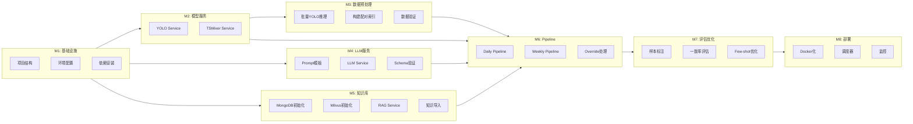

# 温室黄瓜灌水智能体系统 - 详细任务文档

> 版本：v1.0
> 更新日期：2024-12-25
> 文档状态：任务定稿

---

## 1. 任务总览

### 1.1 里程碑规划

| 里程碑 | 名称 | 关键交付物 | 依赖 |
|--------|------|-----------|------|
| M1 | 基础设施搭建 | 项目结构、环境配置 | 无 |
| M2 | 模型服务封装 | YOLO/TSMixer Service | M1 |
| M3 | 数据预处理 | 批量YOLO指标、配对索引 | M2 |
| M4 | LLM服务集成 | Prompt模板、LLM Service | M1 |
| M5 | 知识库构建 | MongoDB/Milvus、RAG Service | M1 |
| M6 | Pipeline实现 | Daily/Weekly Pipeline | M2,M4,M5 |
| M7 | 评估与优化 | 一致率>80%、few-shot优化 | M6 |
| M8 | 部署上线 | Docker、调度器、监控 | M7 |

### 1.2 任务依赖图



---

## 2. 阶段一：基础设施搭建 (M1)

### 任务 T1.1: 项目结构初始化

**目标**：创建完整的项目目录结构

**具体步骤**：

```bash
# 1. 创建目录结构
mkdir -p cucumber-irrigation/{configs/schema,data/{images,csv,processed,knowledge},prompts/{plant_response,sanity_check,weekly_reflection},src/{services,pipelines,models,utils,scripts},tests,db,docs,logs}

# 2. 创建 __init__.py 文件
touch cucumber-irrigation/src/__init__.py
touch cucumber-irrigation/src/services/__init__.py
touch cucumber-irrigation/src/pipelines/__init__.py
touch cucumber-irrigation/src/models/__init__.py
touch cucumber-irrigation/src/utils/__init__.py

# 3. 创建占位文件
touch cucumber-irrigation/logs/.gitkeep
touch cucumber-irrigation/data/processed/.gitkeep
```

**验收标准**：
- [ ] 目录结构符合 design.md 设计
- [ ] 所有 __init__.py 文件存在
- [ ] .gitkeep 占位文件存在

---

### 任务 T1.2: 环境配置

**目标**：配置开发环境和配置文件

**具体步骤**：

1. 创建 `.env.example`:

```bash
# OpenAI API
OPENAI_API_KEY=your_api_key_here

# MongoDB
MONGODB_URI=mongodb://localhost:27017

# Milvus
MILVUS_HOST=localhost
MILVUS_PORT=19530

# GPU
CUDA_VISIBLE_DEVICES=0

# Log
LOG_LEVEL=INFO
```

2. 创建 `configs/settings.yaml` (参考 design.md 7.1 节)

3. 创建 `.gitignore`:

```gitignore
# Python
__pycache__/
*.py[cod]
.venv/
venv/

# Environment
.env
*.log

# Data
data/processed/*
!data/processed/.gitkeep

# Models (large files)
*.pt
*.pth

# IDE
.idea/
.vscode/

# OS
.DS_Store
Thumbs.db
```

**验收标准**：
- [ ] .env.example 包含所有必需变量
- [ ] settings.yaml 配置完整
- [ ] .gitignore 配置正确

---

### 任务 T1.3: 依赖安装

**目标**：安装所有 Python 依赖

**具体步骤**：

1. 创建 `requirements.txt`:

```txt
# Core
torch>=2.0.0
torchvision>=0.15.0
ultralytics>=8.0.0

# Data
numpy>=1.24.0
pandas>=2.0.0
scikit-learn>=1.3.0
openpyxl>=3.1.0

# Image
opencv-python>=4.8.0
Pillow>=10.0.0

# Database
pymongo>=4.5.0
pymilvus>=2.3.0

# LLM
openai>=1.3.0

# Config
pyyaml>=6.0
python-dotenv>=1.0.0

# Validation
jsonschema>=4.19.0
pydantic>=2.5.0

# Logging
loguru>=0.7.0

# Scheduling
APScheduler>=3.10.0

# Testing
pytest>=7.4.0
```

2. 创建虚拟环境并安装:

```bash
python -m venv .venv
.venv\Scripts\activate  # Windows
pip install -r requirements.txt
```

**验收标准**：
- [ ] 虚拟环境创建成功
- [ ] 所有依赖安装成功
- [ ] `import torch, ultralytics, openai` 无报错

---

## 3. 阶段二：模型服务封装 (M2)

### 任务 T2.1: YOLO Service 封装

**目标**：封装 YOLO11n-FCHL 推理服务

**文件**：`src/services/yolo_service.py`

**具体步骤**：

1. 实现图像分块逻辑:

```python
# src/services/yolo_service.py

import cv2
import numpy as np
from pathlib import Path
from dataclasses import dataclass, asdict
from typing import List, Dict, Optional
from ultralytics import YOLO
import logging

logger = logging.getLogger(__name__)

@dataclass
class YOLOMetrics:
    """YOLO 提取的结构化指标"""
    date: str
    leaf_instance_count: float
    leaf_average_mask: float
    flower_instance_count: float
    flower_mask_pixel_count: float
    terminal_average_mask: float
    fruit_mask_average: float
    all_leaf_mask: float

    def to_dict(self) -> Dict:
        return asdict(self)


class YOLOService:
    """YOLO 实例分割服务"""

    CLASSES = ["leaf", "terminal", "flower", "fruit"]
    CLASS_COLORS = {
        "leaf": (0, 0, 255),      # 红色
        "terminal": (0, 150, 150), # 黄色
        "flower": (0, 255, 0),    # 绿色
        "fruit": (255, 0, 0)      # 蓝色
    }

    def __init__(
        self,
        model_path: str,
        device: str = "cuda",
        tile_size: int = 640,
        original_size: tuple = (2880, 1620),
        process_size: tuple = (3200, 1920)
    ):
        self.model = YOLO(model_path)
        self.device = device
        self.tile_size = tile_size
        self.original_size = original_size
        self.process_size = process_size
        self.grid = (3, 5)  # 3行5列 = 15块

    def preprocess(self, image: np.ndarray) -> List[np.ndarray]:
        """
        图像预处理：缩放并分块

        Args:
            image: 原始图像 (2880×1620)
        Returns:
            15个 640×640 的图像块
        """
        # 缩放到 3200×1920
        resized = cv2.resize(image, self.process_size)

        tiles = []
        rows, cols = self.grid
        for r in range(rows):
            for c in range(cols):
                y1 = r * self.tile_size
                y2 = y1 + self.tile_size
                x1 = c * self.tile_size
                x2 = x1 + self.tile_size
                tile = resized[y1:y2, x1:x2]
                tiles.append(tile)

        return tiles

    def infer_tile(self, tile: np.ndarray):
        """单块推理"""
        results = self.model(tile, device=self.device, verbose=False)
        return results[0]

    def extract_metrics(self, all_results: List) -> Dict[str, Dict]:
        """
        从所有分块结果提取指标

        Returns:
            {class_name: {count, mask_pixels, instances}}
        """
        metrics = {cls: {"count": 0, "mask_pixels": 0, "instances": []}
                   for cls in self.CLASSES}

        for result in all_results:
            if result.masks is None:
                continue

            for i, cls_id in enumerate(result.boxes.cls.cpu().numpy()):
                cls_name = self.CLASSES[int(cls_id)]
                mask = result.masks.data[i].cpu().numpy()
                mask_pixels = np.sum(mask > 0.5)

                metrics[cls_name]["count"] += 1
                metrics[cls_name]["mask_pixels"] += mask_pixels
                metrics[cls_name]["instances"].append(mask_pixels)

        return metrics

    def compute_yolo_metrics(self, raw_metrics: Dict, date: str) -> YOLOMetrics:
        """计算最终的 YOLO 指标"""
        leaf = raw_metrics["leaf"]
        flower = raw_metrics["flower"]
        terminal = raw_metrics["terminal"]
        fruit = raw_metrics["fruit"]

        return YOLOMetrics(
            date=date,
            leaf_instance_count=leaf["count"] / 16,  # 平均每块
            leaf_average_mask=(
                np.mean(leaf["instances"]) if leaf["instances"] else 0
            ),
            flower_instance_count=flower["count"] / 16,
            flower_mask_pixel_count=flower["mask_pixels"],
            terminal_average_mask=(
                np.mean(terminal["instances"]) if terminal["instances"] else 0
            ),
            fruit_mask_average=(
                np.mean(fruit["instances"]) if fruit["instances"] else 0
            ),
            all_leaf_mask=leaf["mask_pixels"]
        )

    def infer(self, image_path: str) -> YOLOMetrics:
        """
        完整推理流程

        Args:
            image_path: 图像路径
        Returns:
            YOLOMetrics 结构化指标
        """
        # 从路径提取日期
        date = self._extract_date(image_path)

        # 读取图像
        image = cv2.imread(image_path)
        if image is None:
            raise FileNotFoundError(f"Image not found: {image_path}")

        # 分块
        tiles = self.preprocess(image)

        # 推理每块
        all_results = [self.infer_tile(t) for t in tiles]

        # 提取指标
        raw_metrics = self.extract_metrics(all_results)

        # 计算最终指标
        return self.compute_yolo_metrics(raw_metrics, date)

    def batch_infer(self, image_paths: List[str]) -> List[YOLOMetrics]:
        """批量推理"""
        results = []
        for path in image_paths:
            try:
                metrics = self.infer(path)
                results.append(metrics)
                logger.info(f"Processed: {path}")
            except Exception as e:
                logger.error(f"Failed to process {path}: {e}")
        return results

    def _extract_date(self, image_path: str) -> str:
        """从图像路径提取日期"""
        # 0315.jpg -> 2024-03-15
        filename = Path(image_path).stem
        month = int(filename[:2])
        day = int(filename[2:])
        return f"2024-{month:02d}-{day:02d}"
```

2. 创建测试文件:

```python
# tests/test_yolo_service.py

import pytest
from src.services.yolo_service import YOLOService, YOLOMetrics

def test_yolo_service_init():
    # 测试初始化（需要模型文件）
    pass

def test_extract_date():
    service = YOLOService.__new__(YOLOService)
    assert service._extract_date("data/images/0315.jpg") == "2024-03-15"
    assert service._extract_date("data/images/0601.JPG") == "2024-06-01"

def test_yolo_metrics_to_dict():
    metrics = YOLOMetrics(
        date="2024-03-15",
        leaf_instance_count=3.5,
        leaf_average_mask=800.0,
        flower_instance_count=0,
        flower_mask_pixel_count=0,
        terminal_average_mask=0,
        fruit_mask_average=0,
        all_leaf_mask=20000
    )
    d = metrics.to_dict()
    assert d["date"] == "2024-03-15"
    assert d["leaf_instance_count"] == 3.5
```

**验收标准**：
- [ ] YOLOService 类实现完整
- [ ] 能正确处理 2880×1620 图像
- [ ] 输出 YOLOMetrics 结构正确
- [ ] 单元测试通过

---

### 任务 T2.2: TSMixer Service 封装

**目标**：封装 TSMixer 时序预测服务

**文件**：`src/services/tsmixer_service.py`

**具体步骤**：

```python
# src/services/tsmixer_service.py

import torch
import numpy as np
import pandas as pd
from pathlib import Path
from typing import Optional
from sklearn.preprocessing import StandardScaler
import pickle
import logging

logger = logging.getLogger(__name__)


class TSMixerService:
    """TSMixer 时序预测服务"""

    FEATURE_COLS = [
        'temperature', 'humidity', 'light',
        'leaf Instance Count', 'leaf average mask',
        'flower Instance Count', 'flower Mask Pixel Count',
        'terminal average Mask Pixel Count', 'fruit Mask average',
        'all leaf mask', 'Target'
    ]

    def __init__(
        self,
        model_path: str,
        scaler_path: Optional[str] = None,
        seq_len: int = 96,
        pred_len: int = 1,
        feature_dim: int = 11,
        device: str = "cpu"
    ):
        self.seq_len = seq_len
        self.pred_len = pred_len
        self.feature_dim = feature_dim
        self.device = device

        # 加载模型
        self.model = self._load_model(model_path)
        self.model.eval()

        # 加载或创建 scaler
        if scaler_path and Path(scaler_path).exists():
            self.scaler = self._load_scaler(scaler_path)
        else:
            self.scaler = None
            logger.warning("No scaler loaded, will fit on first prediction")

    def _load_model(self, path: str) -> torch.nn.Module:
        """加载模型"""
        model = torch.load(path, map_location=self.device)
        if isinstance(model, dict):
            # 如果是 state_dict，需要先构建模型结构
            # 这里需要根据实际的 TSMixer 结构来构建
            raise NotImplementedError("Need to implement model architecture loading")
        return model

    def _load_scaler(self, path: str) -> StandardScaler:
        """加载标准化器"""
        with open(path, 'rb') as f:
            return pickle.load(f)

    def build_window(
        self,
        data: pd.DataFrame,
        target_date: str
    ) -> np.ndarray:
        """
        构建时序窗口

        Args:
            data: 完整数据 DataFrame
            target_date: 目标日期 "YYYY-MM-DD"

        Returns:
            shape [seq_len, feature_dim] 的窗口
        """
        # 解析日期
        data = data.copy()
        data['date'] = pd.to_datetime(data['date'])
        target_dt = pd.to_datetime(target_date)

        # 获取目标日期之前的数据
        historical = data[data['date'] < target_dt].tail(self.seq_len)

        # 提取特征
        window = historical[self.FEATURE_COLS].values.astype(np.float32)

        # 如果不足 seq_len，前向填充
        if len(window) < self.seq_len:
            padding_size = self.seq_len - len(window)
            if len(window) > 0:
                padding = np.tile(window[0:1], (padding_size, 1))
                window = np.vstack([padding, window])
            else:
                # 如果完全没有数据，用零填充
                window = np.zeros((self.seq_len, self.feature_dim))
                logger.warning(f"No historical data for {target_date}, using zeros")

        return window

    def predict(self, window: np.ndarray) -> float:
        """
        预测灌水量

        Args:
            window: shape [seq_len, feature_dim]

        Returns:
            预测的灌水量（反标准化后）
        """
        # 标准化
        if self.scaler is not None:
            window_scaled = self.scaler.transform(window)
        else:
            # 简单标准化
            window_scaled = (window - window.mean(axis=0)) / (window.std(axis=0) + 1e-8)

        # 转 tensor: [1, seq_len, feature_dim]
        x = torch.tensor(window_scaled).unsqueeze(0).float().to(self.device)

        # 推理
        with torch.no_grad():
            pred = self.model(x)

        # 获取预测值 (Target 列)
        pred_value = pred[0, 0, -1].item()  # 假设输出是 [B, pred_len, feature_dim]

        # 反标准化
        if self.scaler is not None:
            # 只对 Target 列反标准化
            target_idx = -1
            mean = self.scaler.mean_[target_idx]
            std = self.scaler.scale_[target_idx]
            pred_denorm = pred_value * std + mean
        else:
            pred_denorm = pred_value

        return max(0, pred_denorm)  # 灌水量不能为负

    def predict_from_csv(
        self,
        csv_path: str,
        target_date: str
    ) -> float:
        """
        从 CSV 读取数据并预测

        Args:
            csv_path: CSV 文件路径
            target_date: 目标日期

        Returns:
            预测的灌水量
        """
        df = pd.read_csv(csv_path, sep='\t')  # irrigation.csv 是 tab 分隔
        window = self.build_window(df, target_date)
        return self.predict(window)

    def fit_scaler(self, data: pd.DataFrame) -> None:
        """拟合标准化器"""
        values = data[self.FEATURE_COLS].values.astype(np.float32)
        self.scaler = StandardScaler()
        self.scaler.fit(values)

    def save_scaler(self, path: str) -> None:
        """保存标准化器"""
        if self.scaler is not None:
            with open(path, 'wb') as f:
                pickle.dump(self.scaler, f)
```

**验收标准**：
- [ ] TSMixerService 类实现完整
- [ ] 能正确构建 96 步时序窗口
- [ ] 预测值在合理范围 [0, 20]
- [ ] 支持标准化/反标准化

---

## 4. 阶段三：数据预处理 (M3)

### 任务 T3.1: 批量 YOLO 推理

**目标**：处理所有历史图像，生成 YOLO 指标 CSV

**文件**：`src/scripts/yolo_batch.py`

```python
# src/scripts/yolo_batch.py

import argparse
import pandas as pd
from pathlib import Path
from tqdm import tqdm
import sys
sys.path.append(str(Path(__file__).parent.parent.parent))

from src.services.yolo_service import YOLOService


def main():
    parser = argparse.ArgumentParser(description="批量 YOLO 推理")
    parser.add_argument("--images-dir", type=str, default="data/images/")
    parser.add_argument("--output", type=str, default="data/processed/yolo_metrics.csv")
    parser.add_argument("--model-path", type=str, required=True)
    parser.add_argument("--device", type=str, default="cuda")
    args = parser.parse_args()

    # 初始化服务
    service = YOLOService(
        model_path=args.model_path,
        device=args.device
    )

    # 获取所有图像
    images_dir = Path(args.images_dir)
    image_paths = sorted(
        list(images_dir.glob("*.jpg")) + list(images_dir.glob("*.JPG"))
    )

    print(f"Found {len(image_paths)} images")

    # 批量推理
    results = []
    for path in tqdm(image_paths, desc="Processing"):
        try:
            metrics = service.infer(str(path))
            results.append(metrics.to_dict())
        except Exception as e:
            print(f"Error processing {path}: {e}")

    # 保存结果
    df = pd.DataFrame(results)
    df.to_csv(args.output, index=False)
    print(f"Saved to {args.output}")


if __name__ == "__main__":
    main()
```

**运行命令**：
```bash
python src/scripts/yolo_batch.py \
    --model-path "../v11_4seg/runs/segment/jy_data_precoco_delive/exp21/weights/best.pt" \
    --images-dir "data/images/" \
    --output "data/processed/yolo_metrics.csv"
```

**验收标准**：
- [ ] 生成 `yolo_metrics.csv`
- [ ] 包含 85 行数据
- [ ] 所有指标列完整

---

### 任务 T3.2: 构建配对索引

**目标**：生成日期配对索引，用于 LLM 对比评估

**文件**：`src/scripts/build_pairs.py`

```python
# src/scripts/build_pairs.py

import json
import pandas as pd
from pathlib import Path
from datetime import datetime, timedelta


def build_pairs_index(
    images_dir: str,
    yolo_csv: str,
    output: str
):
    """构建日期配对索引"""

    # 读取 YOLO 指标
    df = pd.read_csv(yolo_csv)
    df['date'] = pd.to_datetime(df['date'])
    df = df.sort_values('date')

    # 获取图像列表
    images_dir = Path(images_dir)
    images = {}
    for ext in ['*.jpg', '*.JPG']:
        for p in images_dir.glob(ext):
            # 0315.jpg -> 2024-03-15
            month = int(p.stem[:2])
            day = int(p.stem[2:])
            date_str = f"2024-{month:02d}-{day:02d}"
            images[date_str] = str(p)

    # 构建配对
    pairs = []
    dates = sorted(df['date'].tolist())

    for i in range(1, len(dates)):
        today = dates[i]
        yesterday = dates[i - 1]

        today_str = today.strftime("%Y-%m-%d")
        yesterday_str = yesterday.strftime("%Y-%m-%d")

        # 检查图像是否存在
        if today_str not in images or yesterday_str not in images:
            continue

        pair = {
            "date": today_str,
            "today": {
                "image": images[today_str],
                "yolo_row_index": i
            },
            "yesterday": {
                "image": images[yesterday_str],
                "yolo_row_index": i - 1
            }
        }
        pairs.append(pair)

    # 输出
    output_data = {
        "description": "日期配对索引，用于 LLM 对比评估",
        "created_at": datetime.now().isoformat(),
        "yolo_csv": yolo_csv,
        "total_pairs": len(pairs),
        "pairs": pairs
    }

    with open(output, 'w', encoding='utf-8') as f:
        json.dump(output_data, f, indent=2, ensure_ascii=False)

    print(f"Generated {len(pairs)} pairs, saved to {output}")


if __name__ == "__main__":
    build_pairs_index(
        images_dir="data/images/",
        yolo_csv="data/processed/yolo_metrics.csv",
        output="data/processed/pairs_index.json"
    )
```

**验收标准**：
- [ ] 生成 `pairs_index.json`
- [ ] 配对数量 = 图像数 - 1
- [ ] 每个配对包含 today/yesterday 信息

---

### 任务 T3.3: 数据验证

**目标**：验证数据完整性和一致性

**文件**：`src/scripts/validate_data.py`

```python
# src/scripts/validate_data.py

import pandas as pd
from pathlib import Path
import json


def validate_data():
    """数据完整性验证"""

    errors = []
    warnings = []

    # 1. 检查 irrigation.csv
    csv_path = "data/csv/irrigation.csv"
    if not Path(csv_path).exists():
        errors.append(f"Missing: {csv_path}")
    else:
        df = pd.read_csv(csv_path, sep='\t')
        print(f"irrigation.csv: {len(df)} rows")

        # 检查必需列
        required_cols = ['date', 'temperature', 'humidity', 'light', 'Target']
        missing_cols = [c for c in required_cols if c not in df.columns]
        if missing_cols:
            errors.append(f"Missing columns: {missing_cols}")

        # 检查空值
        null_counts = df.isnull().sum()
        if null_counts.any():
            warnings.append(f"Null values:\n{null_counts[null_counts > 0]}")

    # 2. 检查图像目录
    images_dir = Path("data/images/")
    images = list(images_dir.glob("*.jpg")) + list(images_dir.glob("*.JPG"))
    print(f"Images: {len(images)}")

    if len(images) == 0:
        errors.append("No images found")

    # 3. 检查配对索引
    pairs_path = "data/processed/pairs_index.json"
    if Path(pairs_path).exists():
        with open(pairs_path) as f:
            pairs = json.load(f)
        print(f"Pairs: {pairs['total_pairs']}")
    else:
        warnings.append(f"Not generated yet: {pairs_path}")

    # 4. 输出结果
    print("\n" + "=" * 50)
    if errors:
        print("ERRORS:")
        for e in errors:
            print(f"  ❌ {e}")
    else:
        print("✅ No errors")

    if warnings:
        print("\nWARNINGS:")
        for w in warnings:
            print(f"  ⚠️ {w}")

    return len(errors) == 0


if __name__ == "__main__":
    validate_data()
```

**验收标准**：
- [ ] 脚本无错误输出
- [ ] 所有数据文件完整
- [ ] 数据行数/列数正确

---

## 5. 阶段四：LLM 服务集成 (M4)

### 任务 T4.1: Prompt 模板设计

**目标**：创建所有 Prompt 模板文件

**文件列表**：

```
prompts/
├── plant_response/
│   ├── system_v1.txt      # 参考 design.md 5.1 节
│   ├── user_v1.txt
│   └── examples_v1.jsonl
├── sanity_check/
│   ├── system_v1.txt      # 参考 design.md 5.2 节
│   ├── user_v1.txt
│   └── examples_v1.jsonl
└── weekly_reflection/
    ├── system_v1.txt      # 参考 design.md 5.3 节
    ├── user_v1.txt
    └── examples_v1.jsonl
```

**examples_v1.jsonl 示例 (plant_response)**：

```jsonl
{"user": "请对比以下两张监控图像...\n\n昨日YOLO指标:\n{\"leaf_instance_count\": 3.3, \"leaf_average_mask\": 710, ...}\n\n今日YOLO指标:\n{\"leaf_instance_count\": 3.5, \"leaf_average_mask\": 820, ...}", "assistant": "{\"date\": \"2024-03-15\", \"comparison\": {\"trend\": \"better\", \"confidence\": 0.85, \"evidence\": \"叶片实例数从3.3增至3.5，平均掩码面积增加15%\"}, \"abnormalities\": {\"wilting\": false, \"yellowing\": false, \"pest_damage\": null, \"other\": null}, \"growth_stage\": \"vegetative\", \"key_observations\": [\"叶片面积持续增长\", \"未观察到明显异常\"]}"}
```

**验收标准**：
- [ ] 所有模板文件创建完成
- [ ] Prompt 内容符合设计文档
- [ ] 每个任务至少 3 个 few-shot 示例

---

### 任务 T4.2: LLM Service 封装

**目标**：封装 GPT-5.2 调用服务

**文件**：`src/services/llm_service.py`

```python
# src/services/llm_service.py

import json
import base64
from pathlib import Path
from typing import List, Dict, Optional, Tuple
from openai import OpenAI
import logging

from src.models.plant_response import PlantResponse
from src.models.sanity_check import SanityCheck
from src.models.weekly_summary import WeeklySummaryBlock
from src.services.yolo_service import YOLOMetrics

logger = logging.getLogger(__name__)


class LLMService:
    """GPT-5.2 LLM 服务"""

    def __init__(
        self,
        api_key: str,
        model: str = "gpt-4-vision-preview",  # 或 gpt-5.2
        temperature: float = 0.3,
        max_tokens: int = 2000,
        prompt_dir: str = "prompts/"
    ):
        self.client = OpenAI(api_key=api_key)
        self.model = model
        self.temperature = temperature
        self.max_tokens = max_tokens
        self.prompt_dir = Path(prompt_dir)
        self._prompt_cache = {}

    def _load_prompt(self, task: str, version: str = "v1") -> Tuple[str, str]:
        """加载 system/user prompt"""
        cache_key = f"{task}_{version}"
        if cache_key not in self._prompt_cache:
            task_dir = self.prompt_dir / task
            system = (task_dir / f"system_{version}.txt").read_text(encoding='utf-8')
            user = (task_dir / f"user_{version}.txt").read_text(encoding='utf-8')
            self._prompt_cache[cache_key] = (system, user)
        return self._prompt_cache[cache_key]

    def _load_examples(self, task: str, version: str = "v1") -> List[Dict]:
        """加载 few-shot 示例"""
        examples_file = self.prompt_dir / task / f"examples_{version}.jsonl"
        examples = []
        if examples_file.exists():
            with open(examples_file, encoding='utf-8') as f:
                for line in f:
                    if line.strip():
                        examples.append(json.loads(line))
        return examples

    def _encode_image(self, image_path: str) -> str:
        """图像 base64 编码"""
        with open(image_path, "rb") as f:
            return base64.b64encode(f.read()).decode("utf-8")

    def _build_messages(
        self,
        system: str,
        user: str,
        examples: List[Dict] = None,
        weekly_summary: Optional[Dict] = None
    ) -> List[Dict]:
        """构建消息列表"""
        # System prompt
        system_content = system
        if weekly_summary:
            system_content += f"\n\n## 近期总结（波动Prompt）\n{json.dumps(weekly_summary, ensure_ascii=False, indent=2)}"

        messages = [{"role": "system", "content": system_content}]

        # Few-shot 示例
        if examples:
            for ex in examples:
                messages.append({"role": "user", "content": ex["user"]})
                messages.append({"role": "assistant", "content": ex["assistant"]})

        # 当前请求
        messages.append({"role": "user", "content": user})

        return messages

    def evaluate_plant(
        self,
        image_today: str,
        image_yesterday: str,
        yolo_today: YOLOMetrics,
        yolo_yesterday: YOLOMetrics
    ) -> PlantResponse:
        """
        长势评估

        Args:
            image_today: 今日图像路径
            image_yesterday: 昨日图像路径
            yolo_today: 今日 YOLO 指标
            yolo_yesterday: 昨日 YOLO 指标

        Returns:
            PlantResponse 长势评估结果
        """
        system, user_template = self._load_prompt("plant_response")
        examples = self._load_examples("plant_response")

        # 填充 user prompt
        user = user_template.format(
            yolo_yesterday=json.dumps(yolo_yesterday.to_dict(), indent=2, ensure_ascii=False),
            yolo_today=json.dumps(yolo_today.to_dict(), indent=2, ensure_ascii=False)
        )

        messages = self._build_messages(system, user, examples)

        # 添加图像（多模态）
        img_yesterday_b64 = self._encode_image(image_yesterday)
        img_today_b64 = self._encode_image(image_today)

        messages[-1] = {
            "role": "user",
            "content": [
                {"type": "text", "text": user},
                {"type": "text", "text": "昨日图像:"},
                {"type": "image_url", "image_url": {"url": f"data:image/jpeg;base64,{img_yesterday_b64}"}},
                {"type": "text", "text": "今日图像:"},
                {"type": "image_url", "image_url": {"url": f"data:image/jpeg;base64,{img_today_b64}"}}
            ]
        }

        # 调用 API
        response = self.client.chat.completions.create(
            model=self.model,
            messages=messages,
            temperature=self.temperature,
            max_tokens=self.max_tokens,
            response_format={"type": "json_object"}
        )

        result = json.loads(response.choices[0].message.content)
        return PlantResponse.from_dict(result)

    def sanity_check(
        self,
        plant_response: PlantResponse,
        tsmixer_pred: float,
        rag_context: List[str],
        weekly_summary: Optional[WeeklySummaryBlock] = None
    ) -> SanityCheck:
        """
        合理性复核

        Args:
            plant_response: 长势评估结果
            tsmixer_pred: TSMixer 预测值
            rag_context: RAG 检索到的相关文本
            weekly_summary: 周度总结（用于动态 Prompt）

        Returns:
            SanityCheck 复核结果
        """
        system, user_template = self._load_prompt("sanity_check")
        examples = self._load_examples("sanity_check")

        user = user_template.format(
            plant_response=json.dumps(plant_response.to_dict(), indent=2, ensure_ascii=False),
            tsmixer_pred=tsmixer_pred,
            rag_context="\n".join([f"- {c}" for c in rag_context]) if rag_context else "无相关建议"
        )

        weekly_dict = weekly_summary.to_dict() if weekly_summary else None
        messages = self._build_messages(system, user, examples, weekly_dict)

        response = self.client.chat.completions.create(
            model=self.model.replace("-vision-preview", ""),  # 非视觉模型
            messages=messages,
            temperature=self.temperature,
            max_tokens=self.max_tokens,
            response_format={"type": "json_object"}
        )

        result = json.loads(response.choices[0].message.content)
        return SanityCheck.from_dict(result)

    def weekly_reflect(
        self,
        episodes: List[Dict]
    ) -> WeeklySummaryBlock:
        """
        周度反思

        Args:
            episodes: 过去 7 天的 Episode 列表

        Returns:
            WeeklySummaryBlock 周度总结
        """
        system, user_template = self._load_prompt("weekly_reflection")
        examples = self._load_examples("weekly_reflection")

        # 格式化 episodes 摘要
        episodes_summary = self._format_episodes_summary(episodes)
        user = user_template.format(episodes=episodes_summary)

        messages = self._build_messages(system, user, examples)

        response = self.client.chat.completions.create(
            model=self.model.replace("-vision-preview", ""),
            messages=messages,
            temperature=self.temperature,
            max_tokens=self.max_tokens,
            response_format={"type": "json_object"}
        )

        result = json.loads(response.choices[0].message.content)
        return WeeklySummaryBlock.from_dict(result)

    def _format_episodes_summary(self, episodes: List[Dict]) -> str:
        """格式化 episodes 用于周度反思"""
        lines = []
        for ep in episodes:
            date = ep.get("date", "unknown")
            irrigation = ep.get("final_decision", {}).get("value", "N/A")
            source = ep.get("final_decision", {}).get("source", "N/A")
            trend = ep.get("llm_outputs", {}).get("plant_response", {}).get("comparison", {}).get("trend", "N/A")

            lines.append(f"- {date}: 灌水量={irrigation}L/m², 来源={source}, 长势={trend}")

        return "\n".join(lines)
```

**验收标准**：
- [ ] LLMService 类实现完整
- [ ] 支持多模态输入（图像+文本）
- [ ] 正确处理 JSON 输出
- [ ] 支持动态 Prompt 注入

---

### 任务 T4.3: Schema 验证

**目标**：实现 JSON Schema 验证

**文件**：`src/utils/validation.py`

```python
# src/utils/validation.py

import json
from pathlib import Path
from typing import Dict, Any
import jsonschema
from jsonschema import validate, ValidationError


class SchemaValidator:
    """JSON Schema 验证器"""

    def __init__(self, schema_dir: str = "configs/schema/"):
        self.schema_dir = Path(schema_dir)
        self._schemas = {}

    def _load_schema(self, name: str) -> Dict:
        """加载 Schema"""
        if name not in self._schemas:
            schema_file = self.schema_dir / f"{name}.schema.json"
            if schema_file.exists():
                with open(schema_file, encoding='utf-8') as f:
                    self._schemas[name] = json.load(f)
            else:
                raise FileNotFoundError(f"Schema not found: {schema_file}")
        return self._schemas[name]

    def validate(self, data: Dict, schema_name: str) -> bool:
        """
        验证数据是否符合 Schema

        Args:
            data: 要验证的数据
            schema_name: Schema 名称（不含扩展名）

        Returns:
            是否验证通过
        """
        schema = self._load_schema(schema_name)
        try:
            validate(instance=data, schema=schema)
            return True
        except ValidationError as e:
            return False

    def validate_with_errors(self, data: Dict, schema_name: str) -> tuple:
        """验证并返回错误信息"""
        schema = self._load_schema(schema_name)
        try:
            validate(instance=data, schema=schema)
            return True, None
        except ValidationError as e:
            return False, str(e)
```

**验收标准**：
- [ ] 能正确加载所有 Schema
- [ ] 验证通过时返回 True
- [ ] 验证失败时返回详细错误

---

## 6. 阶段五：知识库构建 (M5)

### 任务 T5.1: MongoDB 初始化

**目标**：初始化 MongoDB 集合和索引

**文件**：`db/init_mongo.py`

```python
# db/init_mongo.py

from pymongo import MongoClient, ASCENDING, DESCENDING, TEXT
import logging

logger = logging.getLogger(__name__)

COLLECTIONS = {
    "episodes": {
        "indexes": [
            {"keys": [("date", ASCENDING)], "unique": True},
            {"keys": [("final_decision.source", ASCENDING)]},
            {"keys": [("metadata.created_at", DESCENDING)]}
        ]
    },
    "overrides": {
        "indexes": [
            {"keys": [("date", ASCENDING)]},
            {"keys": [("reason", TEXT)]}
        ]
    },
    "weekly_summaries": {
        "indexes": [
            {"keys": [("week_start", ASCENDING)], "unique": True}
        ]
    },
    "rag_feedback": {
        "indexes": [
            {"keys": [("doc_id", ASCENDING)]},
            {"keys": [("episode_date", ASCENDING)]}
        ]
    },
    "knowledge_docs": {
        "indexes": [
            {"keys": [("source", ASCENDING)]},
            {"keys": [("title", TEXT)]}
        ]
    }
}


def init_mongodb(uri: str = "mongodb://localhost:27017", db_name: str = "cucumber_irrigation"):
    """初始化 MongoDB"""
    client = MongoClient(uri)
    db = client[db_name]

    for coll_name, config in COLLECTIONS.items():
        logger.info(f"Creating collection: {coll_name}")

        # 确保集合存在
        if coll_name not in db.list_collection_names():
            db.create_collection(coll_name)

        collection = db[coll_name]

        # 创建索引
        for idx_config in config.get("indexes", []):
            keys = idx_config["keys"]
            unique = idx_config.get("unique", False)

            try:
                collection.create_index(keys, unique=unique)
                logger.info(f"  Created index: {keys}")
            except Exception as e:
                logger.warning(f"  Index exists or error: {e}")

    logger.info("MongoDB initialization complete")
    return db


if __name__ == "__main__":
    logging.basicConfig(level=logging.INFO)
    init_mongodb()
```

**运行命令**：
```bash
python db/init_mongo.py
```

**验收标准**：
- [ ] 所有集合创建成功
- [ ] 索引创建成功
- [ ] 可通过 MongoDB Compass 验证

---

### 任务 T5.2: Milvus 初始化

**目标**：初始化 Milvus 向量集合

**文件**：`db/init_milvus.py`

```python
# db/init_milvus.py

from pymilvus import (
    connections,
    Collection,
    FieldSchema,
    CollectionSchema,
    DataType,
    utility
)
import logging

logger = logging.getLogger(__name__)

EMBEDDING_DIM = 1536  # text-embedding-ada-002


def init_milvus(
    host: str = "localhost",
    port: int = 19530,
    collection_name: str = "knowledge_vectors"
):
    """初始化 Milvus 集合"""

    # 连接
    connections.connect(host=host, port=port)
    logger.info(f"Connected to Milvus at {host}:{port}")

    # 检查集合是否存在
    if utility.has_collection(collection_name):
        logger.info(f"Collection {collection_name} already exists")
        return Collection(collection_name)

    # 定义 Schema
    fields = [
        FieldSchema(name="id", dtype=DataType.INT64, is_primary=True, auto_id=True),
        FieldSchema(name="doc_id", dtype=DataType.VARCHAR, max_length=256),
        FieldSchema(name="snippet", dtype=DataType.VARCHAR, max_length=2048),
        FieldSchema(name="source", dtype=DataType.VARCHAR, max_length=128),
        FieldSchema(name="embedding", dtype=DataType.FLOAT_VECTOR, dim=EMBEDDING_DIM)
    ]

    schema = CollectionSchema(fields, description="Knowledge base vectors")

    # 创建集合
    collection = Collection(name=collection_name, schema=schema)
    logger.info(f"Created collection: {collection_name}")

    # 创建索引
    index_params = {
        "metric_type": "IP",  # Inner Product
        "index_type": "IVF_FLAT",
        "params": {"nlist": 128}
    }
    collection.create_index(field_name="embedding", index_params=index_params)
    logger.info("Created index on embedding field")

    # 加载集合
    collection.load()
    logger.info("Collection loaded")

    return collection


if __name__ == "__main__":
    logging.basicConfig(level=logging.INFO)
    init_milvus()
```

**验收标准**：
- [ ] Milvus 集合创建成功
- [ ] 索引创建成功
- [ ] 集合可正常加载

---

### 任务 T5.3: RAG Service 实现

**目标**：实现 RAG 检索服务

**文件**：`src/services/rag_service.py`

```python
# src/services/rag_service.py

from typing import List, Dict, Optional
from dataclasses import dataclass
from pymilvus import connections, Collection
from pymongo import MongoClient
from openai import OpenAI
import logging

logger = logging.getLogger(__name__)


@dataclass
class RAGResult:
    """RAG 检索结果"""
    doc_id: str
    snippet: str
    relevance_score: float
    source: str


class RAGService:
    """RAG 知识检索服务"""

    def __init__(
        self,
        openai_api_key: str,
        milvus_host: str = "localhost",
        milvus_port: int = 19530,
        collection_name: str = "knowledge_vectors",
        embedding_model: str = "text-embedding-ada-002",
        mongodb_uri: str = "mongodb://localhost:27017"
    ):
        # Milvus
        connections.connect(host=milvus_host, port=milvus_port)
        self.collection = Collection(collection_name)
        self.collection.load()

        # OpenAI
        self.embedding_client = OpenAI(api_key=openai_api_key)
        self.embedding_model = embedding_model

        # MongoDB
        self.mongo = MongoClient(mongodb_uri)
        self.db = self.mongo["cucumber_irrigation"]

    def embed_text(self, text: str) -> List[float]:
        """文本向量化"""
        response = self.embedding_client.embeddings.create(
            model=self.embedding_model,
            input=text
        )
        return response.data[0].embedding

    def search(
        self,
        query: str,
        top_k: int = 5
    ) -> List[RAGResult]:
        """
        相似检索

        Args:
            query: 查询文本
            top_k: 返回数量

        Returns:
            RAGResult 列表
        """
        # 向量化查询
        query_vec = self.embed_text(query)

        # 检索
        search_params = {"metric_type": "IP", "params": {"nprobe": 10}}

        results = self.collection.search(
            data=[query_vec],
            anns_field="embedding",
            param=search_params,
            limit=top_k,
            output_fields=["doc_id", "snippet", "source"]
        )

        # 转换结果
        rag_results = []
        for hit in results[0]:
            rag_results.append(RAGResult(
                doc_id=hit.entity.get("doc_id"),
                snippet=hit.entity.get("snippet"),
                relevance_score=hit.score,
                source=hit.entity.get("source")
            ))

        return rag_results

    def record_feedback(
        self,
        doc_id: str,
        user_rating: Optional[int],
        user_note: Optional[str],
        episode_date: str
    ):
        """记录用户反馈"""
        from datetime import datetime

        self.db["rag_feedback"].insert_one({
            "doc_id": doc_id,
            "user_rating": user_rating,
            "user_note": user_note,
            "episode_date": episode_date,
            "created_at": datetime.utcnow()
        })

    def index_document(
        self,
        doc_id: str,
        text: str,
        source: str,
        chunk_size: int = 512,
        overlap: int = 64
    ):
        """索引新文档"""
        # 分块
        chunks = self._chunk_text(text, chunk_size, overlap)

        # 索引每个块
        for i, chunk in enumerate(chunks):
            chunk_id = f"{doc_id}_chunk_{i}"
            embedding = self.embed_text(chunk)

            self.collection.insert([{
                "doc_id": chunk_id,
                "snippet": chunk,
                "source": source,
                "embedding": embedding
            }])

        logger.info(f"Indexed {len(chunks)} chunks for {doc_id}")

    def _chunk_text(self, text: str, chunk_size: int, overlap: int) -> List[str]:
        """文本分块"""
        chunks = []
        start = 0
        while start < len(text):
            end = start + chunk_size
            chunk = text[start:end]
            if chunk.strip():
                chunks.append(chunk)
            start = end - overlap
        return chunks
```

**验收标准**：
- [ ] 向量化正常工作
- [ ] 检索返回正确结果
- [ ] 反馈记录正确入库

---

### 任务 T5.4: 知识库导入

**目标**：导入 FAO56 等知识文档

**文件**：`src/scripts/init_knowledge.py`

```python
# src/scripts/init_knowledge.py

import os
from pathlib import Path
from src.services.rag_service import RAGService


def init_knowledge_base():
    """初始化知识库"""

    # 初始化服务
    api_key = os.getenv("OPENAI_API_KEY")
    rag = RAGService(openai_api_key=api_key)

    # 知识文档目录
    knowledge_dir = Path("data/knowledge/")

    # 导入 FAO56 文档
    fao56_dir = knowledge_dir / "fao56"
    if fao56_dir.exists():
        for txt_file in fao56_dir.glob("*.txt"):
            doc_id = f"fao56_{txt_file.stem}"
            text = txt_file.read_text(encoding='utf-8')
            rag.index_document(doc_id, text, source="FAO56")
            print(f"Indexed: {doc_id}")

    # 导入文献
    literature_dir = knowledge_dir / "literature"
    if literature_dir.exists():
        for txt_file in literature_dir.glob("*.txt"):
            doc_id = f"lit_{txt_file.stem}"
            text = txt_file.read_text(encoding='utf-8')
            rag.index_document(doc_id, text, source="literature")
            print(f"Indexed: {doc_id}")

    print("Knowledge base initialization complete")


if __name__ == "__main__":
    init_knowledge_base()
```

**准备工作**：
1. 将 FAO56 相关文本放入 `data/knowledge/fao56/`
2. 将参考文献放入 `data/knowledge/literature/`

**验收标准**：
- [ ] 所有文档成功索引
- [ ] 可通过 RAG 检索到相关内容

---

## 7. 阶段六：Pipeline 实现 (M6)

### 任务 T6.1: Daily Pipeline

**目标**：实现每日推理流程

**文件**：`src/pipelines/daily_pipeline.py`

参考 design.md 4.1 节完整实现

**验收标准**：
- [ ] 完整运行一天的推理流程
- [ ] Episode 正确入库
- [ ] 预警时正确触发通知

---

### 任务 T6.2: Weekly Pipeline

**目标**：实现每周反思流程

**文件**：`src/pipelines/weekly_pipeline.py`

参考 design.md 4.2 节完整实现

**验收标准**：
- [ ] 能读取过去 7 天 Episodes
- [ ] 生成 WeeklySummaryBlock
- [ ] 正确注入动态 Prompt

---

### 任务 T6.3: Override 处理

**目标**：实现人工覆盖功能

**文件**：`src/pipelines/daily_pipeline.py` 中的 `handle_override` 方法

**验收标准**：
- [ ] Override 记录正确入库
- [ ] Episode 正确更新
- [ ] 支持理由字段

---

## 8. 阶段七：评估与优化 (M7)

### 任务 T7.1: 样本标注

**目标**：标注 50 对样本用于一致性评估

**文件**：`data/annotations/plant_response_gold.jsonl`

**格式**：

```jsonl
{"pair_date": "2024-03-15", "human_trend": "better", "human_confidence": 0.9, "notes": "叶片明显增多"}
{"pair_date": "2024-03-16", "human_trend": "same", "human_confidence": 0.7, "notes": "变化不明显"}
```

**验收标准**：
- [ ] 50 对样本标注完成
- [ ] 标注格式规范
- [ ] 包含置信度和备注

---

### 任务 T7.2: 一致率评估

**目标**：评估 LLM 输出与人工标注的一致率

**文件**：`src/scripts/eval_consistency.py`

```python
# src/scripts/eval_consistency.py

import json
import pandas as pd
from pathlib import Path
from collections import Counter


def evaluate_consistency(
    predictions_file: str,
    gold_file: str
) -> dict:
    """
    评估一致率

    Args:
        predictions_file: LLM 预测结果
        gold_file: 人工标注

    Returns:
        评估指标
    """
    # 加载数据
    with open(predictions_file) as f:
        predictions = {json.loads(line)["date"]: json.loads(line) for line in f}

    with open(gold_file) as f:
        gold = {json.loads(line)["pair_date"]: json.loads(line) for line in f}

    # 统计
    total = 0
    correct = 0
    confusion = Counter()

    for date, g in gold.items():
        if date not in predictions:
            continue

        pred = predictions[date]
        pred_trend = pred.get("comparison", {}).get("trend")
        gold_trend = g["human_trend"]

        total += 1
        if pred_trend == gold_trend:
            correct += 1
        else:
            confusion[(pred_trend, gold_trend)] += 1

    # 计算指标
    accuracy = correct / total if total > 0 else 0

    return {
        "total": total,
        "correct": correct,
        "accuracy": accuracy,
        "confusion": dict(confusion)
    }


if __name__ == "__main__":
    result = evaluate_consistency(
        "data/processed/llm_predictions.jsonl",
        "data/annotations/plant_response_gold.jsonl"
    )
    print(f"Accuracy: {result['accuracy']:.2%}")
    print(f"Confusion: {result['confusion']}")
```

**验收标准**：
- [ ] 一致率 > 80%
- [ ] 输出混淆矩阵
- [ ] 识别常见错误模式

---

### 任务 T7.3: Few-shot 优化

**目标**：基于错误案例优化 few-shot 示例

**步骤**：
1. 分析错误案例
2. 选择典型错例加入 examples.jsonl
3. 重新评估一致率

**验收标准**：
- [ ] 新增 5-10 个 few-shot 示例
- [ ] 一致率提升至 > 85%
- [ ] 200 对回归测试通过

---

## 9. 阶段八：部署上线 (M8)

### 任务 T8.1: Docker 容器化

**目标**：创建 Docker 镜像和编排文件

**文件**：`Dockerfile`, `docker-compose.yml`

参考 design.md 8.1-8.2 节

**验收标准**：
- [ ] 镜像构建成功
- [ ] 容器正常启动
- [ ] 服务间通信正常

---

### 任务 T8.2: 调度器配置

**目标**：配置每日/每周定时任务

**文件**：`src/scheduler.py`

```python
# src/scheduler.py

from apscheduler.schedulers.blocking import BlockingScheduler
from apscheduler.triggers.cron import CronTrigger
import logging

from src.pipelines.daily_pipeline import DailyPipeline
from src.pipelines.weekly_pipeline import WeeklyPipeline

logger = logging.getLogger(__name__)


def create_scheduler(config: dict):
    """创建调度器"""
    scheduler = BlockingScheduler()

    # 每日任务：早上 6:00
    scheduler.add_job(
        run_daily,
        CronTrigger(hour=6, minute=0),
        id="daily_pipeline",
        name="Daily Irrigation Pipeline"
    )

    # 每周任务：周日晚上 20:00
    scheduler.add_job(
        run_weekly,
        CronTrigger(day_of_week="sun", hour=20, minute=0),
        id="weekly_pipeline",
        name="Weekly Reflection Pipeline"
    )

    return scheduler


def run_daily():
    """运行每日流程"""
    from datetime import date
    today = date.today().isoformat()
    logger.info(f"Running daily pipeline for {today}")
    # 初始化并运行 pipeline
    # ...


def run_weekly():
    """运行每周流程"""
    logger.info("Running weekly reflection")
    # 初始化并运行 pipeline
    # ...


if __name__ == "__main__":
    logging.basicConfig(level=logging.INFO)
    scheduler = create_scheduler({})
    scheduler.start()
```

**验收标准**：
- [ ] 定时任务正确触发
- [ ] 日志记录完整
- [ ] 异常处理健壮

---

### 任务 T8.3: 监控配置

**目标**：配置系统监控和告警

**监控指标**：
- 每日推理延迟
- API 调用成功率
- 数据库写入成功率
- Override 率

**验收标准**：
- [ ] 关键指标可观测
- [ ] 异常告警正常触发
- [ ] 日志持久化存储

---

## 10. 任务检查清单

### 阶段一：基础设施 ✓

- [ ] T1.1 项目结构初始化
- [ ] T1.2 环境配置
- [ ] T1.3 依赖安装

### 阶段二：模型服务 ✓

- [ ] T2.1 YOLO Service 封装
- [ ] T2.2 TSMixer Service 封装

### 阶段三：数据预处理 ✓

- [ ] T3.1 批量 YOLO 推理
- [ ] T3.2 构建配对索引
- [ ] T3.3 数据验证

### 阶段四：LLM 服务 ✓

- [ ] T4.1 Prompt 模板设计
- [ ] T4.2 LLM Service 封装
- [ ] T4.3 Schema 验证

### 阶段五：知识库 ✓

- [ ] T5.1 MongoDB 初始化
- [ ] T5.2 Milvus 初始化
- [ ] T5.3 RAG Service 实现
- [ ] T5.4 知识库导入

### 阶段六：Pipeline ✓

- [ ] T6.1 Daily Pipeline
- [ ] T6.2 Weekly Pipeline
- [ ] T6.3 Override 处理

### 阶段七：评估优化 ✓

- [ ] T7.1 样本标注 (50 对)
- [ ] T7.2 一致率评估
- [ ] T7.3 Few-shot 优化

### 阶段八：部署上线 ✓

- [ ] T8.1 Docker 容器化
- [ ] T8.2 调度器配置
- [ ] T8.3 监控配置

---

## 11. 风险与应对

| 风险 | 可能性 | 影响 | 应对措施 |
|------|--------|------|----------|
| GPT-5.2 API 不可用 | 中 | 高 | 支持降级到 GPT-4 |
| YOLO 推理 GPU 不足 | 中 | 中 | 支持 CPU 推理 |
| 数据量不足 | 低 | 高 | 数据增强/合成 |
| 一致率不达标 | 中 | 高 | 增加 few-shot/调参 |
| 数据库连接失败 | 低 | 高 | 本地缓存机制 |

---

## 12. 附录

### 12.1 快速启动命令

```bash
# 1. 克隆并进入项目
cd cucumber-irrigation

# 2. 创建虚拟环境
python -m venv .venv
.venv\Scripts\activate  # Windows

# 3. 安装依赖
pip install -r requirements.txt

# 4. 配置环境变量
copy .env.example .env
# 编辑 .env 填入 API Key

# 5. 初始化数据库
python db/init_mongo.py
python db/init_milvus.py

# 6. 批量处理历史数据
python src/scripts/yolo_batch.py --model-path "../v11_4seg/runs/.../best.pt"
python src/scripts/build_pairs.py

# 7. 运行每日流程
python src/run_daily.py --date 2024-03-15

# 8. 运行每周反思
python src/run_weekly.py
```

### 12.2 调试技巧

1. **YOLO 推理调试**：
```python
from src.services.yolo_service import YOLOService
service = YOLOService(model_path="...")
metrics = service.infer("data/images/0315.jpg")
print(metrics.to_dict())
```

2. **LLM 调试**：
```python
from src.services.llm_service import LLMService
service = LLMService(api_key="...")
# 测试单个 prompt
```

3. **RAG 调试**：
```python
from src.services.rag_service import RAGService
service = RAGService(openai_api_key="...")
results = service.search("开花期灌水量")
for r in results:
    print(f"{r.doc_id}: {r.snippet[:100]}...")
```
