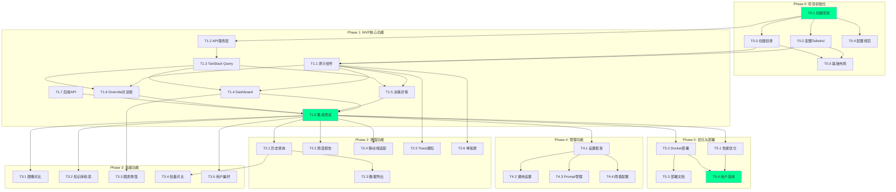

# AgriAgent 前端UI开发任务清单

> **版本**: v1.0
> **创建日期**: 2025-12-26
> **项目状态**: 待开发
> **参考文档**: [requirements_ui.md](requirements_ui.md), [design_ui.md](design_ui.md)

---

## 📋 目录

- [任务概览](#任务概览)
- [Phase 0: 项目初始化](#phase-0-项目初始化)
- [Phase 1: MVP核心功能](#phase-1-mvp核心功能)
- [Phase 2: 增强功能](#phase-2-增强功能)
- [Phase 3: 高级功能](#phase-3-高级功能)
- [Phase 4: 管理功能](#phase-4-管理功能)
- [Phase 5: 优化与部署](#phase-5-优化与部署)
- [任务依赖关系图](#任务依赖关系图)

---

## 任务概览

### 开发阶段规划

| Phase | 阶段名称 | 任务数 | 预估工作量 | 优先级 | 状态 |
|-------|---------|--------|-----------|--------|------|
| Phase 0 | 项目初始化 | 5 | 2-3天 | P0 | 🔴 待开始 |
| Phase 1 | MVP核心功能 | 8 | 10-12天 | P0 | 🔴 待开始 |
| Phase 2 | 增强功能 | 6 | 8-10天 | P1 | ⚪ 待开始 |
| Phase 3 | 高级功能 | 5 | 6-8天 | P2 | ⚪ 待开始 |
| Phase 4 | 管理功能 | 4 | 5-6天 | P3 | ⚪ 待开始 |
| Phase 5 | 优化与部署 | 4 | 3-4天 | P1 | ⚪ 待开始 |

**总计**: 32个任务，预估 34-43 天

---

## Phase 0: 项目初始化

> **目标**: 搭建前端项目骨架，配置开发环境
> **预估时间**: 2-3天
> **优先级**: P0

### T0.1 创建Vite + React + TypeScript项目

**工作量**: 0.5天
**负责人**: 前端Lead
**状态**: 🔴 待开始

#### 详细步骤

1. **创建项目**
   ```bash
   npm create vite@latest agriagent-frontend -- --template react-ts
   cd agriagent-frontend
   npm install
   ```

2. **安装核心依赖**
   ```bash
   # 路由
   npm install react-router-dom

   # 状态管理
   npm install zustand @tanstack/react-query

   # HTTP客户端
   npm install axios

   # 工具库
   npm install dayjs clsx lodash-es
   npm install -D @types/lodash-es
   ```

3. **安装UI依赖**
   ```bash
   # Tailwind CSS
   npm install -D tailwindcss postcss autoprefixer
   npx tailwindcss init -p

   # 图表
   npm install chart.js react-chartjs-2

   # 表单
   npm install react-hook-form zod
   ```

4. **配置TypeScript**
   - 修改 `tsconfig.json`，启用严格模式
   - 配置路径别名 `@/*` -> `src/*`

5. **配置Vite**
   - 设置开发服务器端口为 3000
   - 配置API代理到 `http://localhost:8000`
   - 设置路径别名解析

#### 验收标准

- [ ] 项目可以正常启动（`npm run dev`）
- [ ] 访问 `http://localhost:3000` 可以看到默认页面
- [ ] TypeScript无编译错误
- [ ] `@/` 别名可以正常导入

#### 交付物

- `package.json` - 依赖清单
- `vite.config.ts` - Vite配置
- `tsconfig.json` - TypeScript配置

---

### T0.2 配置Tailwind CSS主题系统

**工作量**: 0.5天
**负责人**: UI开发
**状态**: 🔴 待开始
**依赖**: T0.1

#### 详细步骤

1. **配置Tailwind**
   - 编辑 `tailwind.config.js`，添加自定义颜色
   - 定义 `neon-green`, `neon-blue`, `dark-bg` 等颜色变量
   - 添加自定义动画（`blob`, `float`, `pulse-glow`）

2. **创建全局样式文件**
   - 创建 `src/index.css`
   - 导入Tailwind基础样式
   - 定义 `.glass-panel`, `.glass-sidebar` 等组件类
   - 美化滚动条样式

3. **添加字体**
   - 下载 Inter 字体（英文）
   - 下载 Noto Sans SC 字体（中文）
   - 下载 JetBrains Mono 字体（等宽）
   - 配置 `@font-face` 或使用Google Fonts

4. **配置Phosphor Icons**
   ```html
   <!-- index.html -->
   <link rel="stylesheet" href="https://unpkg.com/@phosphor-icons/web@2.0.3/src/regular/style.css">
   <link rel="stylesheet" href="https://unpkg.com/@phosphor-icons/web@2.0.3/src/bold/style.css">
   <link rel="stylesheet" href="https://unpkg.com/@phosphor-icons/web@2.0.3/src/fill/style.css">
   ```

5. **测试样式**
   - 创建测试页面验证颜色、字体、图标显示正常

#### 验收标准

- [ ] Tailwind类名可以正常应用
- [ ] 自定义颜色（`text-neon-green`）生效
- [ ] 字体显示正常（Inter + Noto Sans SC）
- [ ] Phosphor图标可以正常显示
- [ ] 动画效果（`animate-blob`）正常

#### 交付物

- `tailwind.config.js` - Tailwind配置
- `src/index.css` - 全局样式
- `src/assets/fonts/` - 字体文件（可选）

---

### T0.3 创建项目目录结构

**工作量**: 0.5天
**负责人**: 前端Lead
**状态**: 🔴 待开始
**依赖**: T0.1

#### 详细步骤

1. **创建目录**
   ```bash
   mkdir -p src/{components/{common,layout,features,charts},pages,hooks,services,store,types,utils,routes,styles}
   ```

2. **创建子目录**
   ```bash
   # 业务组件目录
   mkdir -p src/components/features/{dashboard,decision,override,history,weekly,knowledge,settings}

   # 通用组件目录
   mkdir -p src/components/common/{Button,Card,Badge,Input,Modal,Spinner,Tooltip}

   # 布局组件目录
   mkdir -p src/components/layout/{Sidebar,Header,AuroraBackground}
   ```

3. **创建占位文件**
   - 每个目录创建 `index.ts` 用于统一导出
   - 创建 `.gitkeep` 保留空目录

4. **创建README**
   - `src/components/README.md` - 组件说明
   - `src/hooks/README.md` - Hook说明
   - `src/services/README.md` - Service说明

#### 验收标准

- [ ] 目录结构符合 design_ui.md 4.1节规范
- [ ] 每个目录有明确的职责说明
- [ ] Git可以追踪所有目录

#### 交付物

- 完整的目录结构
- 各模块README文档

---

### T0.4 配置代码规范工具

**工作量**: 0.5天
**负责人**: 前端Lead
**状态**: 🔴 待开始
**依赖**: T0.1

#### 详细步骤

1. **安装ESLint**
   ```bash
   npm install -D eslint @typescript-eslint/parser @typescript-eslint/eslint-plugin
   npm install -D eslint-plugin-react-hooks eslint-config-prettier
   ```

2. **创建ESLint配置**
   - 创建 `.eslintrc.json`
   - 配置规则（参考 design_ui.md 12.1节）
   - 配置忽略文件 `.eslintignore`

3. **安装Prettier**
   ```bash
   npm install -D prettier
   ```

4. **创建Prettier配置**
   - 创建 `.prettierrc`
   - 配置规则（参考 design_ui.md 12.1节）
   - 配置忽略文件 `.prettierignore`

5. **配置Git Hooks**
   ```bash
   npm install -D husky lint-staged
   npx husky init
   ```

   - 添加 pre-commit hook 运行 lint-staged
   - 配置 lint-staged 运行 ESLint 和 Prettier

6. **添加npm脚本**
   ```json
   {
     "scripts": {
       "lint": "eslint . --ext ts,tsx --report-unused-disable-directives --max-warnings 0",
       "format": "prettier --write \"src/**/*.{ts,tsx,css}\"",
       "type-check": "tsc --noEmit"
     }
   }
   ```

#### 验收标准

- [ ] `npm run lint` 可以检查代码
- [ ] `npm run format` 可以格式化代码
- [ ] `npm run type-check` 可以检查类型
- [ ] Git commit 时自动运行lint检查

#### 交付物

- `.eslintrc.json` - ESLint配置
- `.prettierrc` - Prettier配置
- `.husky/pre-commit` - Git Hook

---

### T0.5 搭建基础布局框架

**工作量**: 1天
**负责人**: UI开发
**状态**: 🔴 待开始
**依赖**: T0.1, T0.2, T0.3

#### 详细步骤

1. **创建AuroraBackground组件**
   - 路径: `src/components/layout/AuroraBackground/AuroraBackground.tsx`
   - 实现极光背景效果（3个blob动画）
   - 参考 design_ui.md 9.3节

2. **创建Sidebar组件**
   - 路径: `src/components/layout/Sidebar/Sidebar.tsx`
   - 玻璃拟态样式（`glass-sidebar`）
   - 导航菜单项（6个主要页面）
   - NavLink激活状态样式
   - 参考 design_ui.md 7.3节

3. **创建Layout组件**
   - 路径: `src/components/layout/Layout.tsx`
   - 包含 Sidebar + 主内容区
   - 使用 `<Outlet />` 渲染子路由
   - 路由切换时滚动到顶部

4. **创建基础路由**
   - 路径: `src/routes/index.tsx`
   - 定义路由表（参考 design_ui.md 7.1节）
   - 创建占位页面组件（临时显示页面标题）

5. **更新App.tsx**
   - 集成 React Router
   - 集成 TanStack Query
   - 渲染 AuroraBackground + Layout

#### 验收标准

- [ ] 侧边栏显示正常，玻璃拟态效果正确
- [ ] 极光背景动画流畅
- [ ] 点击菜单可以切换页面
- [ ] NavLink激活状态高亮正确
- [ ] 页面切换时平滑过渡

#### 交付物

- `AuroraBackground.tsx` - 极光背景组件
- `Sidebar.tsx` - 侧边栏组件
- `Layout.tsx` - 布局容器
- `routes/index.tsx` - 路由配置
- `App.tsx` - 根组件

---

## Phase 1: MVP核心功能

> **目标**: 实现核心用户场景（查看决策、人工覆盖）
> **预估时间**: 10-12天
> **优先级**: P0

### T1.1 创建通用原子组件库

**工作量**: 2天
**负责人**: UI开发
**状态**: 🔴 待开始
**依赖**: T0.2, T0.3

#### 详细步骤

1. **创建Button组件**
   - 路径: `src/components/common/Button/Button.tsx`
   - 支持4种variant（primary, secondary, danger, ghost）
   - 支持3种size（sm, md, lg）
   - 支持loading状态、icon、disabled
   - 参考 design_ui.md 5.1节示例代码
   - 编写 `Button.stories.tsx`（可选，用于组件预览）

2. **创建Card组件**
   - 路径: `src/components/common/Card/Card.tsx`
   - 支持2种variant（glass, solid）
   - 玻璃拟态样式（`bg-slate-800/40 backdrop-blur-md`）
   - 支持hover效果
   - Props: `variant`, `className`, `children`

3. **创建Badge组件**
   - 路径: `src/components/common/Badge/Badge.tsx`
   - 支持多种variant（info, success, warning, danger）
   - 小尺寸标签样式
   - Props: `variant`, `children`

4. **创建Input组件**
   - 路径: `src/components/common/Input/Input.tsx`
   - 支持多种type（text, number, password等）
   - 错误状态样式
   - Props: `type`, `placeholder`, `error`, `value`, `onChange`

5. **创建Modal组件**
   - 路径: `src/components/common/Modal/Modal.tsx`
   - 支持打开/关闭动画
   - 背景遮罩（backdrop）
   - 支持ESC键关闭
   - Props: `open`, `onClose`, `title`, `children`

6. **创建Spinner组件**
   - 路径: `src/components/common/Spinner/Spinner.tsx`
   - 旋转加载动画
   - 支持多种size（sm, md, lg）
   - Props: `size`, `color`

7. **创建Tooltip组件**
   - 路径: `src/components/common/Tooltip/Tooltip.tsx`
   - 悬停提示
   - 支持4个方向（top, bottom, left, right）
   - Props: `content`, `placement`, `children`

8. **创建Select组件**
   - 路径: `src/components/common/Select/Select.tsx`
   - 下拉选择框
   - Props: `options`, `value`, `onChange`, `placeholder`

9. **创建统一导出**
   - 路径: `src/components/common/index.ts`
   - 统一导出所有组件，方便使用
   ```tsx
   export { Button } from './Button'
   export { Card } from './Card'
   // ...
   ```

#### 验收标准

- [ ] 所有组件TypeScript类型完整
- [ ] 所有组件样式符合设计规范
- [ ] 组件支持className扩展
- [ ] 可以通过 `import { Button } from '@/components/common'` 导入
- [ ] 组件在不同浏览器显示一致

#### 交付物

- 8个通用组件（Button, Card, Badge, Input, Modal, Spinner, Tooltip, Select）
- `index.ts` 统一导出文件

---

### T1.2 创建API服务层

**工作量**: 1.5天
**负责人**: 前端Lead
**状态**: 🔴 待开始
**依赖**: T0.1

#### 详细步骤

1. **创建Axios实例配置**
   - 路径: `src/services/api.ts`
   - 配置baseURL（从环境变量读取）
   - 配置timeout（30秒）
   - 添加请求拦截器（添加token）
   - 添加响应拦截器（统一错误处理）
   - 参考 design_ui.md 8.1节

2. **定义TypeScript类型**
   - 路径: `src/types/api.ts`
   - 定义 `ApiResponse<T>` 接口
   - 定义 `ApiError` 接口
   ```tsx
   export interface ApiResponse<T = any> {
     success: boolean
     data: T | null
     error: ApiError | null
     timestamp: string
   }
   ```

3. **定义Episode类型**
   - 路径: `src/types/episode.ts`
   - 定义 `Episode` 接口（完整字段）
   - 定义 `PlantResponse` 接口
   - 定义 `SanityCheck` 接口
   - 定义 `FinalDecision` 接口
   - 定义 `EpisodeFilters` 接口（查询参数）

4. **创建episodeService**
   - 路径: `src/services/episodeService.ts`
   - 实现 `getLatest()` - 获取最新Episode
   - 实现 `getByDate(date)` - 获取指定日期Episode
   - 实现 `query(filters)` - 筛选查询
   - 实现 `override(data)` - 提交Override
   - 参考 design_ui.md 8.2节

5. **创建weeklyService**
   - 路径: `src/services/weeklyService.ts`
   - 实现 `getAll()` - 获取所有周报
   - 实现 `getByWeek(weekStart)` - 获取指定周报

6. **创建knowledgeService**
   - 路径: `src/services/knowledgeService.ts`
   - 实现 `search(query, topK)` - RAG检索
   - 实现 `feedback(data)` - 提交反馈

7. **创建环境变量文件**
   - 创建 `.env.development`
   ```bash
   VITE_API_BASE_URL=http://localhost:8000/api
   ```
   - 创建 `.env.production`
   ```bash
   VITE_API_BASE_URL=https://api.agriagent.com/api
   ```

#### 验收标准

- [ ] Axios实例配置正确
- [ ] 请求拦截器可以添加token
- [ ] 响应拦截器可以统一处理错误
- [ ] 所有Service函数有完整的TypeScript类型
- [ ] 可以正常调用后端API（需要后端配合）

#### 交付物

- `services/api.ts` - Axios配置
- `services/episodeService.ts` - Episode服务
- `services/weeklyService.ts` - Weekly服务
- `services/knowledgeService.ts` - Knowledge服务
- `types/episode.ts` - Episode类型
- `types/api.ts` - API类型
- `.env.development`, `.env.production` - 环境变量

---

### T1.3 创建TanStack Query Hooks

**工作量**: 1.5天
**负责人**: 前端开发
**状态**: 🔴 待开始
**依赖**: T1.2

#### 详细步骤

1. **配置QueryClient**
   - 路径: `src/main.tsx`
   - 创建QueryClient实例
   - 配置默认缓存策略（staleTime, cacheTime, retry）
   - 包裹App组件
   - 参考 design_ui.md 6.2节

2. **创建useLatestEpisode Hook**
   - 路径: `src/hooks/useEpisodes.ts`
   - 使用 `useQuery` 获取最新Episode
   - 配置轮询（refetchInterval: 10秒）
   - 配置缓存策略（staleTime: 1分钟）
   ```tsx
   export function useLatestEpisode() {
     return useQuery({
       queryKey: ['episodes', 'latest'],
       queryFn: () => episodeService.getLatest(),
       staleTime: 1000 * 60,
       refetchInterval: 1000 * 10,
     })
   }
   ```

3. **创建useEpisode Hook**
   - 根据date获取Episode
   - 仅当date存在时查询（enabled: !!date）

4. **创建useEpisodesQuery Hook**
   - 支持筛选条件（filters）
   - 保留旧数据（keepPreviousData: true）

5. **创建useOverrideMutation Hook**
   - 使用 `useMutation` 提交Override
   - 成功后失效缓存（invalidateQueries）
   - 错误处理（onError回调）

6. **创建useWeeklySummary Hook**
   - 路径: `src/hooks/useWeeklySummary.ts`
   - 获取所有周报
   - 获取指定周报

7. **创建useKnowledgeSearch Hook**
   - 路径: `src/hooks/useKnowledgeSearch.ts`
   - RAG知识检索
   - 支持动态查询（query参数变化时重新获取）

#### 验收标准

- [ ] QueryClient配置正确
- [ ] 所有Hook有完整的TypeScript类型
- [ ] Hook返回正确的loading/error/data状态
- [ ] 缓存策略生效（重复请求使用缓存）
- [ ] Mutation成功后缓存失效

#### 交付物

- `hooks/useEpisodes.ts` - Episode相关Hook
- `hooks/useWeeklySummary.ts` - Weekly相关Hook
- `hooks/useKnowledgeSearch.ts` - Knowledge相关Hook
- `main.tsx` - QueryClient配置

---

### T1.4 实现Dashboard页面

**工作量**: 2天
**负责人**: UI开发
**状态**: 🔴 待开始
**依赖**: T1.1, T1.3

#### 详细步骤

1. **创建HeroCard组件**
   - 路径: `src/components/features/dashboard/HeroCard.tsx`
   - 显示今日决策摘要
   - 大号灌水量数字
   - 长势趋势、置信度
   - 风险等级指示（边框颜色）
   - 两个操作按钮（查看详情、人工覆盖）
   - 参考 requirements_ui.md 4.1节、design_ui.md 5.1节

2. **创建StatsCard组件**
   - 路径: `src/components/features/dashboard/StatsCard.tsx`
   - 显示本周统计
   - 平均灌水量、better天数、Override次数

3. **创建WarningCard组件**
   - 路径: `src/components/features/dashboard/WarningCard.tsx`
   - 显示预警事项
   - 按优先级排序（critical > high > medium > low）
   - 每条预警显示类型、描述、时间

4. **创建TrendChart组件**
   - 路径: `src/components/features/dashboard/TrendChart.tsx`
   - 使用Chart.js绘制折线图
   - X轴：日期，Y轴：灌水量
   - 数据点区分TSMixer预测和Override
   - 标注长势（better/worse箭头）
   - 工具提示（hover显示详情）
   - 支持切换时间范围（7天/14天/30天）

5. **创建Dashboard页面**
   - 路径: `src/pages/Dashboard.tsx`
   - 组装以上4个组件
   - 使用 `useLatestEpisode` 获取数据
   - 处理loading和error状态
   - 布局参考 requirements_ui.md 4.1节

6. **样式优化**
   - 响应式布局（移动端卡片堆叠）
   - 卡片间距、阴影效果
   - 动画效果（入场动画）

#### 验收标准

- [ ] Dashboard页面可以正常访问
- [ ] HeroCard显示最新决策数据
- [ ] 风险等级边框颜色正确
- [ ] 趋势图显示近30天数据
- [ ] 点击"查看详情"跳转到详情页
- [ ] 点击"人工覆盖"弹出对话框（T1.6实现）
- [ ] Loading状态显示Spinner
- [ ] Error状态显示错误提示

#### 交付物

- `features/dashboard/HeroCard.tsx` - 今日决策卡片
- `features/dashboard/StatsCard.tsx` - 统计卡片
- `features/dashboard/WarningCard.tsx` - 预警卡片
- `features/dashboard/TrendChart.tsx` - 趋势图
- `pages/Dashboard.tsx` - Dashboard页面

---

### T1.5 实现今日决策详情页

**工作量**: 2天
**负责人**: UI开发
**状态**: 🔴 待开始
**依赖**: T1.1, T1.3

#### 详细步骤

1. **创建InputSection组件**
   - 路径: `src/components/features/decision/InputSection.tsx`
   - 显示输入数据（环境、YOLO指标）
   - 今日/昨日图像（可点击放大）
   - 参考 requirements_ui.md 4.2节

2. **创建PlantResponseCard组件**
   - 路径: `src/components/features/decision/PlantResponseCard.tsx`
   - 显示长势评估结果
   - 趋势、置信度、证据、异常、生育期
   - 卡片样式（玻璃拟态）

3. **创建SanityCheckCard组件**
   - 路径: `src/components/features/decision/SanityCheckCard.tsx`
   - 显示合理性复核结果
   - 决策、风险等级、风险因素
   - RAG建议（可展开/收起）
   - 需要确认的问题列表

4. **创建TSMixerPredictionCard组件**
   - 路径: `src/components/features/decision/TSMixerPredictionCard.tsx`
   - 显示TSMixer预测值
   - 简洁卡片

5. **创建FinalDecisionCard组件**
   - 路径: `src/components/features/decision/FinalDecisionCard.tsx`
   - 显示最终决策
   - 大号灌水量数字
   - 来源、状态
   - "人工覆盖"按钮

6. **创建DecisionTimeline组件**
   - 路径: `src/components/features/decision/DecisionTimeline.tsx`
   - 垂直时间线布局（1→2→3→4→5）
   - 连接线+步骤图标

7. **创建ImageModal组件**
   - 路径: `src/components/features/decision/ImageModal.tsx`
   - 图像放大查看
   - 支持今日/昨日对比模式（左右分屏）
   - 可选显示YOLO检测框

8. **创建DailyDecision页面**
   - 路径: `src/pages/DailyDecision.tsx`
   - 从URL参数获取date（`/daily/:date`）
   - 使用 `useEpisode(date)` 获取数据
   - 组装以上组件（时间线布局）
   - 支持上一天/下一天导航

#### 验收标准

- [ ] 可以访问 `/daily/2024-06-14` 查看详情
- [ ] 显示完整的决策链条（5个步骤）
- [ ] 图像可以点击放大
- [ ] RAG建议可以展开/收起
- [ ] 点击上一天/下一天正确跳转
- [ ] Loading和Error状态处理正确

#### 交付物

- `features/decision/InputSection.tsx`
- `features/decision/PlantResponseCard.tsx`
- `features/decision/SanityCheckCard.tsx`
- `features/decision/TSMixerPredictionCard.tsx`
- `features/decision/FinalDecisionCard.tsx`
- `features/decision/DecisionTimeline.tsx`
- `features/decision/ImageModal.tsx`
- `pages/DailyDecision.tsx`

---

### T1.6 实现Override对话框

**工作量**: 1.5天
**负责人**: 前端开发
**状态**: 🔴 待开始
**依赖**: T1.1, T1.3

#### 详细步骤

1. **创建OverrideModal组件**
   - 路径: `src/components/features/override/OverrideModal.tsx`
   - 使用React Hook Form管理表单
   - 使用Zod验证表单数据
   - 参考 requirements_ui.md 4.3节

2. **表单字段**
   - 日期（只读）
   - 系统建议值（只读）
   - 替代灌水量（Input，支持上下按钮）
   - 覆盖理由（Textarea + 快速选择按钮）
   - 需要确认的问题（从SanityCheck读取）

3. **表单验证**
   - 替代值范围：[0.1, 20] L/m²
   - 理由必填（至少10字）
   - 使用Zod定义验证Schema
   ```tsx
   const overrideSchema = z.object({
     replaced_value: z.number().min(0.1).max(20),
     reason: z.string().min(10, '理由至少10字'),
     confirmation_answers: z.record(z.string()),
   })
   ```

4. **提交逻辑**
   - 调用 `useOverrideMutation` 提交数据
   - 显示loading状态（按钮禁用+Spinner）
   - 成功后显示Toast提示
   - 成功后关闭Modal并刷新Dashboard
   - 失败后显示错误提示

5. **快速理由选择**
   - 预设4个常用理由按钮
   - 点击按钮自动填充理由框
   - 支持手动编辑

6. **样式**
   - Modal背景遮罩（半透明）
   - 玻璃拟态卡片样式
   - 输入框聚焦样式
   - 提交按钮hover效果

#### 验收标准

- [ ] Modal可以正常打开/关闭
- [ ] 表单验证生效（不符合条件时提示错误）
- [ ] 快速理由按钮可以填充文本
- [ ] 提交成功后Modal关闭并刷新数据
- [ ] 提交失败后显示错误提示
- [ ] ESC键可以关闭Modal

#### 交付物

- `features/override/OverrideModal.tsx` - Override对话框组件
- `hooks/useOverride.ts` - Override提交Hook（如未在T1.3创建）

---

### T1.7 后端API开发（FastAPI）

**工作量**: 3天
**负责人**: 后端开发
**状态**: 🔴 待开始
**依赖**: 无（后端任务）

#### 详细步骤

1. **创建FastAPI项目结构**
   ```
   backend/
   ├── app/
   │   ├── api/
   │   │   ├── v1/
   │   │   │   ├── episodes.py
   │   │   │   ├── weekly.py
   │   │   │   ├── knowledge.py
   │   │   │   └── override.py
   │   ├── models/
   │   ├── services/
   │   └── main.py
   ```

2. **实现Episodes API**
   - `GET /api/episodes/latest` - 获取最新Episode
   - `GET /api/episodes/{date}` - 获取指定日期Episode
   - `GET /api/episodes` - 筛选查询（支持start, end, trend, source参数）
   - `POST /api/override` - 提交Override
   - `PUT /api/episodes/{date}/feedback` - 提交反馈

3. **实现Weekly API**
   - `GET /api/weekly` - 获取所有周报
   - `GET /api/weekly/{week_start}` - 获取指定周报

4. **实现Knowledge API**
   - `GET /api/knowledge/search` - RAG检索（支持q, top_k参数）
   - `POST /api/knowledge/feedback` - 检索反馈

5. **实现Images API**
   - `GET /api/images/{date}/today` - 获取今日图像
   - `GET /api/images/{date}/yesterday` - 获取昨日图像
   - 返回Base64或图像URL

6. **数据读取逻辑**
   - 从JSON文件读取Episodes（如 `output/episodes/2024-06-14.json`）
   - 从JSON文件读取WeeklySummary（如 `output/weekly_summaries/`）
   - 集成LocalRAG服务

7. **CORS配置**
   ```python
   from fastapi.middleware.cors import CORSMiddleware

   app.add_middleware(
       CORSMiddleware,
       allow_origins=["http://localhost:3000"],
       allow_credentials=True,
       allow_methods=["*"],
       allow_headers=["*"],
   )
   ```

8. **统一响应格式**
   ```python
   {
     "success": true,
     "data": { ... },
     "error": null,
     "timestamp": "2025-12-26T10:00:00Z"
   }
   ```

9. **错误处理**
   - 404: Episode不存在
   - 400: 参数错误
   - 500: 服务器错误

#### 验收标准

- [ ] 所有API端点可以正常访问
- [ ] 返回格式符合 `ApiResponse<T>` 接口
- [ ] CORS配置正确（前端可以跨域请求）
- [ ] 错误处理完善（返回清晰的错误信息）
- [ ] API文档自动生成（访问 `/docs` 查看）

#### 交付物

- `backend/app/api/v1/` - API路由
- `backend/app/services/` - 业务逻辑
- `backend/app/main.py` - FastAPI入口
- `backend/requirements.txt` - Python依赖

---

### T1.8 集成测试与Bug修复

**工作量**: 1天
**负责人**: 全体
**状态**: 🔴 待开始
**依赖**: T1.1-T1.7

#### 详细步骤

1. **前后端联调**
   - 启动后端服务（`uvicorn app.main:app --reload`）
   - 启动前端服务（`npm run dev`）
   - 测试所有API调用

2. **功能测试**
   - Dashboard页面完整流程
   - 今日决策详情页完整流程
   - Override提交流程
   - 错误处理流程

3. **兼容性测试**
   - Chrome浏览器测试
   - Edge浏览器测试
   - Safari浏览器测试（Mac）

4. **性能测试**
   - Dashboard首屏加载时间 < 2秒
   - 页面切换时间 < 300ms
   - API响应时间 < 1秒

5. **Bug修复**
   - 记录所有Bug到Issues
   - 按优先级修复（P0 > P1 > P2）

6. **代码Review**
   - 检查代码规范（ESLint/Prettier）
   - 检查类型安全（TypeScript）
   - 检查组件复用性

#### 验收标准

- [ ] 所有P0功能正常工作
- [ ] 无明显Bug
- [ ] 性能指标达标
- [ ] 代码通过Review

#### 交付物

- Bug列表及修复记录
- 测试报告

---

## Phase 2: 增强功能

> **目标**: 实现历史查询、周度报告、数据导出
> **预估时间**: 8-10天
> **优先级**: P1

### T2.1 实现历史记录查询页面

**工作量**: 3天
**负责人**: 前端开发
**状态**: ⚪ 待开始
**依赖**: Phase 1

#### 详细步骤

1. **创建FilterPanel组件**
   - 路径: `src/components/features/history/FilterPanel.tsx`
   - 日期范围选择器（DatePicker）
   - 长势趋势下拉（all/better/same/worse）
   - 决策来源下拉（all/TSMixer/Override）
   - 风险等级下拉（all/low/medium/high/critical）
   - 重置按钮、应用按钮
   - 参考 requirements_ui.md 4.4节

2. **创建DataTable组件**
   - 路径: `src/components/features/history/DataTable.tsx`
   - 使用虚拟滚动优化（@tanstack/react-virtual）
   - 表格列：日期、灌水量、来源、长势、风险、操作
   - 支持排序（点击列标题）
   - 支持多选（Checkbox）
   - 分页器（每页10/20/50条）

3. **创建CompareView组件**
   - 路径: `src/components/features/history/CompareView.tsx`
   - 并排显示多条记录（最多5条）
   - 关键字段对比

4. **创建ExportButton组件**
   - 路径: `src/components/features/history/ExportButton.tsx`
   - 导出为CSV
   - 字段：日期,灌水量,来源,长势,置信度,风险等级,Override理由

5. **创建History页面**
   - 路径: `src/pages/History.tsx`
   - 组装FilterPanel + DataTable
   - 使用 `useEpisodesQuery(filters)` 获取数据
   - 筛选条件同步到URL（useSearchParams）

6. **DatePicker集成**
   - 可使用库：react-datepicker 或 自定义
   - 支持范围选择

#### 验收标准

- [ ] 筛选功能正常（日期、趋势、来源、风险）
- [ ] 数据表格显示正常
- [ ] 虚拟滚动流畅（大量数据不卡顿）
- [ ] 分页功能正常
- [ ] 可以多选记录进行对比
- [ ] CSV导出功能正常
- [ ] URL参数同步（可分享链接）

#### 交付物

- `features/history/FilterPanel.tsx`
- `features/history/DataTable.tsx`
- `features/history/CompareView.tsx`
- `features/history/ExportButton.tsx`
- `pages/History.tsx`

---

### T2.2 实现周度报告页面

**工作量**: 2天
**负责人**: 前端开发
**状态**: ⚪ 待开始
**依赖**: Phase 1

#### 详细步骤

1. **创建WeeklyList组件**
   - 路径: `src/components/features/weekly/WeeklyList.tsx`
   - 左侧列表（周报日期范围）
   - 点击选中某个周报
   - 当前选中项高亮

2. **创建InsightsCard组件**
   - 路径: `src/components/features/weekly/InsightsCard.tsx`
   - 显示LLM生成的关键洞察
   - 列表样式，每条洞察单独一行

3. **创建StatsOverview组件**
   - 路径: `src/components/features/weekly/StatsOverview.tsx`
   - 本周统计（长势分布、灌溉趋势、异常次数、Override次数）

4. **创建RAGReferences组件**
   - 路径: `src/components/features/weekly/RAGReferences.tsx`
   - 引用知识库片段
   - 可点击查看完整文档

5. **创建PromptBlock组件**
   - 路径: `src/components/features/weekly/PromptBlock.tsx`
   - 显示注入下周的Prompt内容
   - 代码块样式（monospace字体）
   - 复制按钮

6. **创建Weekly页面**
   - 路径: `src/pages/Weekly.tsx`
   - 左右分栏布局（WeeklyList + 详情）
   - 使用 `useWeeklySummary` 获取数据
   - 支持URL参数选中周报（`/weekly/:weekStart`）

#### 验收标准

- [ ] 周报列表显示正常
- [ ] 点击周报可以查看详情
- [ ] LLM洞察显示完整
- [ ] 本周统计数据正确
- [ ] Prompt块可以复制
- [ ] URL参数同步

#### 交付物

- `features/weekly/WeeklyList.tsx`
- `features/weekly/InsightsCard.tsx`
- `features/weekly/StatsOverview.tsx`
- `features/weekly/RAGReferences.tsx`
- `features/weekly/PromptBlock.tsx`
- `pages/Weekly.tsx`

---

### T2.3 实现数据导出功能

**工作量**: 1天
**负责人**: 前端开发
**状态**: ⚪ 待开始
**依赖**: T2.1

#### 详细步骤

1. **创建CSV导出工具函数**
   - 路径: `src/utils/export.ts`
   - 实现 `exportToCSV(data, filename)` 函数
   - 支持中文编码（BOM）
   ```tsx
   export function exportToCSV(data: any[], filename: string) {
     const BOM = '\uFEFF'
     const csvContent = BOM + convertToCSV(data)
     const blob = new Blob([csvContent], { type: 'text/csv;charset=utf-8;' })
     const link = document.createElement('a')
     link.href = URL.createObjectURL(blob)
     link.download = filename
     link.click()
   }
   ```

2. **实现JSON导出**
   - 实现 `exportToJSON(data, filename)` 函数
   - 美化JSON输出（缩进2空格）

3. **集成到History页面**
   - 添加"导出CSV"按钮
   - 添加"导出JSON"按钮
   - 点击导出当前筛选结果

4. **集成到Weekly页面**
   - 支持导出周报为JSON

#### 验收标准

- [ ] CSV导出正确（Excel可正常打开）
- [ ] JSON导出格式正确
- [ ] 中文不乱码
- [ ] 文件名包含时间戳（如 `episodes_20251226_120000.csv`）

#### 交付物

- `utils/export.ts` - 导出工具函数
- 更新 History 和 Weekly 页面

---

### T2.4 移动端适配

**工作量**: 2天
**负责人**: UI开发
**状态**: ⚪ 待开始
**依赖**: Phase 1

#### 详细步骤

1. **创建MobileMenu组件**
   - 路径: `src/components/layout/MobileMenu/MobileMenu.tsx`
   - 汉堡菜单按钮（右上角）
   - 侧滑菜单（从左侧滑入）
   - 点击遮罩关闭

2. **响应式布局调整**
   - 断点设置（参考 requirements_ui.md 6.1节）
     ```css
     /* 移动端 */
     @media (max-width: 768px) { ... }
     /* 平板 */
     @media (min-width: 769px) and (max-width: 1024px) { ... }
     /* PC */
     @media (min-width: 1025px) { ... }
     ```

3. **Dashboard移动端优化**
   - 卡片堆叠布局（竖向）
   - 隐藏趋势图或改为迷你图
   - 预警列表最多显示3条

4. **详情页移动端优化**
   - 折叠式手风琴布局
   - 图像对比改为上下堆叠
   - 减少内边距

5. **History页移动端优化**
   - 筛选面板可折叠
   - 表格改为卡片列表

6. **测试**
   - Chrome DevTools模拟移动设备
   - 实际手机测试（iOS + Android）

#### 验收标准

- [ ] 移动端菜单可以正常打开/关闭
- [ ] 所有页面在移动端显示正常
- [ ] 触摸操作流畅
- [ ] 字体大小适中（不需要缩放）
- [ ] 按钮足够大（易于点击）

#### 交付物

- `layout/MobileMenu/MobileMenu.tsx`
- 更新所有页面的响应式样式

---

### T2.5 添加Toast通知组件

**工作量**: 0.5天
**负责人**: 前端开发
**状态**: ⚪ 待开始
**依赖**: T1.1

#### 详细步骤

1. **选择Toast库**
   - 推荐：react-hot-toast（轻量、好看）
   - 安装：`npm install react-hot-toast`

2. **集成到App.tsx**
   ```tsx
   import { Toaster } from 'react-hot-toast'

   function App() {
     return (
       <>
         <RouterProvider router={router} />
         <Toaster position="top-right" />
       </>
     )
   }
   ```

3. **创建useToast Hook**
   - 路径: `src/hooks/useToast.ts`
   - 封装常用方法
   ```tsx
   import toast from 'react-hot-toast'

   export function useToast() {
     return {
       success: (message: string) => toast.success(message),
       error: (message: string) => toast.error(message),
       loading: (message: string) => toast.loading(message),
     }
   }
   ```

4. **应用到各处**
   - Override提交成功/失败
   - API请求错误
   - 数据导出成功

#### 验收标准

- [ ] Toast显示正常
- [ ] 样式符合设计规范
- [ ] 自动消失（3秒）
- [ ] 支持多条Toast堆叠

#### 交付物

- `hooks/useToast.ts`
- 更新App.tsx

---

### T2.6 添加Loading骨架屏

**工作量**: 1天
**负责人**: UI开发
**状态**: ⚪ 待开始
**依赖**: T1.1

#### 详细步骤

1. **创建Skeleton组件**
   - 路径: `src/components/common/Skeleton/Skeleton.tsx`
   - 支持多种形状（rect, circle, text）
   - 动画效果（shimmer）
   ```tsx
   export function Skeleton({ width, height, className }: Props) {
     return (
       <div
         className={clsx(
           'bg-slate-700/50 rounded animate-pulse',
           className
         )}
         style={{ width, height }}
       />
     )
   }
   ```

2. **创建HeroCardSkeleton**
   - 路径: `src/components/features/dashboard/HeroCardSkeleton.tsx`
   - 模拟HeroCard布局

3. **创建TableSkeleton**
   - 模拟表格布局

4. **应用到各页面**
   - Dashboard: 显示HeroCardSkeleton
   - History: 显示TableSkeleton
   - 其他页面: 显示通用Skeleton

#### 验收标准

- [ ] Loading状态显示骨架屏而非空白
- [ ] 骨架屏布局与实际内容相似
- [ ] 动画流畅

#### 交付物

- `common/Skeleton/Skeleton.tsx`
- `features/dashboard/HeroCardSkeleton.tsx`
- 更新各页面

---

## Phase 3: 高级功能

> **目标**: 长势图像对比、知识库检索
> **预估时间**: 6-8天
> **优先级**: P2

### T3.1 实现长势图像对比页面

**工作量**: 2天
**负责人**: 前端开发
**状态**: ⚪ 待开始
**依赖**: Phase 1

#### 详细步骤

1. **创建ImageCompare组件**
   - 路径: `src/components/features/plant-response/ImageCompare.tsx`
   - 左右分屏显示今日/昨日图像
   - 支持同步缩放、拖拽

2. **创建YOLOMetrics组件**
   - 显示YOLO指标对比
   - 增幅百分比（红色/绿色箭头）

3. **创建LLMEvaluation组件**
   - 显示LLM评估结果
   - 趋势、置信度、证据

4. **创建AnnotationPanel组件**
   - 人工标注界面
   - 下拉选择趋势（better/same/worse）
   - 置信度滑块
   - 备注文本框
   - 保存按钮（写入ground_truth.jsonl）

5. **创建DetectionOverlay组件**
   - 在图像上绘制YOLO检测框
   - 支持开关显示
   - 不同类别不同颜色

6. **创建PlantResponse页面**
   - 路径: `src/pages/PlantResponse.tsx`
   - 组装以上组件
   - 从URL获取date

#### 验收标准

- [ ] 图像对比显示正常
- [ ] YOLO指标对比清晰
- [ ] 人工标注可以保存
- [ ] 检测框可以切换显示/隐藏

#### 交付物

- `features/plant-response/ImageCompare.tsx`
- `features/plant-response/YOLOMetrics.tsx`
- `features/plant-response/LLMEvaluation.tsx`
- `features/plant-response/AnnotationPanel.tsx`
- `features/plant-response/DetectionOverlay.tsx`
- `pages/PlantResponse.tsx`

---

### T3.2 实现知识库检索页面

**工作量**: 2天
**负责人**: 前端开发
**状态**: ⚪ 待开始
**依赖**: Phase 1

#### 详细步骤

1. **创建SearchBar组件**
   - 路径: `src/components/features/knowledge/SearchBar.tsx`
   - 搜索输入框
   - 来源筛选（FAO56/用户上传）
   - 检索模式切换（向量/关键词）

2. **创建ResultCard组件**
   - 路径: `src/components/features/knowledge/ResultCard.tsx`
   - 显示检索结果
   - 来源标签（FAO56 Ch7 P123）
   - 相关度评分（星星图标）
   - 内容片段
   - 操作按钮（查看完整文档、标记有用/无用）

3. **创建FeedbackModal组件**
   - 点击"标记有用"弹出
   - 收集反馈原因（多选）
   - 提交到后端

4. **创建Knowledge页面**
   - 路径: `src/pages/Knowledge.tsx`
   - 组装SearchBar + ResultCard列表
   - 使用 `useKnowledgeSearch` 获取数据
   - 分页加载

#### 验收标准

- [ ] 搜索功能正常
- [ ] 结果显示正确（相关度排序）
- [ ] 反馈功能正常
- [ ] 分页加载流畅

#### 交付物

- `features/knowledge/SearchBar.tsx`
- `features/knowledge/ResultCard.tsx`
- `features/knowledge/FeedbackModal.tsx`
- `pages/Knowledge.tsx`

---

### T3.3 实现图表交互增强

**工作量**: 1天
**负责人**: 前端开发
**状态**: ⚪ 待开始
**依赖**: T1.4

#### 详细步骤

1. **趋势图缩放功能**
   - 使用Chart.js插件（zoom plugin）
   - 鼠标滚轮缩放
   - 拖拽平移

2. **图表导出功能**
   - 导出为PNG图片
   - 使用 `chart.toBase64Image()` 方法

3. **图表悬停提示增强**
   - 显示更多信息（完整日期、长势、风险等级）
   - 美化Tooltip样式

4. **交互式图例**
   - 点击图例隐藏/显示数据系列

#### 验收标准

- [ ] 缩放功能流畅
- [ ] 图表可以导出为PNG
- [ ] Tooltip信息完整
- [ ] 图例交互正常

#### 交付物

- 更新 `TrendChart.tsx`

---

### T3.4 实现数据批量对比功能

**工作量**: 1.5天
**负责人**: 前端开发
**状态**: ⚪ 待开始
**依赖**: T2.1

#### 详细步骤

1. **多选功能**
   - History页面表格添加Checkbox
   - 全选/取消全选
   - 最多选择5条

2. **对比视图**
   - 点击"对比"按钮打开Modal
   - 并排显示5条记录
   - 关键字段对比（日期、灌水量、长势、风险等）
   - 差异高亮

3. **对比图表**
   - 多条折线图对比
   - 不同记录不同颜色

#### 验收标准

- [ ] 可以选择多条记录
- [ ] 对比视图显示正常
- [ ] 差异高亮清晰
- [ ] 对比图表正确

#### 交付物

- 更新 `features/history/CompareView.tsx`
- 更新 `pages/History.tsx`

---

### T3.5 添加用户偏好设置

**工作量**: 1天
**负责人**: 前端开发
**状态**: ⚪ 待开始
**依赖**: Phase 1

#### 详细步骤

1. **创建useUserStore**
   - 路径: `src/store/useUserStore.ts`
   - 存储用户偏好（语言、每页条数、默认时间范围等）
   - 持久化到localStorage

2. **集成到各页面**
   - History页面：记住筛选条件
   - 图表：记住时间范围选择

3. **添加重置按钮**
   - 恢复默认设置

#### 验收标准

- [ ] 用户偏好可以保存
- [ ] 刷新页面后偏好保留
- [ ] 重置功能正常

#### 交付物

- `store/useUserStore.ts`
- 更新相关页面

---

## Phase 4: 管理功能

> **目标**: 系统设置、Prompt管理
> **预估时间**: 5-6天
> **优先级**: P3

### T4.1 实现系统设置页面框架

**工作量**: 1天
**负责人**: 前端开发
**状态**: ⚪ 待开始
**依赖**: Phase 1

#### 详细步骤

1. **创建TabPanel组件**
   - 路径: `src/components/common/TabPanel/TabPanel.tsx`
   - 选项卡切换组件
   - 支持4个Tab（通用设置、Prompt管理、阈值配置、用户管理）

2. **创建Settings页面**
   - 路径: `src/pages/Settings.tsx`
   - 使用TabPanel布局
   - 根据选中Tab显示不同内容

#### 验收标准

- [ ] Tab切换正常
- [ ] URL参数同步（如 `/settings?tab=prompt`）

#### 交付物

- `common/TabPanel/TabPanel.tsx`
- `pages/Settings.tsx`

---

### T4.2 实现通用设置Tab

**工作量**: 1天
**负责人**: 前端开发
**状态**: ⚪ 待开始
**依赖**: T4.1

#### 详细步骤

1. **创建GeneralSettings组件**
   - 路径: `src/components/features/settings/GeneralSettings.tsx`
   - LLM模型选择下拉（gpt-5.2/gpt-4-turbo/gpt-4）
   - Temperature滑块（0-1）
   - Max Tokens输入框
   - 自动执行灌水开关
   - 移动端通知开关

2. **后端API**
   - `GET /api/settings` - 获取配置
   - `PUT /api/settings` - 更新配置

3. **保存逻辑**
   - 点击"保存"按钮提交
   - 成功后显示Toast提示

#### 验收标准

- [ ] 所有设置项可以正常修改
- [ ] 保存后立即生效
- [ ] 刷新页面后设置保留

#### 交付物

- `features/settings/GeneralSettings.tsx`
- 后端API实现

---

### T4.3 实现Prompt管理Tab

**工作量**: 2天
**负责人**: 前端开发
**状态**: ⚪ 待开始
**依赖**: T4.1

#### 详细步骤

1. **创建PromptEditor组件**
   - 路径: `src/components/features/settings/PromptEditor.tsx`
   - 支持编辑3类Prompt（PlantResponse, SanityCheck, WeeklySummary）
   - 代码编辑器（使用CodeMirror或Monaco Editor）
   - 版本切换下拉
   - 保存、恢复默认、创建新版本按钮

2. **后端API**
   - `GET /api/prompts/{type}` - 获取Prompt
   - `PUT /api/prompts/{type}` - 更新Prompt
   - `POST /api/prompts/{type}/versions` - 创建新版本

3. **语法高亮**
   - 高亮变量占位符（如 `{yolo_today}`）

4. **版本管理**
   - 显示历史版本列表
   - 切换版本预览
   - 恢复到某个历史版本

#### 验收标准

- [ ] Prompt可以正常编辑
- [ ] 代码编辑器语法高亮正确
- [ ] 版本管理功能正常
- [ ] 保存后后端Prompt更新

#### 交付物

- `features/settings/PromptEditor.tsx`
- 后端API实现

---

### T4.4 实现阈值配置Tab

**工作量**: 1天
**负责人**: 前端开发
**状态**: ⚪ 待开始
**依赖**: T4.1

#### 详细步骤

1. **创建ThresholdEditor组件**
   - 路径: `src/components/features/settings/ThresholdEditor.tsx`
   - 异常检测阈值（A1-A8）
   - 风险等级阈值
   - 数字输入框 + 滑块组合

2. **后端API**
   - `GET /api/settings/thresholds` - 获取阈值
   - `PUT /api/settings/thresholds` - 更新阈值

3. **实时预览**
   - 修改阈值后显示影响范围（如"将有3条记录从medium升级为high"）

#### 验收标准

- [ ] 所有阈值可以修改
- [ ] 保存后生效
- [ ] 实时预览功能正常

#### 交付物

- `features/settings/ThresholdEditor.tsx`
- 后端API实现

---

## Phase 5: 优化与部署

> **目标**: 性能优化、Docker部署
> **预估时间**: 3-4天
> **优先级**: P1

### T5.1 性能优化

**工作量**: 2天
**负责人**: 前端Lead
**状态**: ⚪ 待开始
**依赖**: Phase 1-4

#### 详细步骤

1. **代码分割（Code Splitting）**
   - 使用React.lazy懒加载页面组件
   - 参考 design_ui.md 11.1节

2. **组件懒渲染**
   - 使用IntersectionObserver
   - 图表组件可见时才渲染
   - 参考 design_ui.md 11.2节

3. **虚拟滚动**
   - History页面表格使用@tanstack/react-virtual
   - 参考 design_ui.md 11.3节

4. **图片优化**
   - 添加loading="lazy"
   - 使用WebP格式（如果支持）

5. **Memo优化**
   - 对昂贵组件使用React.memo
   - 参考 design_ui.md 11.5节

6. **打包优化**
   - 配置manualChunks分离vendor
   - 压缩资源

#### 验收标准

- [ ] 首屏加载时间 < 2秒
- [ ] 页面切换时间 < 300ms
- [ ] 大量数据滚动流畅（60fps）
- [ ] 打包体积 < 500KB（gzip）

#### 交付物

- 优化后的代码
- 性能测试报告

---

### T5.2 Docker容器化部署

**工作量**: 1天
**负责人**: DevOps
**状态**: ⚪ 待开始
**依赖**: Phase 1

#### 详细步骤

1. **创建Dockerfile**
   - 参考 design_ui.md 14.5节
   - 多阶段构建（builder + nginx）

2. **创建nginx.conf**
   - 前端路由支持（try_files）
   - API反向代理
   - Gzip压缩
   - 静态资源缓存

3. **创建docker-compose.yml**
   - 前端服务 + 后端服务
   - 网络配置
   - 卷挂载

4. **测试**
   - 构建镜像
   - 启动容器
   - 功能测试

#### 验收标准

- [ ] Docker镜像可以成功构建
- [ ] 容器可以正常启动
- [ ] 前后端可以正常通信
- [ ] 功能与本地开发一致

#### 交付物

- `frontend/Dockerfile`
- `frontend/nginx.conf`
- `docker-compose.yml`

---

### T5.3 编写部署文档

**工作量**: 0.5天
**负责人**: 前端Lead
**状态**: ⚪ 待开始
**依赖**: T5.2

#### 详细步骤

1. **创建README.md**
   - 项目介绍
   - 技术栈
   - 快速开始
   - 开发指南
   - 构建部署

2. **创建DEPLOYMENT.md**
   - 环境要求
   - 构建步骤
   - 部署步骤（Docker + Nginx）
   - 常见问题

3. **创建API.md**
   - API端点列表
   - 请求/响应示例

#### 验收标准

- [ ] 文档完整清晰
- [ ] 新人可以根据文档快速上手

#### 交付物

- `README.md`
- `DEPLOYMENT.md`
- `API.md`

---

### T5.4 用户验收测试（UAT）

**工作量**: 1天
**负责人**: 全体 + 用户
**状态**: ⚪ 待开始
**依赖**: Phase 1-4

#### 详细步骤

1. **准备测试环境**
   - 部署到测试服务器
   - 准备测试数据

2. **邀请用户测试**
   - 温室种植人员测试核心流程
   - 研究人员测试历史查询、周报

3. **收集反馈**
   - 记录所有问题和建议
   - 按优先级分类

4. **修复问题**
   - 修复P0/P1问题
   - P2/P3问题记录到Backlog

5. **验收确认**
   - 用户确认所有核心功能正常
   - 签署验收文档

#### 验收标准

- [ ] 用户可以独立完成核心任务
- [ ] 无P0/P1问题
- [ ] 用户满意度 > 80%

#### 交付物

- UAT测试报告
- 问题列表及修复记录
- 验收文档

---

## 任务依赖关系图



---

## 附录

### A. 任务状态说明

| 状态 | 图标 | 说明 |
|------|------|------|
| 待开始 | 🔴 | 任务尚未开始 |
| 进行中 | 🟡 | 任务正在进行 |
| 已完成 | 🟢 | 任务已完成并验收 |
| 阻塞中 | 🔵 | 任务被依赖项阻塞 |

### B. 优先级说明

| 优先级 | 说明 |
|--------|------|
| P0 | 核心功能，必须完成 |
| P1 | 重要功能，建议完成 |
| P2 | 增强功能，时间允许时完成 |
| P3 | 可选功能，可延后 |

### C. 工作量估算说明

- 工作量按1人/天计算
- 包含设计、开发、测试、Review时间
- 不包含等待时间和会议时间

### D. 相关文档

- [requirements_ui.md](requirements_ui.md) - 前端UI需求文档
- [design_ui.md](design_ui.md) - 前端UI设计文档
- [requirements.md](docs/requirements.md) - 后端需求文档
- [design.md](docs/design.md) - 后端设计文档

---

<div align="center">

**文档版本**: v1.0
**最后更新**: 2025-12-26
**维护者**: AgriAgent Development Team

</div>
